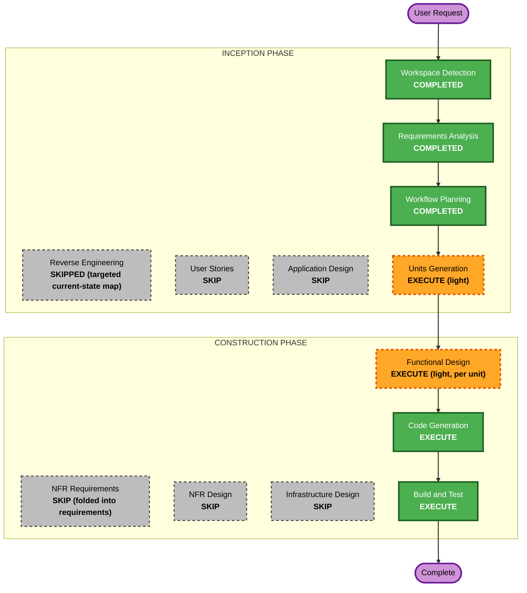

# Execution Plan — Local Config-Driven Install (okc-hooks + okc-mcp)

Root umbrella initiative, 2026-09-09 KST. Autopilot: recommended options, minimal scope, concise checkpoints instead of hard gates. Requirements: [local-install-requirements.md](../requirements/local-install-requirements.md).

## Detailed Analysis Summary

### Change Impact Assessment
- **User-facing changes**: Yes — new operator CLI commands (`setup` / teardown) for two modules; local install/registration UX.
- **Structural changes**: No — additive subcommands within existing module boundaries; reuse existing OS-service registration and okc-web HTTP clients.
- **Data model changes**: Minor — add an `agents` field to okc-mcp config schema; okc-hooks config schema unchanged.
- **API changes**: No — okc-web contracts consumed unchanged; no okc-web code change.
- **NFR impact**: Yes — security (credential handling, file perms, no-secret-logging, validation) enforced inline; PBT on config round-trips.

### Component Relationships
- **Primary components**: `okc-hooks` (Rust: `watcher-bin`, `ops-control`, `lifecycle-deploy`), `okc-mcp` (TypeScript: `src/cli.ts`, `src/config.ts`, registration).
- **Shared/consumed**: `okc-web` `/api/sync` (hooks upload token) and `/api/serving` (mcp read token) — consumed, not modified.
- **Dependent**: user's coding agents (Claude Code, Codex) — written to via their official CLIs.

### Risk Assessment
- **Risk Level**: Low–Medium. Additive, isolated per module; rollback = revert commits.
- **Rollback Complexity**: Easy.
- **Testing Complexity**: Moderate (subprocess/agent-CLI interaction and config file writes; mitigated by official CLIs, `0600`, backups, and fakeable command runners in tests).

## Workflow Visualization

## Phases to Execute / Skip

### INCEPTION
- [x] Workspace Detection — COMPLETED
- [x] Reverse Engineering — SKIPPED (prior RE artifacts exist; targeted current-state map done instead)
- [x] Requirements Analysis — COMPLETED
- [ ] User Stories — SKIP. *Rationale*: internal developer-tooling/install ergonomics; no multi-persona story value.
- [x] Workflow Planning — COMPLETED (this document)
- [ ] Application Design — SKIP. *Rationale*: additive subcommands within existing module boundaries; no new architectural components/services.
- [ ] Units Generation — EXECUTE (light). *Rationale*: two independent modules → two units aid parallel implementation and per-unit design.

### CONSTRUCTION (per unit)
- [ ] Functional Design — EXECUTE (light, per unit). *Rationale*: pin the `setup`/teardown flow, config fields, agent-CLI detection + print-only fallback, idempotency, error/redaction behavior before coding.
- [ ] NFR Requirements — SKIP. *Rationale*: NFRs + security-baseline mapping already captured in requirements.
- [ ] NFR Design — SKIP. *Rationale*: constraints are simple (0600, redaction, validation, fail-closed) — enforced inline, no new patterns.
- [ ] Infrastructure Design — SKIP. *Rationale*: no cloud infra; local OS-service registration already implemented.
- [ ] Code Generation — EXECUTE (per unit).
- [ ] Build and Test — EXECUTE (aggregate at root; module gates per unit).

## Units and Module Update Strategy

Units are defined in [local-install-unit-of-work.md](local-install-unit-of-work.md).

- **Update Approach**: Parallel. U1 (okc-hooks) and U2 (okc-mcp) have no code dependency on each other.
- **Critical Path**: none between units.
- **Coordination Points**: shared okc-web token semantics (upload token vs serving read token) — documentation-level only; verified in root Build & Test.
- **Testing Checkpoints**: per-module unit/integration gates, then a root aggregate check.
- **Rollback**: per-module commit revert; no cross-module migration.

Per routing rules, each unit's functional-design + code + tests are written **inside that module's own workspace** (`<module>/aidlc-docs/` + module source); this root plan links to them.

## Success Criteria

- **Primary Goal**: A user fills a `0600` config per module and runs one `setup` command per module; okc-hooks then runs as an auto-start daemon, and okc-mcp is registered into the user's chosen coding agents (Claude Code, Codex) — with matching teardown.
- **Key Deliverables**: `okc-hooks` `setup`/teardown; `okc-mcp` `setup`/unregister + `agents` config field; per-module tests incl. config round-trip PBT; updated module docs; root aggregate verification.
- **Quality Gates**: module build + lint/typecheck pass; new + existing tests pass; security applicable-rules check (no secret logging, 0600, validation, fail-closed) passes; no okc-web change.
