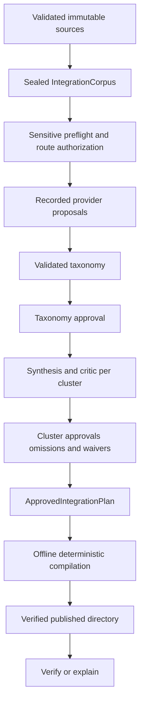

# Functional Design — Business Logic Model

## Unit

`UOW-OKC-001 / okc-schema3-product`

## Core transaction model

Text alternative: sources become a sealed corpus; preflight precedes recorded
AI proposals; taxonomy and each cluster receive explicit review; a complete
plan authorizes offline compile; the staged result is verified before
publication and can later be independently verified/explained.

## Flow A — source to sealed corpus

1. Validate one to ten typed source descriptors and default safety policy.
2. Reject duplicate source IDs, unsupported archive kinds, unsafe workspace
   overlap, and duplicate whole-Vault content.
3. Enumerate each directory/archive under deterministic path order and hard bounds.
4. Reject symlinks/special files/traversal/lossy or colliding portable paths;
   exclude private/tooling paths by sealed policy.
5. Hash exact bytes and domain-separated source/file/snapshot identities.
6. Parse Markdown/frontmatter/Obsidian constructs and retained Canvas/Base
   safety records without implying current output support.
7. Run private exact/near candidate and path/conflict analysis.
8. Project every Markdown document, block text, and frontmatter value into a
   sorted Schema 3 `IntegrationCorpus` and seal its hash.

Normative algorithms: ALG-SNP-001, ALG-NRM-001, ALG-DED-001/002, ALG-CNF-001.

## Flow B — semantic integration

1. Open or resume the current run whose source/configuration hashes match.
2. Scan every block and metadata key/value before semantic disclosure; persist
   finding categories/locations/hashes, never matched secret text.
3. Resolve role profiles and classify each endpoint as local or remote.
4. For every cache miss, require a valid route and, for remote data, explicit
   per-call consent; force sensitive semantic work to local providers.
5. Generate/validate embeddings and deterministic candidate records.
6. Ask the organizer for exactly-one taxonomy coverage and safe unique paths;
   locally validate/reseal its output and record the exchange.
7. Require curator approval of the complete taxonomy hash.
8. For each cluster, including singletons, obtain synthesis with complete
   dispositions/evidence/contradictions and an independent critic report.
9. Reject critical/major findings; require exact rationales for omissions and
   minor waivers; append the curator's cluster approval.
10. Seal a plan only when every cluster and provider recording closes.

Normative algorithms: ALG-SEM-001 and ALG-INT-001. The scalable HNSW/chunk/
hierarchy portions remain partial as recorded in current state.

## Flow C — approval and invalidation

- Approval binds the exact target hash, curator, policy version, and rationale
  where required.
- Source, policy, language, route, prompt, schema, candidate, taxonomy,
  proposal, critic, or feedback changes produce new identities.
- Dependent old tasks/approvals/plans remain history but are unavailable as
  current authority.
- Regeneration binds feedback to previous proposal and critic hashes and creates
  a new revision; it cannot reseal the previous approval.
- Configuration/source invalidation is journaled before manifest replacement
  so a partial update cannot expose changed inputs with old live authority.

## Flow D — compile and publication

1. Validate the complete `ApprovedIntegrationPlan` without provider access.
2. Validate the requested destination and source/output separation; it must be absent.
3. Create one restrictive sibling stage.
4. Render canonical notes under `knowledge/`, source redirects under `legacy/`,
   and plan/provenance/manifest/checksum audit files under `.okc/`.
5. Synchronize files and staged directories in the defined order.
6. Independently regenerate and verify all allowed bytes from the plan.
7. Atomically publish the stage using the platform's no-replace primitive.
8. Synchronize the parent where supported and return an explicit durability-
   uncertain error if publication succeeded but that final sync failed.

The current materializer emits no Pack and no non-Markdown content.

## Flow E — verify and explain

- Detect the artifact boundary before full decode; retired recognized markers
  receive the structured unsupported-schema result.
- Derive the only allowed inventory from the plan plus fixed audit files.
- Regenerate notes, redirects, provenance, manifest relationships, and checksums.
- Reject any missing/additional/symlinked/tampered/malformed/oversized record.
- `explain` first performs full verification, then returns exactly one record
  for a safe relative output path.

## Flow F — jobs and UI

- TUI work runs through a bounded worker so the reducer remains responsive.
- Language operations run through a bounded interop scheduler with typed
  progress and separately retained terminal results.
- Same-project mutation is excluded in-process and by an on-disk writer lock.
- Cancellation changes state before publication; once `publishing` is reached,
  cancellation returns the defined too-late/barrier outcome.

## Failure model

All validation failures are fail-closed. Before publication the requested
destination remains absent; cleanup errors report the exact known stage and
both causes. After publication, rollback is forbidden because deleting a
visible verified result could remove another actor's reuse of the name.
