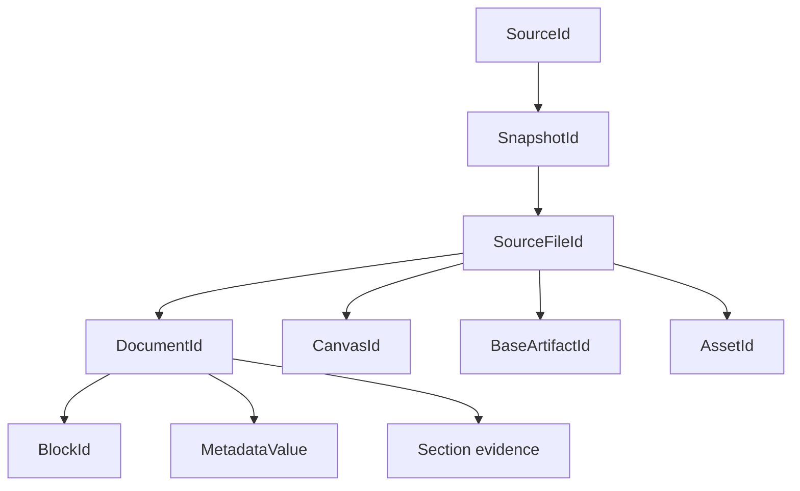

# Functional Design — Domain Entities

## Identity hierarchy

Text alternative: source owns a snapshot; snapshot owns accepted files; a
Markdown file projects to a document and its blocks/metadata/sections; other
file kinds retain distinct typed identities in the private parser boundary.

## Source and corpus entities

| Entity | Key fields | Invariant |
|---|---|---|
| `SourceId` | bounded canonical text | unique within project/corpus |
| `SourceSpec` | kind, ID, path, optional owner | directory/ZIP/tar.zst only |
| `VaultSnapshot` | snapshot ID, content ID, source, sorted files | source-specific and whole-content identities both valid |
| `IntegrationDocument` | source/document IDs, original path/hash, blocks, metadata | all records derived from one immutable document |
| `SourceBlock` | block ID, content hash, text | deterministic order and exact evidence target |
| `MetadataValue` | metadata ID, key/index, hash, typed JSON value | one value per key/index slot |
| `IntegrationCorpus` | schema, corpus/policy hashes, documents | sorted, sealed, exactly current source facts |

## Proposal and approval entities

| Entity | Relationship/meaning |
|---|---|
| `TaxonomyCluster` | One safe canonical path and a non-empty set of document IDs |
| `TaxonomyProposal` | Exactly-once assignment of all corpus documents plus organizer recording |
| `ApprovalBinding` | Curator/policy decision over one exact hash |
| `DispositionTarget` | Exact block or metadata target with document/content identity |
| `SourceDisposition` | Integrated, preserved verbatim, or omission proposed |
| `SynthesisSection` | Bounded heading/body with source evidence |
| `RelatedLink` | Typed link to another approved cluster with evidence |
| `ContradictionSet` | Multiple context/time-scoped, independently evidenced claims |
| `SynthesisProposal` | Complete cluster output proposal, revision, recording, dispositions |
| `CriticFinding` | Stable ID, severity, kind, message, evidence |
| `CriticReport` | Independent findings bound to exact proposal and recording |
| `OmissionApproval` | Exact omitted target plus curator rationale |
| `FindingWaiver` | Exact minor finding plus curator rationale |
| `ClusterApproval` | Hash-bound closure over proposal, critic, omissions, waivers |
| `ApprovedClusterRevision` | Proposal + critic + approval tuple |
| `ApprovedIntegrationPlan` | Corpus + taxonomy approval + every cluster revision + recordings |

## Project and execution entities

| Entity | Persistence | Role |
|---|---|---|
| `ProjectManifest` | `manifest.json`, schema 3 | name, curator/policy, language, AI routes, sources |
| `RunRecord` | SQLite schema 4 | source/config identity and append order |
| `TaskDefinition`/`TaskState` | SQLite + object IDs | stage/cache/request and latest event state |
| Provider recording | immutable object | canonical request/response evidence |
| `ClusterRegenerationRequest` | object/journal | feedback bound to previous proposal/critic |
| `SensitiveFinding` | versioned object | category/location/hash without matched text |
| `ProviderProfile` | global config or immutable interop client | non-secret kind/endpoint/model/limits/options/reference |
| `OperationControl` | runtime only | cancellation token and progress observer |

## Artifact entities

| Entity | Role |
|---|---|
| `CompiledArtifact` | Return path and manifest from successful compile |
| `ManifestFile` | Safe path, length, SHA-256, domain content hash |
| `CompiledVaultManifest` | Schema/product/plan/corpus/taxonomy/profile and exact inventory |
| `ProvenanceRecord` | One note/redirect derivation through plan, cluster, evidence, critic, approval |

## Interop entities

| Entity | Contract |
|---|---|
| `OkcClient` | Immutable provider set and bounded scheduler |
| `Project` | Absolute-path handle over shared project state |
| `Job<T>` | State, bounded events, cancel, separately retained terminal result |
| `OkcError` | Code, category, sanitized message, retryable flag, typed details |
| Result DTOs | Every envelope contains `interop_schema_version = 2` |

## Entity lifecycle

Facts flow from source to corpus; proposals reference facts; critics reference
proposals; approvals reference exact proposal/critic/target hashes; the plan
references all current authority; artifacts reference the plan. No later entity
rewrites an earlier one to manufacture currency.
