# NFR Design — Logical Components

## Component map

| Logical component | Physical implementation | NFR responsibility |
|---|---|---|
| Safety policy | `okc-core/config.rs` | hard source/path/archive/dedup/output limits |
| Source capability | `source_io.rs`, `snapshot.rs` | immutable regular-file reads and bounded enumeration |
| Canonicalizer/identity registry | `canonical.rs`, `identity.rs` | stable bytes and domain separation |
| Strict parsers | `json.rs`, `parse.rs`, `ir.rs` | reject ambiguity while retaining spans/originals |
| Candidate planner | `dedup.rs`, private `plan.rs` | deterministic exact/near/path/conflict candidates |
| Closure validator | `integration.rs` | total taxonomy/disposition/evidence/critic/approval checks |
| Artifact publisher | `integration.rs` target-specific paths | stage/sync/verify/no-replace/cleanup state |
| Artifact verifier | core integration + app ArtifactService | bounded schema detection and plan-derived byte closure |
| Sensitive scanner | `okc-app/project_state.rs` | versioned category/location/hash-only findings |
| Credential boundary | `okc-app/provider_service.rs`, `okc-ai::SecretString` | references, redaction, zeroization, no fallback |
| Provider transport | `okc-ai::ProviderClient/UreqTransport` | endpoint/TLS/redirect/size/deadline/retry controls |
| Immutable object store | `okc-app::ProjectStore` | synchronized no-clobber evidence objects |
| Journal | `state.sqlite3`, schema 4 | append-only runs/tasks/approvals/plan/output pointers |
| Project locks/reservations | `project.lock`, interop global reservation | cross-process and in-process single-writer semantics |
| TUI worker | `okc-app/worker.rs` | bounded progress, retained completion, cancellation barrier |
| Interop scheduler | `okc-interop` | bounded concurrency/queue/events and structured errors |
| Terminal guard/reducer | `okc/tui.rs` | safe rendering, responsive state, restoration |
| Packaging matrix | cargo-dist, Maturin, napi-rs, GitHub Actions | native portability, artifacts, checksums/SBOM |

## Runtime data flow

```mermaid
flowchart LR
    INPUT["Hostile source"] --> SAFETY["Safety parser and identity"]
    SAFETY --> CORPUS["Sealed corpus"]
    CORPUS --> DISCLOSE["Scanner and route gate"]
    DISCLOSE --> PROVIDER["Bounded provider transport"]
    PROVIDER --> OBJECTS["Immutable recordings"]
    OBJECTS --> CLOSURE["Local closure validator"]
    CLOSURE --> JOURNAL["Append-only approvals and plan"]
    JOURNAL --> PUBLISH["Offline verified publisher"]
    PUBLISH --> OUTPUT["Current directory artifact"]
```

Text alternative: untrusted source passes safety/identity into the corpus;
preflight gates provider disclosure; responses become immutable recordings;
local closure plus journaled approvals seals the plan; the offline publisher
creates the current directory artifact.

## Observability model

- CLI human/JSON outputs and SDK progress/error DTOs expose bounded operational state.
- TUI displays phase/progress without logging secrets or raw hostile controls.
- Provider usage receipts record factual token/request information when supplied.
- There is no telemetry, remote monitoring service, or production dashboard.
- Full performance reports and release attestations are external build evidence.

## Recovery model

- Complete task recordings may be reused only under the full current cache key.
- Failed/cancelled tasks resume at the first incomplete task.
- Historical runs and approvals remain immutable.
- Pre-commit compile failure publishes nothing; known stage cleanup is explicit.
- Post-commit durability uncertainty preserves the verified artifact and reports state.
- Automated process-kill/orphan and cross-store intent recovery remains future work.

## Infrastructure-design disposition

No logical component requires a cloud compute, managed database, queue, load
balancer, API gateway, or network service deployment. Local filesystem,
SQLite, provider endpoints, and native build runners are already fixed
boundaries; therefore the AI-DLC Infrastructure Design stage is skipped.
