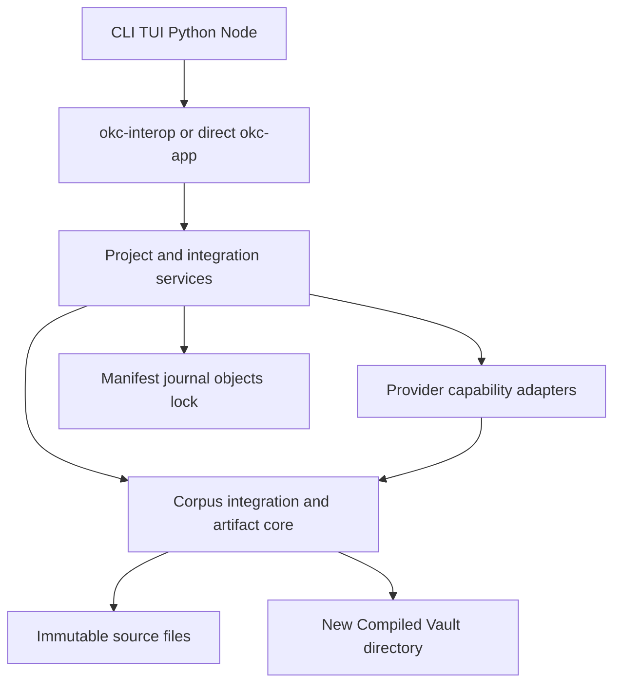

# Application Design — Component Dependencies

## Dependency diagram

Text alternative: surfaces call interop/application services; application
services call provider and core components; AI depends on core primitives;
core reads immutable sources and owns artifact bytes; app owns project state.

## Package dependency matrix

`D` means the row package directly depends on the column package.

| Consumer | core | ai | app | interop |
|---|---:|---:|---:|---:|
| `okc-core` | — |  |  |  |
| `okc-ai` | D | — |  |  |
| `okc-app` | D | D | — |  |
| `okc-interop` | D | D | D | — |
| `okc` | D | D | D |  |
| `okc-python` |  |  |  | D |
| `okc-node` |  |  |  | D |

## Communication contracts

| From | To | Contract |
|---|---|---|
| Source adapters | Corpus builder | typed `SourceSpec`; no MCP identity |
| App | AI | portable Schema 3 request, cancellation, explicit boundary/consent |
| AI | App/core | recorded untrusted response; strict schema and semantic validation |
| App | Core | sealed corpus/proposals/approvals/plan; no provider handle |
| Core | Filesystem | safe reads, sibling stage, create-new writes, no-replace publish |
| CLI/TUI | App | service calls and typed results; no subprocess delegation |
| Python/Node | Interop | explicit paths and DTO schema 2 |
| Interop | App | bounded job closures and structured errors |

## Forbidden dependency edges

- `okc-core` to provider, app, interop, CLI/TUI, keychain, updater, or language runtimes.
- AI/provider code to approval or publication authority.
- CLI/TUI/bindings to independent project schemas or compiler policy.
- Any current package to future MCP/plugin/registry implementations.
- Any default compiler component to experimental ALG-MEM algorithms.

## Change propagation

| Change | Invalidates or requires review of |
|---|---|
| Source bytes/binding/policy/language/routes | active run and all dependent tasks/approvals/plans |
| Candidate input/provider/profile/prompt/schema | task cache and downstream taxonomy |
| Taxonomy | all cluster proposals, critics, approvals, and plan |
| Synthesis | critic, waivers, cluster approval, and plan |
| Critic | cluster approval and plan |
| Public DTO/schema/path bytes | binding contracts, goldens, ADR, migration policy |
| Dependency or release tooling | QG-008, licenses/SBOM/reproducibility evidence |
