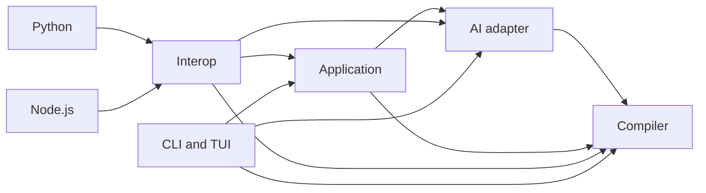

# Unit of Work Dependencies

There is one unit of work, so no inter-unit runtime protocol exists. Internal
module dependencies remain important for review and build order.

## Internal dependency order

Text alternative: core is built first; AI depends on core; app depends on core
and AI; interop depends on all three; CLI/TUI depends on core/AI/app; Python
and Node each depend only on interop.

## Coordination points

| Contract | Producers/consumers | Verification |
|---|---|---|
| Schema 3 integration DTOs | core; app/interop/surfaces | core closure tests and binding E2E |
| Provider capability/request schemas | AI; app | provider unit tests and portable-schema test |
| Project/journal/object layout | app; CLI/TUI/interop | app lifecycle/fault tests and binding E2E |
| Interop DTO schema 2 | interop; Python/Node | Rust DTO tests, Python typing/API, Node declarations/API |
| Artifact bytes/golden | core; every public surface | Rust/Python/Node shared inventory SHA-256 |
| CLI grammar/exit classes | `okc`; scripts/operators | `cli_contract.rs` |

## Change strategy

- Core schema or bytes first require an accepted ADR and new goldens.
- Application changes preserve journal history and current project compatibility.
- Interop changes precede synchronized Python/Node adapter and type updates.
- Integrated tests run after any module change; release gates remain whole-product.
