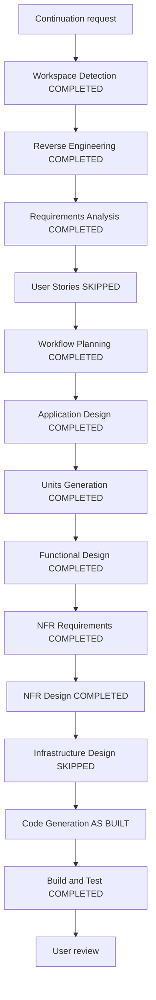

# AI-DLC Execution Plan — As-Built Construction Documentation

## Detailed analysis summary

### Transformation scope

- **Type**: System-wide documentation reconciliation over an existing product.
- **Application behavior changes**: None.
- **Documentation changes**: Refresh incomplete/stale reverse engineering;
  complete application/unit design and Construction artifacts.
- **Related components**: All seven Cargo packages, guide/build/test assets,
  normative requirements, and AI-DLC state/audit records.

### Impact assessment

| Area | Impact |
|---|---|
| User-facing behavior | No runtime behavior change |
| Architecture | No decision change; as-built boundaries recorded |
| Data/schema | No schema or stored-byte change |
| Public API | No API change |
| NFR | Current requirements and gaps documented, not relaxed |
| Build/test | Existing commands re-run and current evidence recorded |
| Rollback | Documentation files can be reverted independently |

### Risk assessment

- **Risk level**: Medium. Runtime risk is low, but documentation error could
  misstate approval, security, format, or release authority.
- **Rollback complexity**: Easy for AI-DLC-only files; the one repaired
  traceability link is also isolated.
- **Testing complexity**: Moderate because claims span Rust, CLI/TUI, Python,
  Node.js, guide, and release matrices.
- **Primary control**: Distinguish implemented, partial, absent, future, and
  proposed behavior and defer to normative source precedence.

## Workflow visualization

Text alternative: refresh workspace and reverse engineering; reconcile
requirements; skip new user stories; generate the execution/application/unit
design; create functional and NFR construction design; skip runtime
infrastructure; document current code; run build/test checks; hand off for review.

## Stage decisions

### Inception

- [x] Workspace Detection — execute; checkout layout changed from the prior artifact.
- [x] Reverse Engineering — execute; prior artifact set was incomplete/stale.
- [x] Requirements Analysis — execute; current/future status needed correction.
- [x] User Stories — skip; documentation-only request with no new behavior.
- [x] Workflow Planning — execute; mandatory and needed to record retrospective semantics.
- [x] Application Design — execute; current package/service contracts need an as-built map.
- [x] Units Generation — execute; the multi-package workspace needs a bounded design unit.

### Construction

- [x] Functional Design — execute; the integration/approval/publication rules are complex.
- [x] NFR Requirements — execute; determinism, safety, privacy, portability, and scale are load-bearing.
- [x] NFR Design — execute; concrete patterns exist and need mapping.
- [x] Infrastructure Design — skip; no deployed runtime infrastructure or infrastructure change.
- [x] Code Generation — execute as retrospective inventory/traceability only.
- [x] Build and Test — execute; create instructions and capture current-run evidence.

### Operations

- [ ] Operations — placeholder; not part of the installed workflow or this request.

## Unit strategy

Use one unit of work, `okc-schema3-product`, because the seven packages form one
local product and share one schema/approval/publication contract. Package
boundaries remain modules within the unit; they are not modeled as independent
microservices.

## Dependency-aware analysis order

1. `okc-core`
2. `okc-ai`
3. `okc-app`
4. `okc-interop`
5. `okc` CLI/TUI
6. Python and Node.js bindings
7. Build, package, guide, and release evidence

No package source update is scheduled by this documentation task.

## Deliverables

- Full reverse-engineering artifact set.
- Requirements reconciliation and explicit status boundaries.
- Application component/method/service/dependency design.
- Unit definition, dependency map, and FR/REQ coverage map.
- Per-unit functional and NFR design.
- Retrospective code-generation plan and as-built source trace.
- Build, unit/integration/performance/security/contract/E2E instructions and summary.
- Updated state, append-only audit, current-state note, decision log, and repaired link.

## Success criteria

1. Every required AI-DLC artifact for each executed stage exists.
2. Every skip has a concrete rationale.
3. No current document advertises Pack/non-Markdown/future/proposed work as implemented.
4. All current REQ/ALG/ADR/QG mappings resolve to authoritative sources.
5. Markdown links and Mermaid source pass local validation.
6. Relevant build/test commands and exact outcomes are recorded without a stable-release claim.
