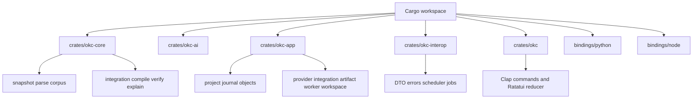

# Reverse Engineering — Code Structure

## Build system

- **Primary**: Cargo workspace at `Cargo.toml`, resolver 2, seven packages.
- **Pinned toolchain**: `rust-toolchain.toml`, Rust 1.97.1 with Clippy and rustfmt.
- **Python**: `bindings/python/pyproject.toml` and Maturin/PyO3.
- **Node.js**: `bindings/node/package.json`, npm, napi-rs, and TypeScript.
- **Guide**: `guide/package.json` and VitePress.
- **Release candidates**: `dist-workspace.toml` and GitHub Actions in the
  parent Git checkout's `.github/workflows/` directory.

## Module hierarchy

Text alternative: the Cargo root contains seven packages. `okc-core` splits
hostile-input corpus construction from Schema 3 integration/materialization;
`okc-app` splits project state from shared services; adapters depend inward.

## Existing production files

### `okc-core`

| File | Responsibility |
|---|---|
| `crates/okc-core/src/lib.rs` | Minimal public re-export boundary |
| `cancellation.rs` | Cooperative cancellation token |
| `canonical.rs` | Deterministic JSON encoding and domain hashing |
| `config.rs` | Private compiler/safety/path/dedup/output policy |
| `corpus.rs` | `CorpusBuilder` and `PreparedCorpus` public boundary |
| `dedup.rs` | Exact grouping and bounded MinHash/LSH candidates |
| `diagnostic.rs` | Typed diagnostic codes, severity, and spans |
| `error.rs` | Non-exhaustive core failure taxonomy |
| `identity.rs` | Content and typed domain-separated identities |
| `integration.rs` | Schema 3 DTOs, closure validation, compile, verify, explain, publication |
| `ir.rs` | Private parsed Markdown/Canvas/Base/asset representation |
| `json.rs` | Recursive duplicate-key rejecting JSON decoder |
| `parse.rs` | Markdown/frontmatter/Obsidian link and Canvas parsing |
| `plan.rs` | Private analysis, conflict/path allocation, and materialization planning |
| `snapshot.rs` | Directory/archive enumeration, bounds, snapshot sealing |
| `source.rs` | Strict `SourceId` and directory/archive descriptors |
| `source_io.rs` | No-follow source handles and regular-file validation |
| `workspace.rs` | Optional bounded SQLite inspection persistence |

### `okc-ai`

| File | Responsibility |
|---|---|
| `crates/okc-ai/src/lib.rs` | Provider roles/profiles/capabilities, portable schemas, transport, five adapter shapes, validation, redaction, retry/deadline policy |

### `okc-app`

| File | Responsibility |
|---|---|
| `crates/okc-app/src/lib.rs` | Project manifest/layout, immutable objects, lock, progress, optional updater |
| `artifact_service.rs` | Bounded current-schema detection and typed verify/explain |
| `integration_execution.rs` | Embedding/candidate/organizer/synthesis/critic execution and recording |
| `integration_service.rs` | Checkpoints, preflight, approvals, regeneration, plan sealing, compile |
| `project_state.rs` | Append-only schema-4 journal, cache keys, sensitive scanning, disclosure |
| `provider_service.rs` | Profile persistence, keychain/environment credential resolution, capability test |
| `worker.rs` | Bounded TUI worker, progress coalescing, cancellation barrier |
| `workspace_bootstrap.rs` | Deterministic cwd project/Vault discovery and safe placement |

### Public surfaces

| File | Responsibility |
|---|---|
| `crates/okc-interop/src/lib.rs` | Runtime-neutral API-v1 DTOs, errors, project handles, bounded jobs/scheduler/reservations |
| `crates/okc/src/main.rs` | CLI grammar, command routing, exit classes, terminal sanitization |
| `crates/okc/src/commands.rs` | Thin CLI application-service adapters |
| `crates/okc/src/tui.rs` | TUI model/event/effect reducer, rendering, terminal lifecycle |
| `bindings/python/src/lib.rs` | PyO3 native bridge |
| `bindings/python/okc/__init__.py` | Pythonic immutable profiles, jobs, client, project wrapper |
| `bindings/python/okc/__init__.pyi` | Typed Python public surface |
| `bindings/python/okc/_native.pyi` | Private native module stubs |
| `bindings/node/src/lib.rs` | napi-rs native bridge |
| `bindings/node/index.cjs` | CommonJS public wrapper and safe key conversion |
| `bindings/node/index.js` | ESM exports |
| `bindings/node/index.d.ts` | TypeScript declarations |
| `bindings/node/native.cjs` | Platform-native addon loader |

## Test structure

| Location | Coverage role |
|---|---|
| Package-local `#[cfg(test)]` modules | Core invariants, provider shapes, project state, worker, interop scheduler, TUI reducer |
| `crates/okc-core/tests/corpus_builder_contract.rs` | Hostile source, immutability, ordering, workspace safety |
| `crates/okc-core/tests/adversarial_contract.rs` | Fixed-seed JSON/ZIP mutation and construction-order properties |
| `crates/okc-core/tests/sdk_output_golden.rs` | Cross-language artifact inventory golden |
| `crates/okc-core/tests/documentation_contract.rs` | Repository-relative links in root/docs/guide Markdown |
| `crates/okc/tests/cli_contract.rs` | Exact current command grammar and retired-surface absence |
| `bindings/python/tests/` | Python API, typing, full approval/compile/verify/explain workflow |
| `bindings/node/tests/` | CommonJS/ESM API, declarations, full workflow |
| `tests/tui_pty_smoke.py` | POSIX interactive workflow and terminal/source invariants |

## Design patterns

| Pattern | Location | Purpose |
|---|---|---|
| Ports and adapters | package dependency graph | Keep canonical policy independent of provider/UI/runtime |
| Immutable content-addressed values | integration DTOs and project objects | Make staleness and tampering detectable |
| Append-only journal | `project_state.rs` | Resume without rewriting prior authority |
| Pure reducer plus effects | `tui.rs` | Test navigation independently of I/O |
| Record/replay boundary | `okc-ai` plus integration execution | Convert nondeterministic responses into deterministic inputs |
| Stage-verify-publish | `integration.rs` | Prevent partial or replacing publication |
| Typed facade | `okc-interop` | Keep Python/Node behavior equivalent and side-effect bounded |
| Feature-gated host integrations | `okc-app` | Exclude keychain/updater from language bindings |

## Modification rule for future brownfield work

Modify existing files in place and preserve the inward dependency direction.
Do not create generation-suffixed copies, reintroduce retired schema packages,
or place executable code under `aidlc-docs/`.
