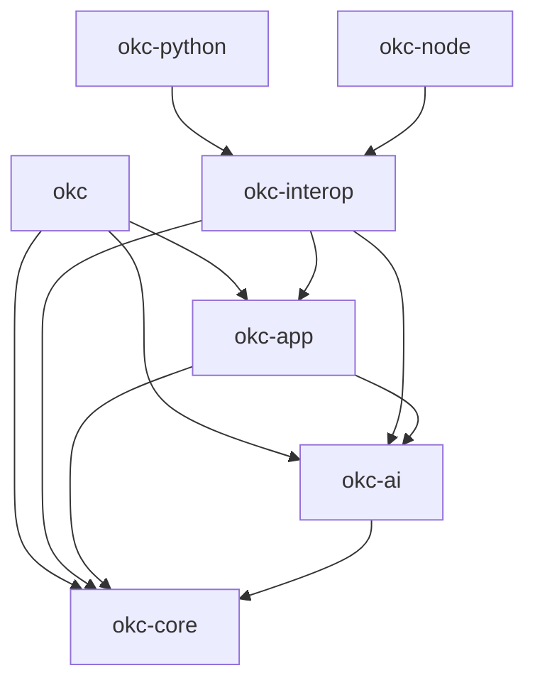

# Reverse Engineering — Dependencies

## Internal dependency direction

Text alternative: `okc-core` is the innermost package. `okc-ai` depends on
core; `okc-app` depends on both; `okc-interop` and `okc` depend on the
application/core boundary; Python and Node depend only on interop.

## Internal dependency table

| Consumer | Internal dependencies | Reason |
|---|---|---|
| `okc-core` | none | Canonical deterministic policy owner |
| `okc-ai` | `okc-core` | Shared cancellation and strict JSON boundary |
| `okc-app` | `okc-core`, `okc-ai` | Orchestrate compiler and provider proposals |
| `okc-interop` | `okc-core`, `okc-ai`, `okc-app` | Map application behavior to stable runtime-neutral DTOs/jobs |
| `okc` | `okc-core`, `okc-ai`, `okc-app` | Thin CLI/TUI adapter and explicit plan compile path |
| `okc-python` | `okc-interop` | Native Python projection without policy duplication |
| `okc-node` | `okc-interop` | Native Node projection without policy duplication |

## External dependency roles

Versions below are direct manifest constraints; the committed `Cargo.lock` and
package lockfiles define exact resolved graphs.

| Dependency group | Direct dependencies | Role |
|---|---|---|
| Parsing and normalization | `comrak 0.48`, `serde_yaml_ng 0.10`, `unicode-normalization =0.1.25`, `unicode-segmentation`, `caseless =0.2.2` | Preserve structure/spans and portable comparison forms |
| Serialization and identity | `serde`, `serde_json`, `sha2`, `hex`, `data-encoding`, `toml 0.9` | Strict DTOs, canonical bytes, hashes, configuration |
| Source/archive safety | `ignore`, `zip 4`, `tar 0.4`, `zstd 0.13`, `rustix =1.1.4`, `atomicwrites =0.4.4`, `tempfile` | Bounded enumeration and no-replace publication |
| State | `rusqlite 0.37` with bundled SQLite | Private deterministic local journal/workspace |
| Provider transport | `ureq =3.4.0`, rustls/platform verifier | Bounded synchronous HTTPS/local HTTP adapters |
| Secrets | `zeroize`, optional `keyring =4.2.0` | Redacted memory and opaque native credentials |
| Operator surface | `clap 4`, `ratatui =0.30.2`, `crossterm =0.29.0`, `ctrlc 3` | CLI grammar, terminal UI, signal restoration |
| Release/update | optional `axoupdater =0.10.0`, cargo-dist 0.32.0 | Receipt-aware updates and release candidates |
| Language adapters | `pyo3 =0.29.2`, `napi =3.12.2`, `napi-derive =3.6.3` | ABI3 and Node-API native bindings |

## Dependency constraints

- `okc-core` must not gain provider, terminal, runtime, keychain, updater,
  MCP, web, or vendor SDK dependencies.
- `okc-app` keychain/updater features are disabled by `okc-interop` and both
  language bindings.
- Tokio may appear only transitively inside the pinned blocking updater path
  under ADR-0021; it is not the application worker architecture.
- The Node adapter's unsafe allowance is scoped to napi-rs macro expansion;
  handwritten core/interop code remains safe Rust.
- Direct licenses were not independently re-audited in this documentation run.
  QG-008 and the release procedure remain the authority for license/SBOM evidence.

## External systems

| System | Access | Boundary |
|---|---|---|
| Local filesystem/SQLite | read and explicit new writes | Hostile source reads; private project state; absent output only |
| Provider endpoint | explicit network call | Preflight, route capability, consent, bounds, recording |
| Native keychain | CLI/TUI only | Opaque account reference; no plaintext fallback |
| GitHub/PyPI/npm | build/release time | No package publication is authorized or implemented in current CI |
