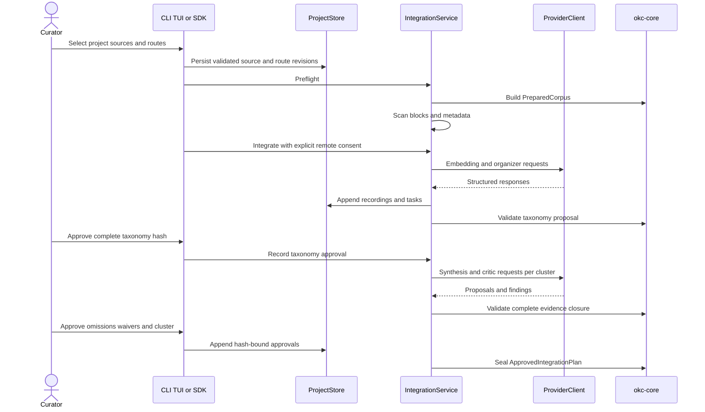
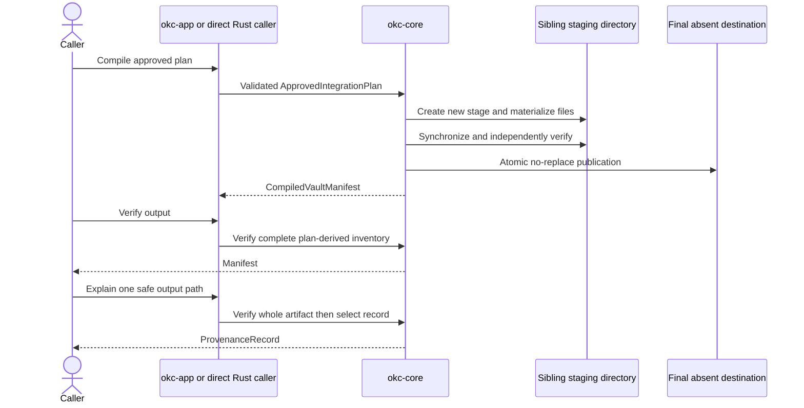
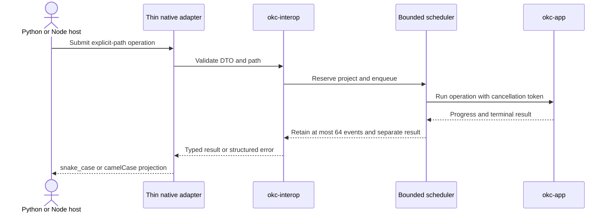

# Reverse Engineering — Interaction Diagrams

## Transaction 1: project integration and review

Text alternative: all source/config mutations are validated and invalidate
dependent authority; preflight precedes provider calls; every provider result
is recorded; taxonomy and each cluster require separate exact approvals before
the integration plan can be sealed.

## Transaction 2: offline compile, verify, and explain

Text alternative: compile validates one complete plan, writes and verifies a
sibling stage, then atomically publishes only if the requested destination is
absent. Verify and explain reconstruct allowed bytes from the embedded plan;
explain verifies the whole artifact before returning one record.

## Transaction 3: Python/Node job execution

Text alternative: language hosts submit absolute-path operations; interop
validates and schedules them with same-project exclusion; progress is bounded
and the terminal result is retained independently; adapters only translate
names/types/errors.

## Failure interactions

- A source or configuration change starts a fresh active run and makes old
  approvals unavailable; it does not edit historical objects.
- A remote cache miss without both required consent booleans fails before
  disclosure.
- Critical/major critic findings block approval; every minor finding needs an
  exact waiver.
- Cancellation is honored before publication and becomes too late at/after
  the barrier.
- Any unplanned file, symlink, malformed control file, stale hash, or publish
  race fails closed without replacing the winner.
