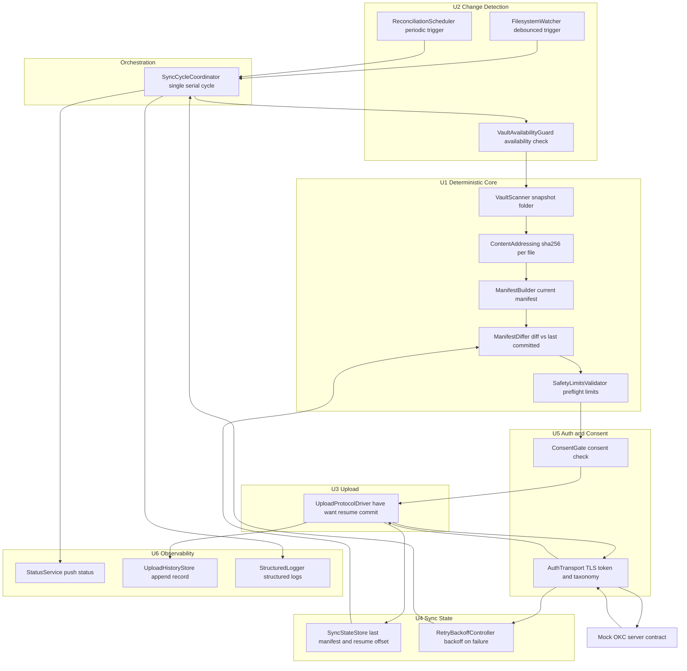

## 컴포넌트 의존성 — okc-hooks "Watcher"

**단계**: INCEPTION → Application Design
**작성일**: 2026-09-08
**범위**: 30개 컴포넌트/서비스의 의존성 매트릭스 + 통신 패턴 + 데이터 흐름(검증된 Mermaid + 텍스트 대안) + 네이밍 레지스트리 + 설계 검증 + 잔여 이슈. 크리틱(CONCERNS, blocking 0) 2건 수정을 아래 §7에 반영했다.

> **§0. 크리틱 수정 반영 요약**
> - **(수정1) 빌드 순서 역전 5 엣지 → 파운데이션-계약 의존으로 재해석**: `UploadProtocolDriver`(U3)→`StatusService`/`StructuredLogger`(U6), `AuthTransport`(U5)→`StructuredLogger`(U6), `ConsentGate`(U5)→`StatusService`/`StructuredLogger`(U6). 로깅·상태-push **계약(trait)** 과 Q9 2축 상태 값 타입을 파운데이션 `CoreTypes`에 두고 U6는 **구현만** 제공, `WatcherDaemon`이 주입. 아래 매트릭스에서 해당 5 엣지에 `[Foundation-contract]`를 병기 — 순환도 순서 위반도 아님.
> - **(수정2) 선택적 컴포넌트 경성 의존 완화**: `CriticalErrorNotifier`(U6)→`TrayIndicator`(U6) 엣지는 **nullable no-op 싱크** 주입으로 계약 — 트레이 부재 시에도 로그+헬스+CLI status 표면화(US-E5-04) 불변. 아래 매트릭스 22번 행에 `[optional no-op]` 병기.

---

## 1. 의존성 매트릭스 (컴포넌트 → 의존 대상)

빌드 순서(파운데이션 → U1 → U4 → U5 → U2 → U3 → U6 → U7 → 오케스트레이션)로 정렬. 파운데이션(`ConfigProvider`, `CoreTypes`)은 거의 모든 컴포넌트로 아래 방향 주입되므로 표에서 `[Foundation]`으로 축약.

| # | 컴포넌트 | 단위 | kind | → 의존 대상 |
|---|---|---|---|---|
| 1 | CoreTypes | Foundation | component | (없음 — 루트) |
| 2 | ConfigProvider | Foundation | component | CoreTypes |
| 3 | ContentAddressing | U1 | component | CoreTypes |
| 4 | VaultScanner | U1 | component | [Foundation] |
| 5 | ManifestBuilder | U1 | component | VaultScanner, ContentAddressing, CoreTypes |
| 6 | ManifestDiffer | U1 | component | CoreTypes |
| 7 | SafetyLimitsValidator | U1 | component | CoreTypes |
| 8 | SyncStateStore | U4 | component | [Foundation] |
| 9 | RetryBackoffController | U4 | component | [Foundation] |
| 10 | CredentialProvider | U5 | component | [Foundation] |
| 11 | AuthTransport | U5 | component | [Foundation], CredentialProvider, StructuredLogger `[Foundation-contract]` |
| 12 | ConsentGate | U5 | component | [Foundation], StatusService `[Foundation-contract]`, StructuredLogger `[Foundation-contract]` |
| 13 | FilesystemWatcher | U2 | component | [Foundation] |
| 14 | ReconciliationScheduler | U2 | component | [Foundation] |
| 15 | VaultAvailabilityGuard | U2 | component | [Foundation] |
| 16 | SingleInstanceLock | U2 | component | [Foundation] |
| 17 | UploadProtocolDriver | U3 | component | [Foundation], AuthTransport, SyncStateStore, ContentAddressing, SafetyLimitsValidator, StatusService `[Foundation-contract]`, StructuredLogger `[Foundation-contract]` |
| 18 | StructuredLogger | U6 | component | [Foundation] |
| 19 | StatusService | U6 | component | CoreTypes |
| 20 | UploadHistoryStore | U6 | component | [Foundation] |
| 21 | TrayIndicator | U6 | component | StatusService, [Foundation] |
| 22 | CriticalErrorNotifier | U6 | component | StructuredLogger, StatusService, TrayIndicator `[optional no-op]`, [Foundation] |
| 23 | ServiceManager | U7 | component | ConfigProvider, StructuredLogger, CoreTypes |
| 24 | AutoUpdater | U7 | component | StatusService, ServiceManager, CriticalErrorNotifier, StructuredLogger, [Foundation] |
| 25 | Uninstaller | U7 | component | ServiceManager, CredentialProvider, ConfigProvider, StructuredLogger, CoreTypes |
| 26 | RunStateController | U7 | component | StatusService, ConfigProvider, StructuredLogger, CoreTypes |
| 27 | ControlPlane | U7 | component | StatusService, UploadHistoryStore, RunStateController, ConsentGate, ConfigProvider, StructuredLogger, CoreTypes |
| 28 | OperatorCli | U7 | component | ControlPlane, ServiceManager, Uninstaller, [Foundation] |
| 29 | SyncCycleCoordinator | Orchestration | service | [Foundation], FilesystemWatcher, ReconciliationScheduler, VaultAvailabilityGuard, VaultScanner, ManifestBuilder, ManifestDiffer, SafetyLimitsValidator, ConsentGate, AuthTransport, UploadProtocolDriver, SyncStateStore, RetryBackoffController, StatusService, UploadHistoryStore, CriticalErrorNotifier |
| 30 | WatcherDaemon | Orchestration | service | [Foundation], SingleInstanceLock, SyncStateStore, SyncCycleCoordinator, FilesystemWatcher, ReconciliationScheduler, StatusService, StructuredLogger, ControlPlane |

`[Foundation-contract]` = 수정1 적용 후 파운데이션 계약(trait)으로 해석되는 엣지(원래 ⚠️ 빌드 순서 역전). `[optional no-op]` = 수정2 적용(nullable no-op 주입). 순환은 없음 — §6 참조.

**계층 요약(의존 방향은 위→아래로만 흐름)**:
- 최하단: `CoreTypes` → `ConfigProvider` (파운데이션, 모든 단위가 소비)
- 순수 코어: U1 (파일 읽기 외 I/O 없음)
- 상태/복원력: U4 (지속 상태 + 백오프)
- 인증/동의: U5, 업로드: U3
- 관측(횡단): U6 (`StructuredLogger`/`StatusService`는 사실상 파운데이션급 싱크 — 계약은 `CoreTypes`, 구현은 U6)
- 수명주기/CLI: U7
- 최상단 조립 루트: `WatcherDaemon` → `SyncCycleCoordinator`

---

## 2. 통신 패턴 분류

30개 컴포넌트/서비스 간 엣지를 5개 패턴으로 분류. 모든 패턴은 단일 배포 바이너리 내부의 in-process 호출이며, 예외는 (4) 로컬 IPC(프로세스 경계)와 (5) HTTP(네트워크 경계)뿐이다.

### 1. 직접 함수 호출 (in-process, 동일 바이너리)
컴포넌트가 협력자의 공개 메서드를 직접 호출. 데이터 파이프라인의 주 패턴.
- `ManifestBuilder → VaultScanner`, `ManifestBuilder → ContentAddressing` (스냅샷→해시→매니페스트 조립)
- `SyncCycleCoordinator → {VaultAvailabilityGuard, VaultScanner, ManifestBuilder, ManifestDiffer, SafetyLimitsValidator, ConsentGate, UploadProtocolDriver}` (사이클 오케스트레이션)
- `UploadProtocolDriver → {SyncStateStore, ContentAddressing, SafetyLimitsValidator}` (재개 오프셋 조회, 재검증 해시, 런타임 한도)
- `AuthTransport → CredentialProvider` (매 요청 토큰 조달)
- `AutoUpdater → {ServiceManager, CriticalErrorNotifier}`, `Uninstaller → {ServiceManager, CredentialProvider}`

### 2. Config 주입 (파운데이션 → 아래로)
조립 루트(`WatcherDaemon`)가 `ConfigProvider`/`CoreTypes`를 최초 1회 생성해 생성자 주입. 역참조 없음(파운데이션은 어떤 단위도 참조하지 않음). 단일 JSON(nginx식) 리로드 팬아웃도 이 경로.
- `ConfigProvider → CoreTypes` (파운데이션 내부)
- `VaultScanner / FilesystemWatcher / ReconciliationScheduler / SyncStateStore / RetryBackoffController / CredentialProvider / StructuredLogger / UploadHistoryStore → ConfigProvider, CoreTypes` (대표적인 하향 주입 엣지)
- 리로드 예: 토큰 변경 → `ConsentGate` 재확인, 로그레벨 변경 → `StructuredLogger`

### 3. Status Push (→ StatusService, push-only)
각 단위가 운영 라이프사이클/조건집합(Q9 2축)을 `StatusService`로 밀어 넣기만 함. `StatusService`는 `CoreTypes`에만 의존 → U1–U5를 역참조하지 않음(순환 방지). 로깅도 동형 push/sink 패턴(→ `StructuredLogger`). **수정1**: 이 push 대상 계약(trait)은 `CoreTypes` 소유, U6는 구현 제공.
- push(쓰기): `ConsentGate → StatusService` (ConsentBlocked), `RunStateController → StatusService` (paused/idle), `SyncCycleCoordinator → StatusService` (syncing/offline/OverLimit), `AutoUpdater → StatusService` (UpdateRolledBack)
- pull(읽기, 상위에서만): `ControlPlane → StatusService`, `TrayIndicator → StatusService`, `CriticalErrorNotifier → StatusService`, `AutoUpdater → StatusService.update_probe()`
- 로깅 push: `AuthTransport / ConsentGate / UploadProtocolDriver / ServiceManager / … → StructuredLogger`

### 4. 로컬 IPC (프로세스 경계 — Unix 도메인 소켓 / Windows 명명 파이프)
CLI 프로세스와 실행 중인 데몬 프로세스를 잇는 유일한 프로세스 간 경로(Q5=A). 소유자 권한 제한, 작은 버전드 요청/응답 + `--json`.
- `OperatorCli → ControlPlane` (클라이언트 측; 별도 프로세스에서 소켓/파이프로 요청)
- `WatcherDaemon → ControlPlane` (데몬이 IPC 서버로 `ControlPlane` 호스팅/구동)
- 경로 예: `watcher status/pause/resume/sync-now/history/consent/reload` → OperatorCli → (IPC) → ControlPlane → {StatusService, UploadHistoryStore, RunStateController, ConsentGate}

### 5. HTTP-over-AuthTransport (네트워크 경계 — U3 → U5 → 서버 목계약)
U3는 HTTP를 직접 소유하지 않음. `AuthTransport`(U5)가 TLS + 매 요청 토큰 부착 + 응답/오류 taxonomy(타입은 `CoreTypes`) 분류를 단독 소유(Q4=A).
- `UploadProtocolDriver → AuthTransport → (TLS) → Mock OKC Server` (have/want 협상, 재개 청크 전송, 커밋)
- 오류 흐름: `AuthTransport`가 응답을 `CoreTypes` 전송결과/오류 taxonomy로 분류 → `RetryBackoffController`가 그 taxonomy로 재시도/백오프 판단(U4가 U3/U5 역참조 없이 사용), 401 등 인증실패는 `ConsentGate`/`StatusService`(AuthFailed)로 표면화

---

## 3. 데이터 흐름 다이어그램 (Mermaid)

단일 업로드 사이클의 데이터 흐름. Q2=B 단일 직렬 사이클 + FQ-2=A 최신 상태 대체 모델.



---

## 4. 데이터 흐름 (텍스트 대안)

단일 업로드 사이클 데이터 흐름 (트리거 → 스냅샷 → diff → 프리플라이트 → 동의게이트 → have/want → 전송 → 커밋 → 상태지속). Q2=B 단일 직렬 사이클 + FQ-2=A 최신상태 대체 모델.

```text
[트리거] U2
  FilesystemWatcher(디바운스) 또는 ReconciliationScheduler(주기)
        |
        v
[사이클 시작] Orchestration
  SyncCycleCoordinator (트리거마다 끝까지 도는 단일 직렬 사이클)
        |
        v
[가용성 가드] U2
  VaultAvailabilityGuard  --(볼트 언마운트/부분가용이면 사이클 중단, 파괴적 빈 커밋 방지)-->  X 중단
        | (가용)
        v
[스냅샷] U1
  VaultScanner  ->  ContentAddressing(파일별 표준 sha256)  ->  ManifestBuilder(현재 매니페스트)
        |
        v
[diff] U1  <-- SyncStateStore(U4)에서 마지막 커밋 매니페스트 로드
  ManifestDiffer(현재 vs 마지막커밋)  ->  변경집합(want = 경로->해시 맵; Q6=C)
        |
        v
[프리플라이트] U1
  SafetyLimitsValidator(크기/개수 한도)  --(초과 시 OverLimit)-->  StatusService
        |
        v
[동의 게이트] U5
  ConsentGate  --(미동의 시 ConsentBlocked)-->  StatusService, 사이클 중단
        | (동의됨)
        v
[have/want + 전송 + 커밋] U3 -> U5 -> 서버
  UploadProtocolDriver
     -> AuthTransport(TLS + 토큰 + 응답 taxonomy) -> Mock OKC Server (have/want 협상)
     -> 전송 시 각 blob 재-읽기/재-해시 재검증(Q8=A); 재개 오프셋은 SyncStateStore에서
        불일치 시: 이 커밋 중단 -> 다음 사이클이 새 스냅샷으로 반영
     -> AuthTransport -> Server (커밋: 권위 있는 경로->해시 맵 포함)
        |
        +--(오류/오프라인: AuthTransport가 CoreTypes taxonomy로 분류)--> RetryBackoffController(백오프) --> SyncCycleCoordinator(재조정/재시도)
        |
        v (성공)
[상태 지속 + 관측] U4 / U6
  UploadProtocolDriver -> SyncStateStore: 새 마지막커밋 매니페스트 + dirty 해제 + 재개오프셋
                          (원자적 temp+rename/WAL, 크래시 복구)
  UploadProtocolDriver -> UploadHistoryStore: append-only 기록
  SyncCycleCoordinator -> StatusService: idle 복귀
  SyncCycleCoordinator -> StructuredLogger: 사이클 요약 로그

불변식: StatusService/StructuredLogger는 push-only 싱크(U1-U5를 역참조하지 않음). U1은 VaultScanner 파일읽기 외 I/O 없음(지속 저장은 U4).
```

---

## 5. 정식 컴포넌트 이름 레지스트리 + 별칭 통일

이름 드리프트는 의존성 그래프 검증을 깨므로 아래 정식 이름만 사용한다. 4명의 설계 에이전트 초안에서 나온 별칭은 좌변 정식 이름으로 통일.

### 파운데이션 (2)
- `CoreTypes` — 별칭 통일: `CoreTypes & Codec`, `SharedTypes`, `ErrorTaxonomy`, `Codec` → **CoreTypes** (공유 값 타입 + 전송결과/오류 taxonomy + 무손실 직렬화 코덱 + Q9 2축 상태 값 타입 + 관측 싱크 계약 trait 포함)
- `ConfigProvider` — 별칭: `ConfigLoader`, `SettingsProvider` → **ConfigProvider** (단일 JSON, nginx식; Q3=X)

### U1 Deterministic Content Core (5)
- `ContentAddressing` — 별칭: `Hasher`, `Sha256Hasher`, `FingerprintCalculator` → **ContentAddressing** (표준 SHA-256; FQ-1=A로 okc-core 재현 제거)
- `VaultScanner` — 별칭: `FolderScanner`, `SnapshotBuilder` → **VaultScanner**
- `ManifestBuilder` — 별칭: `SnapshotManifest` → **ManifestBuilder**
- `ManifestDiffer` — 별칭: **VaultDiff = ManifestDiffer**, `DiffEngine` → **ManifestDiffer**
- `SafetyLimitsValidator` — 별칭: `LimitsChecker`, `PreflightValidator` → **SafetyLimitsValidator**

### U2 Change Detection & Trigger (4)
- `FilesystemWatcher` — 별칭: `FsWatcher`, `VaultWatcher`; **DebounceTrigger는 내장 책임으로 흡수** → **FilesystemWatcher**
- `ReconciliationScheduler` — 별칭: `PeriodicScheduler`, `ReconScheduler` → **ReconciliationScheduler**
- `VaultAvailabilityGuard` — 별칭: `EmptyVaultGuard`, `MountGuard` → **VaultAvailabilityGuard**
- `SingleInstanceLock` — 별칭: `InstanceLock`, `PidLock` → **SingleInstanceLock**

### U4 Resilience, Queue & Retry (2)
- `SyncStateStore` — **DurableQueue → SyncStateStore** (FQ-2=A 최신상태 대체 모델: 마지막커밋 매니페스트 + dirty 표시 + 재개 오프셋; 이벤트별 큐/CoalesceEngine 제거)
- `RetryBackoffController` — 별칭: `BackoffController`, `RetryScheduler` → **RetryBackoffController**

### U5 Auth & Consent (3)
- `AuthTransport` — 별칭: `OkcHttpClient`(HTTP 소유권 이관), `TlsTransport` → **AuthTransport** (Q4=A: TLS+토큰+taxonomy 단독 소유)
- `CredentialProvider` — 별칭: `TokenProvider`, `SecretProvider` → **CredentialProvider**
- `ConsentGate` — 별칭: `ConsentManager`, `DisclosureGate` → **ConsentGate**

### U3 Upload Protocol Client (1)
- `UploadProtocolDriver` — **OkcUploadClient → UploadProtocolDriver**; `HaveWantNegotiator`/`ResumeUploader`/**TransferProgressReporter는 내부 하위 로직으로 흡수** → **UploadProtocolDriver**

### U6 Observability (5)
- `StructuredLogger` — **Logger = StructuredLogger** → **StructuredLogger**
- `StatusService` — 별칭: `StatusReporter`, `HealthService` → **StatusService** (Q9=B 2축 + `health_check()`/`update_probe()` 분리)
- `UploadHistoryStore` — 별칭: `HistoryStore`, `AuditHistory` → **UploadHistoryStore**
- `CriticalErrorNotifier` — 별칭: `ErrorNotifier`, `AlertNotifier` → **CriticalErrorNotifier**
- `TrayIndicator` — 별칭: `TrayIcon`, `SystemTray` → **TrayIndicator** (선택적; FR-18/US-E5-05)

### U7 Lifecycle, Service Packaging & CLI (6)
- `ServiceManager` — 별칭: `ServiceInstaller`, `DaemonPackager` → **ServiceManager**
- `AutoUpdater` — 별칭: `Updater`, `SelfUpdater` → **AutoUpdater**
- `Uninstaller` — 별칭: `Cleanup`, `Purger` → **Uninstaller**
- `RunStateController` — 별칭: `PauseResumeController`, `RunController` → **RunStateController**
- `OperatorCli` — 별칭: `Cli`, `CommandLine` → **OperatorCli**
- `ControlPlane` — 별칭: `IpcServer`, `ControlServer` → **ControlPlane** (Q5=A 로컬 IPC 서버)

### Orchestration (2)
- `WatcherDaemon` — **DaemonSupervisor 병합 → WatcherDaemon** (단일 조립 루트 1개)
- `SyncCycleCoordinator` — 별칭: `SyncOrchestrator`, `CycleRunner` → **SyncCycleCoordinator**

### 제거/폐기된 초안 컴포넌트 (생성하지 않음)
- **UploadDrainWorker / 소비자(drain) 루프** — 제거 (Q2=B 단일 직렬 사이클)
- **DurableQueue / CoalesceEngine / 이벤트별 큐** — SyncStateStore로 축소 (FQ-2=A)
- **okc-interop / okc-core 재사용 컴포넌트 / 골든벡터 하네스** — 제거 (FQ-1=A: okc-core 의존성 0)
- **DaemonSupervisor** — WatcherDaemon으로 병합
- **DebounceTrigger / TransferProgressReporter** — 상위 컴포넌트 내부 책임으로 흡수

---

## 6. 설계 검증

### (a) 순환 의존 — 없음 ✅
30개 노드 전체를 위상 정렬 가능(DAG). 확인한 잠재 순환 지점:
- **U6 push-only 불변식**: `StatusService → [CoreTypes]`만, `StructuredLogger → [ConfigProvider, CoreTypes]`만 의존. U1–U5를 역참조하지 않으므로 "각 단위가 push → U6는 되돌아보지 않음"이 구조적으로 성립. 순환 없음.
- **오케스트레이션**: `WatcherDaemon → SyncCycleCoordinator`이고 `SyncCycleCoordinator`는 `WatcherDaemon`을 참조하지 않음 → 순환 없음. 둘 다 최상위(어떤 컴포넌트도 이들을 참조하지 않음).
- **U6 내부**: `CriticalErrorNotifier → TrayIndicator → StatusService` 단방향, 되돌아오는 엣지 없음.
- **U7 내부**: `OperatorCli → ControlPlane → RunStateController` 단방향. 순환 없음.
- **U4의 역방향 참조 위험(Q4)**: `RetryBackoffController`는 `CoreTypes`의 전송결과/오류 taxonomy만 사용, U3/U5를 직접 참조하지 않음 → 빌드순서상 역참조 없음. ✅

### (b) 빌드 시퀀스(U1→U4→U5→U2→U3→U6→U7) 정합 — 수정1 적용 후 정합 ✅
파운데이션은 U1 이전, 오케스트레이션은 최상위 — 일치. 원래 **횡단 관측 싱크 2개**로 인한 순서 역전 엣지 5건(⚠️)이 있었으나, **수정1 적용**으로 해소:
- `AuthTransport`(U5, pos3) → `StructuredLogger`(U6, pos6)
- `ConsentGate`(U5, pos3) → `StructuredLogger`, `StatusService`(U6, pos6)
- `UploadProtocolDriver`(U3, pos5) → `StructuredLogger`, `StatusService`(U6, pos6)

**해소**: 로깅·상태-push의 *계약(trait)* 과 Q9 2축 상태 값 타입을 파운데이션(`CoreTypes`)에 두고, U6는 *구현*만 제공해 조립 루트(`WatcherDaemon`)가 주입(의존성 역전). 이로써 위 5 엣지가 파운데이션 계약으로 해석되어 순서 역전이 사라진다(`[Foundation-contract]`). 그 외 모든 엣지(예: U7→U6, U3→U5/U4/U1, U5→파운데이션)는 빌드 방향과 정합.

### (c) U1 순수성 — 유지 ✅
- `ContentAddressing`, `ManifestDiffer`, `SafetyLimitsValidator` → `CoreTypes`만 의존(순수 계산).
- `VaultScanner` → 파운데이션만 의존, 파일/디렉터리 읽기만 수행(허용된 유일 I/O).
- `ManifestBuilder` → `VaultScanner`, `ContentAddressing`, `CoreTypes` — 메모리 내 조립.
- **어떤 U1 컴포넌트도 `SyncStateStore`(U4)·`StructuredLogger`/`StatusService`(U6)·네트워크(U5)에 의존하지 않음** → 매니페스트 지속 저장은 U4(`SyncStateStore`)가 담당하고 U1은 파일읽기 외 I/O 없음. 순수성 유지.

### (d) 파운데이션 하향 주입 + U6 push-only 역참조 없음 — 확인 ✅
- **하향 주입**: `CoreTypes`(루트, 의존 0) ← `ConfigProvider`(→CoreTypes)만 그 위. 두 파운데이션 컴포넌트는 어떤 단위도 참조하지 않으며 나머지 28개가 이들을 소비 → 조립 루트가 1회 생성해 아래로 주입하는 구조 성립.
- **U6 push-only**: `StatusService`(→CoreTypes), `StructuredLogger`(→Foundation), `UploadHistoryStore`(→Foundation), `TrayIndicator`(→StatusService), `CriticalErrorNotifier`(→StructuredLogger/StatusService/TrayIndicator) — U6 5개 컴포넌트 전부 **U1–U5를 역참조하지 않음**. 각 단위는 U6로 상태를 push하고 U6는 되돌아보지 않음 → 순환 방지 불변식 충족.

### 확장 컴플라이언스 (Application Design 단계)
- Security Baseline: OFF (미로딩).
- Property-Based Testing: Application Design에는 N/A(Functional Design/Code Generation에서 적용).
- Resiliency Baseline: ON — 이 그래프가 무손실(`SyncStateStore` 원자적 쓰기), 백오프(`RetryBackoffController`), 자동 업데이트/롤백 게이팅(`AutoUpdater`↔`StatusService.update_probe()`), 관측(U6 push-only)을 명시적 컴포넌트로 배치 → 정합.

---

## 7. 잔여 이슈 및 크리틱 수정 처리

통합 검증에서 나온 2건은 모두 **비블로킹**(순환/커버리지 결함 아님)이며, 크리틱 판정도 CONCERNS(blocking 0, 미커버 요구사항 0, 순환 0, 네이밍 불일치 0)였다. 두 건 모두 이 설계 산출물에서 **계약 수준으로 해소**했다:

1. **빌드 순서 역전 (순환 아님) — 수정1로 해소**: U5의 `AuthTransport`/`ConsentGate`와 U3의 `UploadProtocolDriver`가 U6의 `StructuredLogger`/`StatusService`에 의존하나 빌드 시퀀스상 U6가 늦게 빌드됨. 두 싱크는 사실상 파운데이션급 횡단 관측 컴포넌트(push-only, 자신은 파운데이션에만 의존). **해소**: 로깅·상태-push 계약(trait)과 Q9 2축 상태 값 타입을 `CoreTypes`(파운데이션)에 두고 U6는 구현만 제공, 조립 루트가 주입(의존성 역전). §1 매트릭스의 해당 5 엣지에 `[Foundation-contract]` 병기, `components.md` §0·`services.md` 4단계에 반영. Functional Design 착수 전 이 계약 지점을 파운데이션 담당과 확정한다.

2. **선택적 컴포넌트 경성 의존 (경미) — 수정2로 해소**: `CriticalErrorNotifier`(U6)가 `TrayIndicator`(U6)를 depends_on에 두는데 `TrayIndicator`는 OPTIONAL(FR-18/US-E5-05, 헤드리스 데몬에서 부재 가능). **해소**: `TrayIndicator`를 no-op/nullable 싱크(옵션)로 주입하도록 계약 정의 → 트레이 부재 시에도 중대오류 표면화(로그+헬스+CLI status, US-E5-04) 불변. §1 매트릭스 22번 행 `[optional no-op]` 병기, `component-methods.md` `TrayIndicator::start()` → `Ok(None)` 계약에 반영. 그래프상 순환/순서 문제 아님 — 상세는 Functional Design에서 처리.

> 관련 산출물: 컴포넌트 계약 `components.md`, 메서드 `component-methods.md`, 서비스 `services.md`, 통합 개요 `application-design.md`.
