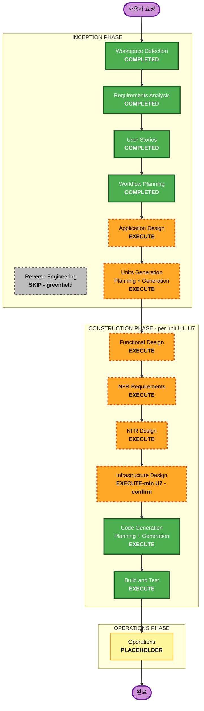

# 실행 계획 (Execution Plan) — okc-hooks "Watcher"

**단계**: INCEPTION → Workflow Planning
**작성일**: 2026-09-07
**프로젝트 유형**: Greenfield (신규)
**상태**: 아래 계획을 검토하시고 승인해 주시면 다음 단계(Application Design)로 진행합니다. **승인 전에는 진행하지 않습니다.**

> 이 계획은 승인된 requirements.md(FR-01..23, NFR-01..17, RISK-01/02, DEP-01..07)와 stories.md(44개 INVEST 스토리 / 7개 에픽) + personas.md(P1/P2)를 근거로, 병렬 분석 4건 + 완전성 검증 크리틱 1건을 거쳐 종합했습니다. 크리틱 지적(자격증명 저장 표현·Infrastructure Design 경계 판단·MVP 범위)은 이 문서에 모두 반영했습니다.

---

## 1. 상세 분석 요약

### 1.1 변경 범위 (Transformation Scope)
- **유형**: 신규(greenfield) 단일 배포 컴포넌트(RESILIENCY-01) — nginx 방식의 GUI 없는 백그라운드 데몬/서비스.
- **주요 특성**: 기존 코드 없음(blast radius 0). 내부적으로는 다중 모듈(결정적 코어 / 파일시스템 감시 어댑터 / 지속 큐 상태 머신 / 업로드 프로토콜 클라이언트 / 인증·동의 / 관측성 / 수명주기·패키징).
- **외부 계약**: okc-core(Rust 라이브러리, `raw_sha256`/`vault_content_id`)를 재사용, 미구축 OKC 웹 서비스는 범위 밖 → DEP-01..07 계약 + Q3 가정 기반 목(mock) 토큰 매치로만 검증.

### 1.2 변경 영향 평가 (Change Impact Assessment)
- **사용자 대면 변경**: 예 — GUI가 없으므로 제어/관측 표면 전체가 신규(편집 가능 config + CLI + 구조화 로그 + 헬스 체크). 트레이(FR-18)는 선택·비의존.
- **구조적 변경**: 예 — 전면 신규 코드베이스(단일 배포 컴포넌트, 내부 다중 모듈).
- **데이터 모델 변경**: 예 — 전부 신규 로컬 지속 상태(온디스크 파일): 지속 큐, 마지막 커밋 매니페스트, append-only 히스토리, 동의 참조, config. `raw_sha256`/`vault_content_id`는 okc-core와 바이트 단위로 일치해야 함(NFR-08/NFR-13).
- **API 변경**: Watcher는 API를 제공하지 않는 클라이언트. CLI 명령 집합이 사실상의 운영자 API. 소비하는 계약 = okc-core 프리미티브 + 미구축 OKC 웹 서비스(DEP-01..07, 목 계약).
- **NFR 영향**: 매우 높음 — 사실상 NFR 주도형 빌드(무손실 NFR-03, 백오프/오프라인 NFR-04, 자동 업데이트/롤백 NFR-16, 관측성 NFR-15, 이식성 NFR-05, 성능/스케일 NFR-02, PBT NFR-08..14).

### 1.3 리스크 평가 (Risk Assessment)
- **리스크 수준**: **High**
- **롤백 복잡도**: Moderate (개발물 자체는 폐기 가능하나, 배포된 데몬의 업로드 행위는 비가역 + OS 서비스/자동 업데이트 수명주기의 전용 정리 필요 US-E6-04/FR-20)
- **테스트 복잡도**: Complex (PBT 11개 스토리 + 상태 기반 큐 모델 PBT-06 + 크래시 주입/오프라인/이벤트 드롭 RESILIENCY-14 + 3-OS 매트릭스 + 바이트 단위 재개 검증 + okc-core 해시 동등성 + 서버 통합은 서버 구축 전까지 검증 불가)

**핵심 리스크(설계 시 대응 대상)**:
1. **무손실 지속 큐 실패**(NFR-03/FR-03) — 비원자적 쓰기·중간 크래시 시 큐/커밋 변경 유실. 임의 지점 크래시 주입으로 검증 필요.
2. **파괴적 빈 커밋**(FR-09/US-E1-06) — 볼트 루트 언마운트/삭제/이동 시 0-파일 매니페스트가 "전부 삭제"로 diff되어 서버 콘텐츠를 비가역적으로 삭제. 부분 가용 케이스까지 커버하는 가드 필요.
3. **RISK-01 원시 볼트 유출** — Security Baseline OFF + 민감정보 사전검사 없음(FR-15) + 상시 동의(FR-14) + 자동 동기화 → 전체 볼트(비밀/PII)가 연속·비가역 전송. 로컬 평문 산출물(큐/매니페스트/히스토리/로그 **및 config/env 토큰**)에도 경로·비밀 노출.
4. **서버 계약 divergence** — DEP-01..07 전부 blocked-on-server, 목 계약(토큰 매치)으로만 검증. 실제 인증/동의 강제/엔드포인트/에러코드/백프레셔/머터리얼라이즈 의미가 다를 수 있음.
5. **자동 업데이트/롤백 정확성**(FR-20/NFR-16) — 헬스 체크·롤백 경로까지 깨는 나쁜 업데이트가 무인 데몬을 조용히 중단시킬 위험, 3개 서비스 관리자에 걸친 롤백 루프 방지.
6. **크로스플랫폼 이벤트 손실**(FR-01/FR-04) — FSEvents coalescing, inotify overflow, ReadDirectoryChangesW 버퍼 오버플로, 네트워크 마운트 무이벤트. 백스톱은 T_recon 주기 재조정뿐.
7. **재개 전송/TOCTOU 정확성**(FR-08/FR-22, US-E7-03) — 바이트 단위 청크 재조립·일관 스냅샷 해시 일치.
8. **okc-core 콘텐츠 주소 불일치**(FR-02/NFR-08) — `raw_sha256`/`vault_content_id` 정확 재현. NFR-17(Rust 코어) 가정에 의존.
9. **RISK-02 재승인 thrash** — 상시 동의 + 이벤트 자동 업로드가 매 신규 `vault_content_id`마다 서버 승인계획 무효화(주로 서버측 DEP-07 완화).
10. **MVP 범위 미확정**(오픈) — 아래 §5에서 확정.

---

## 2. 워크플로 시각화

### 2.1 Mermaid 다이어그램



### 2.2 텍스트 대안 (항상 포함)

```
🔵 INCEPTION PHASE
- Workspace Detection ....... COMPLETED
- Reverse Engineering ....... SKIP (greenfield)
- Requirements Analysis ..... COMPLETED
- User Stories .............. COMPLETED
- Workflow Planning ......... COMPLETED (현재)
- Application Design ........ EXECUTE (comprehensive)
- Units Generation .......... EXECUTE (standard) → 단위 U1..U7

🟢 CONSTRUCTION PHASE (단위 U1..U7마다 반복)
- Functional Design ......... EXECUTE (comprehensive)
- NFR Requirements .......... EXECUTE (comprehensive)
- NFR Design ................ EXECUTE (comprehensive)
- Infrastructure Design ..... EXECUTE-minimal (U7만) *경계 판단 — 사용자 확인 요청*
- Code Generation ........... EXECUTE (always)
- Build and Test ............ EXECUTE (always, 전 단위 완료 후)

🟡 OPERATIONS PHASE
- Operations ................ PLACEHOLDER
```

---

## 3. 실행/생략 단계 (Phases)

### 🔵 INCEPTION PHASE
- [x] Workspace Detection — COMPLETED
- [x] Reverse Engineering — SKIP
  - **근거**: Greenfield. okc-core는 이 워크스페이스의 코드가 아닌 외부 참조 라이브러리 → 역공학 불필요.
- [x] Requirements Analysis — COMPLETED (2026-09-07 승인)
- [x] User Stories — COMPLETED (2026-09-07 승인, 44 스토리 / P1·P2)
- [x] Workflow Planning — IN PROGRESS (이 문서)
- [ ] **Application Design — EXECUTE (comprehensive)**
  - **근거**: 신규 코드베이스, 약 14개 신규 컴포넌트·인터페이스·서비스 계층 오케스트레이션·의존성 정의 필요. 두 아키텍처 결정을 여기서 확정: (a) Rust 결정적 코어 vs 크로스플랫폼 셸 분리(NFR-17, okc-core 프리미티브 재사용), (b) 미구축 서버에 대한 가정 기반 목 계약 인터페이스(DEP-01..07, Q3). 이 경계가 Units Generation과 모든 per-unit Construction을 좌우하므로 comprehensive.
- [ ] **Units Generation — EXECUTE (standard)**
  - **근거**: 44 스토리 / 7 에픽은 per-unit Construction 루프를 위해 분해 필요. 단, RESILIENCY-01(단일 배포 컴포넌트)이므로 단위는 **하나의 바이너리 내부 논리 모듈**이지 독립 배포 서비스가 아님 → 팀 소유권/바운디드 컨텍스트 심층 분석은 과설계. 표준 depth로 3개 산출물 + 코드 조직 전략이면 충분. (§4의 U1..U7 분해)

### 🟢 CONSTRUCTION PHASE (단위별)
- [ ] **Functional Design — EXECUTE (comprehensive)**
  - **근거**: 신규 데이터 모델(매니페스트/큐/히스토리/동의/config), 복잡 로직(콘텐츠 주소·have/want·재개 청크 상태머신·coalescing·재조정 diff·백오프·일관 스냅샷), 비즈니스 규칙(빈 볼트 가드·단일 인스턴스·동의 게이트·상태 집합). PBT-01 최종 속성·제너레이터 및 PBT-06 큐 모델을 여기서 확정. 무손실(NFR-03) 큐 의미론 때문에 comprehensive.
- [ ] **NFR Requirements — EXECUTE (comprehensive)**
  - **근거**: 기술 스택 결정이 미해결·load-bearing (NFR-17 Rust 코어 확정 = US-E7-10, PBT-09 프레임워크 proptest 선택이 여기에 의존). 성능/스케일(NFR-01/02), 신뢰성(NFR-03/04), 이식성(NFR-05), 최소 보안(NFR-06 TLS). 시스템 전역 1회 패스(단위마다 재도출 아님).
- [ ] **NFR Design — EXECUTE (comprehensive)**
  - **근거**: NFR Requirements 실행 → 자동 실행. 가장 어려운 설계가 여기 집중: 무손실 원자적 쓰기(temp+rename/WAL, 부분쓰기 롤백), 백오프 스케줄(401 제외), 스트리밍 해시 메모리 바운딩, 업데이트 게이팅 헬스 체크. RESILIENCY-14 회복탄력성 테스트 전략(크래시 주입/오프라인/재개/이벤트 드롭) 확정.
- [ ] **Infrastructure Design — EXECUTE-minimal (U7만) ⚠️ 경계 판단 · 사용자 확인 요청**
  - **근거(EXECUTE-min 권장)**: 3개 트리거 중 2개(인프라 서비스 매핑·클라우드 리소스)는 명백히 부재 — Watcher는 클라우드 인프라를 프로비저닝하지 않고 서버는 범위 밖. 그러나 "배포 아키텍처 필요" 트리거는 실재: launchd/systemd/Windows Service 3종 패키징 + 부팅/로그인 자동시작(FR-21, US-E6-01), 헬스 체크 기반 자동 업데이트 + 자동 롤백 아티팩트 레이아웃(FR-20/NFR-16/RESILIENCY-04), 제거/폐기 정리(US-E6-04). 이 per-OS 매트릭스를 한 곳에 모으면 RESILIENCY-04가 명시적 홈을 얻고 Code Generation이 임기응변으로 흩어지는 것을 방지. **클라우드 토폴로지 0** → depth는 minimal, U1–U6은 N/A.
  - **대안(SKIP)**: E6 스토리가 이미 기능적 데몬 동작으로 서술됨(`watcher install`이 서비스 등록, 헬스 체크가 롤백 트리거, `uninstall`이 정리) → "인프라 변경 없음"으로 보고 SKIP + Functional Design/Code Generation에 흡수도 타당. 이 경우 **자동 업데이트/롤백(FR-20/NFR-16/RESILIENCY-04)은 U7 Functional Design에 전용 설계 섹션으로 반드시 명시**해야 유실 방지.
  - **기본 권장**: EXECUTE-minimal(U7 한정). §6-A에서 사용자 확인.
- [ ] **Code Generation — EXECUTE (ALWAYS)**
  - **근거**: 각 단위 구현·테스트 생성. PBT 속성 테스트(PBT-10) + 도메인 제너레이터(PBT-07) + shrinking/seed(PBT-08) 포함.
- [ ] **Build and Test — EXECUTE (ALWAYS)**
  - **근거**: 전 단위 완료 후 빌드/단위/통합 테스트. RESILIENCY-14 회복탄력성 테스트 + PBT CI(seed 로깅) + NFR-03 무손실 검증 통합.

### 🟡 OPERATIONS PHASE
- [ ] Operations — PLACEHOLDER (향후 배포/모니터링)

---

## 4. 단위 분해 (Units Generation 대상 — U1..U7)

**원칙**: 단일 배포 바이너리(RESILIENCY-01) 내부의 **논리 모듈**. 44개 스토리가 각 단위에 정확히 1회씩 매핑(검증됨: 8+5+8+8+6+5+4 = 44, 누락·중복 0). 결정적 코어(U1)를 E1/E2에서 분리해 공유 프리미티브 + stateless PBT 속성을 한 라이브러리로 응집. E7(회복탄력성·PBT)은 **독립 단위가 아니라** 검증 대상 코드를 소유한 단위로 접힘(PBT-ON per-unit 모델).

| 단위 | 이름 | 커버 에픽 | 스토리 | 핵심 |
|---|---|---|---|---|
| **U1** | Deterministic Content Core | E1,E2,E7 | US-E1-02, US-E2-01, US-E2-02, US-E7-01, US-E7-05, US-E7-06, US-E7-07, US-E7-10 | 순수 Rust 결정적 코어(해싱/매니페스트/스냅샷/diff/SafetyLimits/직렬화) + stateless PBT 4종 + 기술스택 확정(NFR-17). **선행 단위.** |
| **U2** | Change Detection & Trigger | E1 | US-E1-01, US-E1-03, US-E1-04, US-E1-05, US-E1-06 | 감시/디바운스 트리거, 시작·주기 재조정, 단일 인스턴스 락, 빈 볼트 가드. |
| **U3** | Upload Protocol Client | E2,E7 | US-E2-03, US-E2-04, US-E2-05, US-E2-06, US-E2-07, US-E2-08, US-E7-02, US-E7-03 | have/want, 재개 청크 전송, 커밋, 멱등, 진행률, 런타임 한도 + 프로토콜 PBT 2종. |
| **U4** | Resilience, Queue & Retry | E3,E7 | US-E3-01, US-E3-02, US-E3-03, US-E3-04, US-E7-04, US-E7-08, US-E7-09, US-E7-11 | 무손실 지속 큐 상태머신, coalescing, 백오프, 오프라인 drain + 큐/크래시 PBT + RESILIENCY-14 전략. |
| **U5** | Auth & Consent | E4 | US-E4-01, US-E4-02, US-E4-03, US-E4-04, US-E4-05, US-E4-06 | config 토큰 인증(TLS), 선택적 secure-store, 인증실패 복구, RISK-01 고지·상시 동의·조회/철회. **P2 주담당 스토리 소재지.** |
| **U6** | Observability | E5 | US-E5-01, US-E5-02, US-E5-03, US-E5-04, US-E5-05 | 구조화 로그(주 표면), CLI status + 헬스 체크, append-only 히스토리, 중대오류 표면화, 선택적 트레이. |
| **U7** | Lifecycle, Service Packaging & CLI | E6 | US-E6-01, US-E6-02, US-E6-03, US-E6-04 | OS 서비스 설치·자동시작, 자동 업데이트+롤백, 실행상태 제어, 제거 정리. **Infrastructure Design 대상 단위.** |

**권장 Construction 시퀀스(의존성 기반)**: **U1 → U4 → U5 → U2 → U3 → U6 → U7**
- U1(코어+기술스택) → U4(큐=재시도 매체) → U5(인증 게이트) → U2(감시, U4에 적재) → U3(업로드, U1/U4/U5 의존) → U6(관측, 전체 상태 표면) → U7(패키징/셸, 전 단위 호스팅).

---

## 5. MVP 최소 골격 (확정)

stories.md 오픈 항목 #3 및 리스크 #10 해소. 자동 동기화가 실제로 동작하려면 전송 스켈레톤(FR-01/06/07/08/03)만으로는 부족하고 **전제 조건(매니페스트 FR-02, 일관 스냅샷 FR-22, 토큰 인증 FR-13)** 이 필요. 이에 다음을 **명시적 MVP 정의**로 채택:

| 단위 | MVP 스토리 | 역할 |
|---|---|---|
| U1 | US-E1-02(매니페스트+diff), US-E2-01(일관 스냅샷) | 변경 감지의 전제 |
| U2 | US-E1-01(감시+디바운스 트리거) | 자동 트리거 |
| U4 | US-E3-01(무손실 지속 큐) | 손실 없는 대기 |
| U5 | US-E4-01(config 토큰 인증) | 업로드 인증 전제 |
| U3 | US-E2-03(have/want), US-E2-04(재개 전송), US-E2-05(커밋) | 실제 업로드 |

> 전체 MoSCoW 우선순위는 각 단위 착수 시점에 확정. 이 표는 "최초 end-to-end 동작"을 위한 최소 세트.

---

## 6. 확인이 필요한 결정 항목 (승인 게이트에서)

### 6-A. Infrastructure Design 실행 여부 (경계 판단)
- **옵션 1 (권장)**: EXECUTE-minimal, U7 한정 — launchd/systemd/Windows Service 패키징 + 자동시작 + 자동 업데이트/롤백 + 제거를 한 곳에서 설계(RESILIENCY-04 명시적 홈).
- **옵션 2**: SKIP — Functional Design/Code Generation에 흡수(단, FR-20/NFR-16 자동 업데이트/롤백은 U7 Functional Design 전용 섹션으로 명시).

### 6-B. 자격증명 저장 posture (크리틱 지적 반영 — 이 계획의 확정 표현)
- Security Baseline OFF에서 잔존 보안 통제 = **TLS(NFR-06) + config/env 를 1차(primary) 토큰 저장(keyring-less, 평문)**, **OS secure-store는 선택적 강화(US-E4-02, confirm-or-drop)**. 데몬 모델과 일치(US-E4-01/02). "OS secure-store가 유일 통제"라는 표현은 폐기.
- **RISK-01 로컬 평문 산출물 목록에 config/env 토큰 포함**(US-E6-04 정리 대상): 큐/매니페스트/히스토리/로그 **+ config 토큰**.

### 6-C. 하위 단계로 이월되는 confirm-or-drop 항목 (유실 방지 스케줄)
- FR-18 트레이 아이콘 = OPTIONAL (US-E5-05, U6 Functional Design에서 확인)
- US-E4-02 OS secure-store 강화 (U5 Functional Design)
- FR-21 로그인/부팅 자동시작 (Application/Infrastructure Design에서 확인)
- RESILIENCY-03 변경관리 면제 (단일 사용자 데스크톱 도구로 확정 — NFR Requirements에서 재확인)
- NFR-17 Rust 코어 확정 → PBT-09 proptest 잠금 **전에** NFR Requirements에서 확정(비-Rust 결정 시 프레임워크 재선택).

---

## 7. 확장(Extensions) 컴플라이언스 매핑

| 확장 | 활성 | 적용 단계 | 요지 |
|---|---|---|---|
| **Security Baseline** | **OFF** | (없음) | 규칙 미로딩·미강제. RISK-01/RISK-02는 문서화된 수용 리스크(비강제). 잔존 통제는 일반 요구사항(TLS NFR-06, config 토큰 §6-B). |
| **Resiliency Baseline** | **ON** (blocking) | 전 단계 | 단일 컴포넌트/criticality High; 크래시·오프라인·재시도 설계; 무손실(NFR-03); 자동 업데이트/롤백(RESILIENCY-04); 로깅(05)/헬스(06); 타임아웃/백오프(10); 회복탄력성 테스트(14). **N/A(스코핑, 비차단)**: 클라우드 전용 RESILIENCY-07/08/09/11/12/13 + RTO/SLA(단일 사용자 로컬 데몬). |
| **Property-Based Testing** | **ON (Full)** (blocking) | Functional Design, NFR Requirements, Code Generation, Build and Test | PBT-01 속성 명세(NFR-08..14) + PBT-06 상태 기반 큐; PBT-09 프레임워크(proptest, NFR-17 의존); PBT-07 도메인 제너레이터; PBT-08 shrinking/seed/CI; PBT-10 회귀 예시. Application Design/Units Generation/NFR Design/Infrastructure Design에는 비적용. |

> 각 단계 완료 메시지에 활성 확장의 컴플라이언스 요약(compliant/non-compliant/N/A + 근거)을 포함. 활성 확장의 적용 규칙 위반은 차단 사유.

---

## 8. 성공 기준 (Success Criteria)

- **주 목표**: Obsidian 볼트 변경을 사람 개입 없이 무손실로 OKC 서버에 자동 동기화하는, nginx 방식의 크로스플랫폼 GUI 없는 데몬.
- **핵심 산출물**: U1..U7 단위 설계 + 코드, 무손실 지속 큐, 재개 가능 업로드 프로토콜(목 계약), 인증·동의, 관측성(로그/CLI status/헬스), OS 서비스 패키징/자동업데이트/롤백, PBT 스위트 + 회복탄력성 테스트.
- **품질 게이트**: 모든 활성 확장 규칙 준수(Resiliency/PBT), NFR-03 무손실 검증, okc-core 해시 동등성, 3-OS 빌드/테스트 통과, MVP end-to-end 동작(목 서버).

## 9. 예상 규모 (Estimated Timeline)

- **실행 단계 수**: INCEPTION 잔여 2개(Application Design, Units Generation) + CONSTRUCTION 단위별 최대 5개 × 7단위 + Build and Test 1개.
- **범위 특성**: 단일 개발 세션이 아니라 단위별 반복 진행. 각 단위는 설계→코드까지 완결 후 다음 단위로.

---

## 부록 A. 분석 출처

- 병렬 분석 4건(INCEPTION 단계 / CONSTRUCTION 단계 / 리스크 / 확장) + 완전성·일관성 크리틱 1건 (workflow wf_aef95535-4c6, 5/5 에이전트, 오류 0).
- 크리틱 판정: **CONCERNS** — 3개 수정 항목(자격증명 표현 §6-B, Infrastructure Design 경계 §6-A, MVP 확정 §5) 모두 본 계획에 반영. 단위 커버리지 검증 통과(44/44, 누락·중복 0).
