# Execution Plan

**Status**: Workflow Planning output (autopilot). Based on approved [`../requirements/requirements.md`](../requirements/requirements.md), [`../user-stories/stories.md`](../user-stories/stories.md), [`../user-stories/personas.md`](../user-stories/personas.md). Decisions favor recommended options within MVP scope; anything beyond the first Unit is deferred, not planned.

## Detailed Analysis Summary

### Transformation Scope (Brownfield note)
- **Transformation Type**: New single-component product (one local stdio MCP server). Brownfield *workspace* only — existing `src/`/`tests/` are **unapproved drafts** and are NOT used to infer or fix scope (per the product gate).
- **Primary Changes**: Build the first-Unit MCP (single Vault, filesystem-direct, in-note authoring/update/heuristic-audit) per REQ-001..013.
- **Related Components**: none external — no cloud infra, no other modules. (Root umbrella `aidlc-docs/` is out of scope for this module request.)

### Change Impact Assessment
- **User-facing changes**: Yes — installer/author/reviewer tool surface (21 stories).
- **Structural changes**: Yes (new) — components: MCP server/tool registry, Vault path-safety boundary, frontmatter/YAML partial-update engine, content-hash module, external backup manager, heuristic audit engine, config/diagnostics.
- **Data model changes**: Yes — note model, frontmatter schema (title/aliases/tags + unknown-key preservation), tool I/O schemas, audit-issue model, backup naming.
- **API changes**: Yes — the MCP tool contract (create/read/update/partial-frontmatter/list/search/audit/config/diagnostics). No network API.
- **NFR impact**: Yes — security/trust boundary (REQ-008/011), data protection (REQ-004, single external backup, manual recovery), correctness (partial-update preservation, hashing), partial property-based testing.

### Risk Assessment
- **Risk Level**: **Medium** — safety-critical because it mutates real user files, but isolated, single local process, single Vault, no network, no shared infra.
- **Rollback Complexity**: Easy–Moderate — git for tool code; user data protected by pre-change external backups + hash-guarded writes.
- **Testing Complexity**: Moderate — pure-function/serialization property tests + path-safety and conflict/backup behavior tests; real OKC ingestion tests deferred (D6).

## Workflow Visualization

### Mermaid Diagram

```mermaid
flowchart TD
    Start(["User Request"])

    subgraph INCEPTION["🔵 INCEPTION PHASE"]
        WD["Workspace Detection<br/><b>COMPLETED</b>"]
        RE["Reverse Engineering<br/><b>SKIPPED</b>"]
        RA["Requirements Analysis<br/><b>COMPLETED</b>"]
        US["User Stories<br/><b>COMPLETED</b>"]
        WP["Workflow Planning<br/><b>COMPLETED</b>"]
        AD["Application Design<br/><b>EXECUTE</b>"]
        UG["Units Generation<br/><b>SKIP</b>"]
    end

    subgraph CONSTRUCTION["🟢 CONSTRUCTION PHASE"]
        FD["Functional Design<br/><b>EXECUTE</b>"]
        NFRA["NFR Requirements<br/><b>EXECUTE</b>"]
        NFRD["NFR Design<br/><b>EXECUTE</b>"]
        ID["Infrastructure Design<br/><b>SKIP</b>"]
        CG["Code Generation<br/>(Planning + Generation)<br/><b>EXECUTE - GATED</b>"]
        BT["Build and Test<br/><b>EXECUTE</b>"]
    end

    subgraph OPERATIONS["🟡 OPERATIONS PHASE"]
        OPS["Operations<br/><b>PLACEHOLDER</b>"]
    end

    Start --> WD
    WD --> RE
    RE --> RA
    RA --> US
    US --> WP
    WP --> AD
    AD --> UG
    UG --> FD
    FD --> NFRA
    NFRA --> NFRD
    NFRD --> ID
    ID --> CG
    CG --> BT
    BT --> OPS
    OPS --> End(["Complete"])

    style WD fill:#4CAF50,stroke:#1B5E20,stroke-width:3px,color:#fff
    style RA fill:#4CAF50,stroke:#1B5E20,stroke-width:3px,color:#fff
    style US fill:#4CAF50,stroke:#1B5E20,stroke-width:3px,color:#fff
    style WP fill:#4CAF50,stroke:#1B5E20,stroke-width:3px,color:#fff
    style CG fill:#4CAF50,stroke:#1B5E20,stroke-width:3px,color:#fff
    style BT fill:#4CAF50,stroke:#1B5E20,stroke-width:3px,color:#fff
    style AD fill:#FFA726,stroke:#E65100,stroke-width:3px,stroke-dasharray: 5 5,color:#000
    style FD fill:#FFA726,stroke:#E65100,stroke-width:3px,stroke-dasharray: 5 5,color:#000
    style NFRA fill:#FFA726,stroke:#E65100,stroke-width:3px,stroke-dasharray: 5 5,color:#000
    style NFRD fill:#FFA726,stroke:#E65100,stroke-width:3px,stroke-dasharray: 5 5,color:#000
    style RE fill:#BDBDBD,stroke:#424242,stroke-width:2px,stroke-dasharray: 5 5,color:#000
    style UG fill:#BDBDBD,stroke:#424242,stroke-width:2px,stroke-dasharray: 5 5,color:#000
    style ID fill:#BDBDBD,stroke:#424242,stroke-width:2px,stroke-dasharray: 5 5,color:#000
    style OPS fill:#FFF59D,stroke:#F57F17,stroke-width:2px,color:#000
    style Start fill:#CE93D8,stroke:#6A1B9A,stroke-width:3px,color:#000
    style End fill:#CE93D8,stroke:#6A1B9A,stroke-width:3px,color:#000
    linkStyle default stroke:#333,stroke-width:2px
```



### Text Alternative (authoritative if Mermaid fails)

```
🔵 INCEPTION
  Workspace Detection ....... COMPLETED
  Reverse Engineering ....... SKIPPED (src/ is an unapproved draft; scope must not be reverse-derived)
  Requirements Analysis ..... COMPLETED (approved)
  User Stories .............. COMPLETED (autopilot-approved; 21 stories, 6 stubs)
  Workflow Planning ......... COMPLETED (this document)
  Application Design ........ EXECUTE (standard depth)
  Units Generation .......... SKIP (single cohesive first Unit)

🟢 CONSTRUCTION  (single unit: "okc-mcp-first-unit")
  Functional Design ......... EXECUTE (standard depth)
  NFR Requirements .......... EXECUTE (minimal depth)
  NFR Design ................ EXECUTE (standard depth; resolves deferred resiliency Qs — mostly N/A)
  Infrastructure Design ..... SKIP (no cloud/deploy infra; local tarball + stdio only)
  Code Generation ........... EXECUTE (ALWAYS) — ⚠ GATED by the product/Construction gate (explicit approval before writing real src/)
  Build and Test ............ EXECUTE (ALWAYS)

🟡 OPERATIONS
  Operations ................ PLACEHOLDER
```

## Phases to Execute

### 🔵 INCEPTION PHASE
- [x] Workspace Detection (COMPLETED)
- [x] Reverse Engineering (SKIPPED)
- [x] Requirements Analysis (COMPLETED)
- [x] User Stories (COMPLETED)
- [x] Workflow Planning (IN PROGRESS → COMPLETING)
- [ ] Application Design — **EXECUTE** (standard)
  - **Rationale**: New components with real business rules (path-safety boundary, conflict-aware partial updates, structure preservation, external backup, heuristic audit). Defining component/method boundaries and rules before coding is where correctness lives. Kept MVP: only first-Unit components.
- [ ] Units Generation — **SKIP**
  - **Rationale**: The first Unit is a single cohesive deliverable (one MCP server). No multi-service/module decomposition is needed now; follow-up Units are already identified and deferred in requirements §7. Avoids over-decomposition (MVP).

### 🟢 CONSTRUCTION PHASE (single unit: `okc-mcp-first-unit`)
- [ ] Functional Design — **EXECUTE** (standard)
  - **Rationale**: New data models/schemas and complex, safety-critical business logic (frontmatter partial-merge preserving unknown keys/comments, malformed-YAML rejection, content hashing, conflict rejection, backup semantics, audit issue model, tool I/O contracts).
- [ ] NFR Requirements — **EXECUTE** (minimal)
  - **Rationale**: NFRs already enumerated in requirements §5 (security/trust boundary, data protection, correctness, PBT-partial). This stage consolidates them per-unit; no tech-stack selection needed (Node/TS fixed).
- [ ] NFR Design — **EXECUTE** (standard)
  - **Rationale**: Enabled resiliency extension defers RESILIENCY-04/08/14/15 to design; most are N/A for a local single-process tool but must be explicitly recorded. Also designs the core NFR patterns: path-safety enforcement, atomic write + single external backup, hash-guarded writes, YAML-preserving partial update, resource bounds.
- [ ] Infrastructure Design — **SKIP**
  - **Rationale**: No cloud resources, no deployment architecture, no networking. Installation is a local npm tarball + stdio; release governance is lightweight (D13) and handled in Build and Test.
- [ ] Code Generation — **EXECUTE (ALWAYS)** — ⚠ **GATED**
  - **Rationale**: Implementation of the first Unit. **The standing product/Construction gate requires explicit user approval before any real `src/` code is written or modified.** Autopilot proceeds through all preceding design (documentation) stages; it does NOT auto-pass this gate.
- [ ] Build and Test — **EXECUTE (ALWAYS)**
  - **Rationale**: Build + unit/property tests + path-safety/conflict/backup behavior tests. Real OKC ingestion tests deferred (D6). Integration tests scoped to the single unit's internal components.

### 🟡 OPERATIONS PHASE
- [ ] Operations — PLACEHOLDER

## Units (Units Generation skipped)
Single unit for the Construction per-unit loop:
- **`okc-mcp-first-unit`** — the entire first-Unit MCP (single Vault; installer/author/reviewer journeys; REQ-001..011, REQ-013; SC1..SC5). Follow-up Units (file reorg, multi-Vault, real OKC ingestion, perf/OS validation, distribution) are out of scope for this Unit.

## Autopilot & Gate Policy
- Autopilot proceeds through Inception (Application Design) and the Construction **design-documentation** stages (Functional Design, NFR Requirements, NFR Design) without blocking per gate, recording each 2-option completion decision as "Continue" in `audit.md`.
- **Hard stop for explicit approval before Code Generation** (first stage that writes real `src/`). This honors the standing product/Construction gate, which autopilot did NOT lift.
- The user may Request Changes at any stage.

## Estimated Timeline
- **Stages to Execute**: 5 (Application Design, Functional Design, NFR Requirements, NFR Design, Code Generation, Build and Test — 6 counting both ALWAYS construction stages).
- **Stages to Skip**: 2 (Units Generation, Infrastructure Design) + Reverse Engineering (deferred).

## Success Criteria
- **Primary Goal**: A safe, installable first-Unit MCP that lets an existing-Vault author tidy notes in place into clean OKC input, with conflict-aware, backed-up writes and a heuristic audit.
- **Key Deliverables**: Application design, functional/NFR design docs, generated code + tests, build/test instructions.
- **Quality Gates**: MVP scope held (no follow-up scope leaks); REQ-008/011 trust boundary enforced; REQ-004/005 data-safety enforced; property tests for pure/serialization logic.
