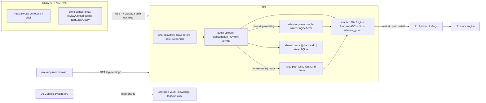

# okc-web — Application Design (Integrated)

**Stage**: INCEPTION / Application Design — Part 2 synthesis · Depth: comprehensive
**System**: okc-web = a Python (FastAPI) + React (Vite) SPA control-plane and serving layer built ON TOP of the okc-core engine (consumed via the `okc` Python bindings, ADR-0002). Single long-lived process (uvicorn, one worker), single SQLite state file, single-writer engine queue.
**Grounding**: okc Python bindings verified at `okc-core/bindings/python/okc/__init__.pyi` (INTEROP_SCHEMA_VERSION=2); okc-core config at `crates/okc-core/src/config.rs` (max_sources=10, follow_symlinks=false, max_archive_expansion_ratio=100). UI frozen by `ui-screens.md` + `design-system.md` — **API-wiring contract only, no UI redesign**.

This document integrates the five design decisions the brief requires: (1) ADR-0002 adapter boundary; (2) RBAC-before-core; (3) single engine process + in-process single-writer queue with PROJECT_BUSY; (4) Case-B `CuratorDecision`→core mapping with winner-select ABSENT; (5) hash-bound staleness-cascade ownership; plus the OkcError→HTTP mapping, the SQLite state model, the E4-3/E5-2 focal data contracts, the screen→story matrix (C1), and the epic-aligned module map (C6).

---

## 1. Topology overview



### Text alternative
The React + Vite SPA frontend (a single client tree with React Router v6 routes; data via TanStack Query) calls a single FastAPI process (uvicorn, one worker) over REST+JSON using three auth contexts (admin cookie, upload bearer token, read-only serving). Inside FastAPI, `shared.authz` enforces RBAC via `Depends(...)` dependencies before any handler runs; handlers live in five modules (auth, upload, orchestration, review, serving). All engine access goes through the `adapter` module (the `OkcEngine` Protocol/ABC + DTOs + schema guard). Reserving/mutating ops route through the single-writer `EngineActor` queue; non-reserving reads use a read-path second `OkcClient`. Only `adapter` imports the `okc` Python bindings (`okc-compiler`, maturin path install), which wrap okc-core. `shared` provides the error mapping, job store, curator audit, and the SQLite state file. U5's CompiledVaultStore reads the immutable 3-root compiled vault directly from disk. okc-mcp consumes the read-only `/api/serving/*` API.

---

## 2. ADR-0002 adapter boundary (OkcEngine Protocol/ABC + typed-DTO schema-v2 guard)

- **One Protocol/ABC, one impl.** `adapter.OkcEngine` is the sole abstract seam; `OkcEngineImpl` is the only class that names `okc.*` types. No new okc-core public API is added — okc-web consumes the existing surface only.
- **Typed DTOs mirror binding schema v2.** `adapter.dto` defines okc-web-owned `*View`/`*Cmd`/`*Spec` Pydantic models and `from_native(dict)`/`model_validate` conversions. Downstream units decouple from binding churn behind this one version boundary.
- **Single schema-version guard.** `SchemaGuard` asserts `okc.INTEROP_SCHEMA_VERSION == 2` once at client init and again at every DTO decode; a mismatch yields `EngineError(code="SchemaUnsupported")` (never a silent mis-decode).
- **Error boundary (corrected).** Every `okc.OkcError` is converted to the okc-web-owned `EngineError(code, category, retryable, retry_after_ms, message)` **inside `adapter`**. U1–U6 signatures use `EngineError` (or their own `AuthError`/`UploadError`/`StateError`) — no binding type crosses the boundary.
- **Corrected Protocol surface** (verifier #1/#2/#5): added `preflight` and `status` (`status` returns `StatusView(checkpoint, integration)` from the single reserving `status()` call); split lifecycle into `create_project` + `open_project` to mirror the bindings.
- **API mapping (verified, no ADR-0002 breach):** `verify`→`verify_artifact`, `explain`→`explain_artifact` (non-mutating); `compile` internally uses `IntegrationService::compile_latest` (hidden okc-core path); `checkpoint` is not a standalone binding method — it is derived from `Project.status()` and packed into `StatusView`.

---

## 3. RBAC-before-core placement (C-1)

okc-core has no auth/RBAC; `curator_id` is an unverified label. Therefore okc-web owns all authz, enforced BEFORE any core call.
- `shared.authz` `Depends(...)` dependencies run first for every protected route. **Invariant (testable):** a 403/401 guarantees zero `OkcEngine` methods executed — okc-core was never touched (a 401/403 raised in a dependency ⇒ the handler body never runs).
- **Roles (corrected):** `Role.{Admin, Contributor}` (`enum.Enum`) only. "Curator" is the capacity in which an admin acts, recorded as the unverified `curator_id` label (FR-AUTH-4). Upload is a capability, modeled as `Principal.UploadToken(UploadContext)`, not a role. `viewer` is deferred (FR-AUTH-2).
- **Principals:** `Principal.Admin(account_id, session_id_hash, curator_label)` (session, cookie); `Principal.UploadToken(UploadContext(token_id, project_id, slot_index, owner_display_name, owner_kind))` (bearer, `/u/{token}/*`).
- **Domain gate on top of RBAC:** U4's `DecisionGate` runs the Major/Critical check in okc-web and returns 422 APPROVAL_REQUIRED before any `approve_cluster` engine call (see §5).
- **Contributor has no app shell** (E1-2 canonical): only `/u/{token}` is reachable without an admin session; contributor direct-hits on `/projects/*`/`/settings/*` → 403 (E1-4).

---

## 4. Single engine process + in-process single-writer queue (Q6 / NFR-CONC-1) + PROJECT_BUSY

- **One `OkcClient` in the process**, owned exclusively by a dedicated single worker thread (`EngineActor` = a `ThreadPoolExecutor(max_workers=1)`). Async handlers submit an `EngineCommand` and `await` the reply via `loop.run_in_executor(engine_pool, ...)`. The worker processes exactly one reserving/mutating command at a time, driving each `okc.Job` to terminal (pumping `.events()` into `JobStore`, then reading the blocking `.result()`), before dequeuing the next. This makes okc-web the single writer on top of the bindings' process-global `PROJECT_RESERVATIONS`.
- **Why a dedicated worker thread, not an asyncio task:** `okc.Job.result()` blocks (the native ext releases the GIL); running it on the event loop would starve the runtime, so the sole `OkcClient` lives on a single-worker `ThreadPoolExecutor` bridged via `run_in_executor` (reconciles Q6's "one task owns the handle").
- **Read-path policy (verifier #8):** only reserving/mutating ops go through the queue — `status` (binding `status()` reserves), `add_source`, `replace_sources`, `preflight`, `integrate`, `approve_taxonomy`, `approve_cluster`, `regenerate_cluster`, `compile`. Non-reserving reads (`taxonomy`, `clusters`, `manifest`, `verify`, `explain`) use a read-path second `OkcClient` (its own small executor) and bypass the queue, so serving/read screens never stall behind a multi-minute integrate/compile.
- **PROJECT_BUSY:** the queue makes lock contention rare; residual `ProjectBusy` (genuine cross-process contention) → HTTP 409 with a synthesized `Retry-After`. okc-web branches on the **code**, never on the binding's `retryable` flag (verified inconsistent for reservation-collision `ProjectBusy`).
- **Progress (Q7):** long ops return a `JobId`; clients poll the canonical route (see §7). Live E3-5 progress reads in-flight `okc.Job.events()`/`.state` via the JobStore (non-reserving), not a fresh `status()`.

---

## 5. Case-B CuratorDecision → core mapping (Q8, FR-INT-5) — winner-select ABSENT (C3)

Per Decision Record "경우 B" (ADR-0024/C-2): the admin's "선택" is a **decision (action)**, never picking a winner. The internal model is an explicit discriminated union with **exactly three variants and no winner-select variant** — a code-verifiable structural differentiator confirmed by the verifier in both U0 and U4.

```python
class ApproveTaxonomy(BaseModel):
    kind: Literal["approve_taxonomy"] = "approve_taxonomy"
    edited_clusters: list[ClusterEdit] | None = None
    rationale: Optional[str] = None

class ApproveCluster(BaseModel):
    kind: Literal["approve_cluster"] = "approve_cluster"
    cluster_id: str
    omission_rationales: dict[str, str]   # key "{document_id}:{target_id}" (core omission_key)
    minor_waivers: dict[str, str]         # key = Minor finding_id

class RegenerateCluster(BaseModel):
    kind: Literal["regenerate_cluster"] = "regenerate_cluster"
    cluster_id: str
    feedback: str

# discriminated union, tagged by `kind` — EXACTLY 3 variants.
# NO SelectWinner / ResolveContradiction variant — structurally unrepresentable (C3), deliberately.
CuratorDecision = Annotated[
    Union[ApproveTaxonomy, ApproveCluster, RegenerateCluster],
    Field(discriminator="kind"),
]
```

Mapping (record-then-act: `AuditStore.append` with `HashBindings` BEFORE the op; receipt/`JobId` linked after):
- `ApproveTaxonomy` → `engine.approve_taxonomy(edited_clusters, rationale)` (rationale required iff edited).
- `ApproveCluster` → **`DecisionGate.assert_approvable`** → `engine.approve_cluster(cluster_id, omission_rationales, minor_waivers)`.
- `RegenerateCluster` → `engine.regenerate_cluster(cluster_id, feedback, allow_remote, disclosure_confirmed)` (long AI job).

**DecisionGate necessity (code-verified):** core rejects blocking approvals with `AppError::InvalidProject("major or critical critic findings require regeneration")`, which the `okc` bindings' `map_project_message` maps to the generic `ProjectInvalid`, NOT `ApprovalRequired`. So the clean, deterministic `422 APPROVAL_REQUIRED` must be produced by the okc-web gate — a genuine correctness reason, not style. Contradictions are read-only (both sides preserved); the only path that changes one is a full cluster Regenerate.

---

## 6. Hash-bound staleness-cascade ownership (C-4)

- **okc-core owns authoritative staleness** via hash binding (`corpus_hash → taxonomy_hash → proposal_hash → integration_plan_id`), surfaced as `ApprovalStale` (category Approval) at run/approve/compile time, or as a checkpoint regression from `status()`.
- **okc-web owns only a DERIVED projection** (`U3.StalenessProjection`): it records the source-set/config fingerprint at each approval (in the audit store) and compares it to the current fingerprint after any `add_source`/`replace_sources`/freeze change, to pre-warn in E3-6/E3-4/E4-1/E5-3 banners. okc-web never treats its projection as truth; on any engine `ApprovalStale` it defers to core and marks the affected approvals stale.
- **Serving staleness (E5-S5):** `ServingStateStore.status ∈ {Offline, Live, Stale}` is derived by comparing the bound manifest hashes to U3's current frozen-input hashes; the immutable manifest is still served with a Stale label.

---

## 7. Job-status polling contract (Q7, corrected)

One canonical resource, one `JobSnapshot` shape, backed by `JobStore.get(jobId)`, exposed on two authenticated mount points:
- `GET /api/projects/{id}/jobs/{jobId}` — admin cookie session (E3-5 integrate, E4-2 taxonomy+synthesis, E4-4 regenerate, E5-1 compile).
- `GET /u/{token}/jobs/{jobId}` — bearer token, scoped to the token's project/job (E2-5 add_source registration).

TanStack Query `useJobPolling` refetches until terminal and drains `events[]` into the append-only log. verify/explain are synchronous (non-mutating) and are NOT polled.

---

## 8. OkcError code/category → HTTP mapping (Q9, extended)

Single table-driven module (`shared.error`). **Branch on `code`/`category` ONLY; never parse `message`.** Body: `{code, category, message, retryable, retry_after_ms?}`.

| EngineErrorCode | Category | HTTP | Notes |
|---|---|---|---|
| Unauthenticated (okc-web) | Auth | **401** | session absent/expired (`SESSION_EXPIRED`) |
| Forbidden (okc-web) | Auth | **403** | role insufficient → **core untouched (C-1)**; also `SENSITIVE_REMOTE_FORBIDDEN` |
| PathNotFound / note out-of-root | NotFound | **404** | serving reads, unknown project/route |
| (mutating verb on read-only API) | — | **405** | `/api/serving/*` write attempt |
| ProjectBusy | Concurrency | **409** | +`Retry-After`, retryable **by code** (not binding flag) |
| OutputExists / OutputOverlap | Project | **409** | compile no-clobber collision |
| ApprovalRequired | Approval | **422** | DecisionGate / compile gate |
| ApprovalStale | Approval | **422** | staleness cascade |
| VerificationFailed | Verification | **422** | verify FAIL |
| **ProjectInvalid** | Project | **422** | *added* — Major/Critical fallthrough, "no approved plan", "no complete critic report"; DecisionGate pre-empts the common case |
| **ArtifactSchemaUnsupported** | Schema | **422** | *added* — serving over an incompatible vault schema |
| RemoteConsentRequired | Consent | **422** | disclosure prompt (E3-5) |
| InvalidArgument | Validation | **400** | — |
| PathNotAbsolute / PathUnsafe / **PathUnsupported** | Validation | **400** | `PathUnsupported` *added* |
| ResourceLimit | Limit | **429** | +`Retry-After`, retryable (≤10 backstop / MAX_QUEUED_JOBS) |
| ProviderUnavailable / ProviderError | Provider | **502 / 424** | remote provider fault |
| Cancelled | Lifecycle | **409** | cancel before publish barrier |
| **OutputDurabilityUncertain** | Io | **500** | *added* — treat as server error |
| SchemaUnsupported | Schema | **500** | binding version mismatch at runtime (startup aborts) |
| Internal / **any unmapped code** | — | **500** | *added* safe default — never fall through to a panic |

---

## 9. okc-web SQLite state data model (Q3)

Single WAL file. Owners in parentheses. `hashed@rest` marks secret-at-rest columns.

- **accounts** (U1): `id` PK (`acc_<ulid>`) · `email` UNIQUE · `display_name` · `role` CHECK IN ('admin','contributor') · `password_hash` **hashed@rest** (argon2id PHC) · `status` CHECK IN ('active','disabled') · `created_at`/`updated_at`/`last_login_at`.
- **sessions** (U1): `id_hash` PK **hashed@rest** (SHA-256 of the opaque id; plaintext only in the cookie) · `account_id` FK → accounts · `created_at`/`last_seen_at`/`expires_at`/`revoked_at?` · `user_agent?`/`ip?`. Index on `account_id` (bulk revoke).
- **upload_tokens** (U2): `id` PK (`tok_<ulid>`) · `project_id` FK → projects · `slot_index` · `selector` UNIQUE (public, indexed) · `verifier_hash` **hashed@rest** (argon2id or HMAC-SHA256+pepper+salt) · `verifier_salt?` · `owner_display_name` (decorative, unverified) · `owner_kind` CHECK IN ('department','individual') · `created_by` FK → accounts · `created_at`/`expires_at?`/`revoked_at?`/`last_used_at?` · `registered_source_id?`. Status derived from timestamps. Index on (`project_id`,`revoked_at`).
- **projects** (U3): `id` PK (`proj_<ulid>`) · `name` · `engine_root_abs_path` · `curator_id` (unverified label, C-1) · `created_by` FK → accounts · `source_set_fingerprint?` · `freeze_state` CHECK IN ('unfrozen','frozen') · `frozen_at?` · `created_at`/`updated_at`.
- **sources** (U3-owned, written by U2 at commit — the `SourceRegistry`, resolves verifier #10): `source_id` PK (okc-core SourceId) · `project_id` FK · `document_id?` · `owner_display_name` · `owner_kind` · `content_hash` · `absolute_path` · `slot_index` · `upload_token_id?` FK → upload_tokens · `registered_at`. Read by U5 for provenance owner-label enrichment.
- **jobs** (U0): `id` PK (`job_<ulid>`, the id clients poll — Q7) · `project_id` · `kind` ('add_source','preflight','integrate','approve_taxonomy','approve_cluster','regenerate_cluster','compile') · `state` CHECK mirroring `okc.JobState` · `phase?` (preflight/embedding/candidate/synthesis/critic) · `progress_completed`/`progress_total` · `error_code?`/`error_category?`/`error_retryable?` (mirror EngineError; never message) · `requested_by?` (account or token id) · `created_at`/`updated_at`/`started_at?`/`finished_at?`. Companion **job_events** (U0): `job_id` FK · `sequence` · `phase` · `code` · `ts` — backs the E3-5 append-only live log.
- **curator_decisions** (U0 audit, produced by U4/U3 — append-only): `id` PK · `project_id` · `account_id` FK · `curator_id` (label sent to core) · `decision_kind` CHECK IN ('approve_cluster','regenerate_cluster','approve_taxonomy') — enum-constrained so **no winner-select row is representable** (C3) · `target_ref?` · `proposal_hash?` · **`critic_hash?`** · **`taxonomy_hash?`** (all three `HashBindings`, verifier LOW #2) · `payload_json` (serialized `CuratorDecision`) · `core_op` · `core_job_id?` FK → jobs · `created_at`. No UPDATE/DELETE (convention + optional deny trigger).
- **serving_publications** (U5): `project_id` PK/FK · `compiled_vault_path` (abs) · `bound_integration_plan_id` · `bound_corpus_hash` · `bound_taxonomy_hash` · `status` CHECK IN ('offline','live','stale') · `published_at?` · `published_by?` (curator_id label).

**Hashed-at-rest summary:** passwords (argon2id PHC), upload-token verifiers (argon2id or HMAC-SHA256+pepper+salt via selector/verifier split), session ids (SHA-256 lookup hash). Everything else is operational metadata; `proposal_hash`/content hashes are integrity digests, not secrets.

---

## 10. E4-3 focal backend data contract (real DTOs — E4-3 클러스터 리뷰 워크스페이스)

Composed 1:1 from okc-core `ClusterTaskOutput{proposal: SynthesisProposal, critic: CriticReport}`, enriched with okc-web gate/derived fields. Every field is populated from real engine output (`engine.clusters()` + `engine.taxonomy()`) — no placeholder/mock (C3/C4 mandate).

```python
class ClusterReviewView(BaseModel):
    cluster_id: str
    title: str                                       # TaxonomyCluster.title (joined from taxonomy)
    proposal_hash: str                               # SynthesisProposal.proposal_hash — the hash the decision binds to
    revision: int
    sections: list[SynthesisSectionDto]              # (section_id, heading, markdown_body, evidence[])  -> Synthesis tab
    related_links: list[RelatedLinkDto]              # (kind, target_cluster_id, evidence[])
    omission_candidates: list[OmissionCandidateDto]  # dispositions where kind==OmissionProposed -> Omission tab
    contradictions: list[ContradictionSetDto]        # read-only, no winner -> Contradictions tab
    findings: list[CriticFindingDto]                 # (finding_id, severity(Minor|Major|Critical), kind, message, evidence[])
    gate: GateVerdict                                # derived by DecisionGate: blocking counts + approvable flag
    approval_state: ClusterApprovalState             # Pending|Approved|Regenerating|Stale

class ContradictionClaimDto(BaseModel):  # both sides preserved
    claim_id: str
    rendered_claim: str
    observed_at: Optional[str]
    context: str
    evidence: list[SectionEvidenceDto]

class SectionEvidenceDto(BaseModel):     # provenance for HoverCard
    document_id: str
    block_id: str
    content_hash: str

class OmissionCandidateDto(BaseModel):
    key: str                             # "{document_id}:{target_id}"
    target_kind: str
    content_hash: str
```

---

## 11. E5-2 focal backend data contract (real DTOs — E5-2 Provenance & Verify)

`NoteProvenanceView` fuses non-mutating `explain` + `verify` + owner labels + the immutable `.okc/` contradiction index. Post-compile serving is self-contained (no live U4 dependency).

```python
class NoteProvenanceView(BaseModel):
    note: RelPath
    verify: VerificationView                # engine.verify -> (valid, artifact_path, manifest, per_file: list[VerifyCheckRowDto])
    provenance: ProvenanceView              # engine.explain -> ProvenanceRecord (record_id, kind, output_path, output_hash,
                                            #   integration_plan_id, cluster_id, proposal_hash, critic_hash, approval_hash,
                                            #   evidence: list[SectionEvidence], source_document)
    lineage: LineageGraphDto                # nodes: source-notes -> cluster/synthesis -> compiled note; edges with evidence
    contradictions: list[ContradictionViewDto]  # from .okc/integration-plan.json; both sides, NO winner control
    owner_labels: OwnerLabelMap             # SourceId/DocumentId -> owner_display_name (from U3 SourceRegistry; decorative)
    manifest: ManifestSummaryDto            # CompiledVaultManifest (integration_plan_id, corpus_hash, taxonomy_hash, files[])
    serving_status: ServingStatusDto        # Live/Offline/Stale (E5-S5)
```
`verify` = internal-consistency proof, NOT publisher-authenticity (NFR-DET-1, surfaced as a permanent callout). Provenance is file-granular (not span-level).

---

## 12. Screen → Story-ID matrix (C1 traceability)

All screens from `ui-screens.md` §1, stories from `stories.md`. ★ = focal "wow" screen.

| Screen | Route | Epic | Story IDs | FR | Unit(s) |
|---|---|---|---|---|---|
| E1-1 Login | `/login` | E1 | E1-S1, E1-S5 | FR-AUTH-1,2 · FR-UP-2 | U1 |
| E1-2 App shell / RBAC nav | `/(app)` layout | E1 | E1-S3, E1-S4 | FR-AUTH-3,4,2 | U1 (+U0 authz) |
| E1-3 Users & roles | `/settings/users` | E1 | E1-S2, E1-S1, E1-S4 | FR-AUTH-2,3,4 | U1 |
| E1-4 403 / 401 | `/403` + interceptor | E1 | E1-S3, E1-S1 | FR-AUTH-1,3 | U0 authz + U6 |
| E1-5 My account | `/settings/account` | E1 | E1-S1, E1-S5 | FR-AUTH-1 | U1 |
| E2-1 Token console | `/projects/[id]/tokens` | E2 | E2-S1, E2-S2 | FR-UP-1,4 | U2 |
| E2-2 Issue token dialog | `/projects/[id]/tokens/new` | E2 | E2-S1 | FR-UP-1,2,4 | U2 |
| E2-3 Upload portal | `/u/[token]` | E2 | E2-S3 | FR-UP-2 | U2 |
| E2-4 Upload & validate (mini-polish) | `/u/[token]/upload` | E2 | E2-S3, E2-S4, E2-S5 | FR-UP-2,3,4 | U2 |
| E2-5 Done & registration | `/u/[token]/done` | E2 | E2-S5, E2-S6 | FR-UP-4 | U2 (+U0 jobs) |
| E3-1 Project list & dashboard | `/projects` | E3 | E3-S1(ref), E3-S7 | FR-INT-1,2,8 · FR-AUTH-3,4 | U3 |
| E3-2 New project modal | `/projects/new` | E3 | E3-S1, E1-S4(ref) | FR-INT-1 · FR-AUTH-4 | U3 |
| E3-3 Project overview | `/projects/[id]` | E3 | E3-S3, E3-S7 | FR-INT-2,8 | U3 |
| E3-4 Sources & freeze | `/projects/[id]/sources` | E3 | E3-S2, E2-S5(ref) | FR-INT-1,2 · FR-UP-4 | U3 (+U2) |
| **E3-5 Integration monitor ★** | `/projects/[id]/integration` | E3 | E3-S3, E3-S4, E3-S7 | FR-INT-2,7,8 | U3 (+U0 queue/jobs) |
| E3-6 Invalidation warning | dialog on `/sources`·`/integration` | E3 | E3-S2, E3-S5 | FR-INT-1,2 | U3 |
| E4-1 Review gate | `/projects/[id]/review` | E4 | E4-S6, E4-S2 | FR-INT-3,4,5,6,7,8 | U4 |
| E4-2 Taxonomy approve | `/projects/[id]/review/taxonomy` | E4 | E4-S1 | FR-INT-3,2,8 | U4 |
| **E4-3 Cluster workspace ★** | `/projects/[id]/review/clusters/[clusterId]` | E4 | E4-S2, E4-S3, E4-S5 | FR-INT-4,5,6,8 | U4 (+U0 audit) |
| E4-4 Regenerate diff | `/.../clusters/[clusterId]/regenerate` | E4 | E4-S4 | FR-INT-5,4,8 | U4 |
| E5-1 Compiled Vault | `/projects/[id]/compiled` | E5/E3 | E3-S6, E5-S2 | FR-INT-7 · FR-SRV-1 | U3 (compile) + U5 |
| **E5-2 Provenance & Verify ★** | `/projects/[id]/serving/verify` | E5 | E5-S3, E4-S5, E5-S5 | FR-SRV-2 · FR-INT-6 · NFR-DET-1 | U5 |
| E5-3 Serving & publish | `/projects/[id]/serving` | E5 | E5-S1, E5-S5 | FR-SRV-1 · FR-AUTH-3 | U5 |
| E5-4 okc-mcp contract | `/projects/[id]/serving/contract` | E5 | E5-S4 | FR-SRV-3 | U5 |
| (machine) read API | `/api/serving/{project}/{tree|note|verify|explain}` | E5 | E5-S2, E5-S3 | FR-SRV-1,2 | U5 |

Every FR (FR-AUTH-1..4, FR-UP-1..4, FR-INT-1..8, FR-SRV-1..3, NFR-DET-1) maps to ≥1 screen and ≥1 story.

---

## 13. Epic → Unit → Module map (C6)

| Epic | Unit | Backend module(s) | Frontend wiring (U6) | Screens |
|---|---|---|---|---|
| E1 auth/RBAC | U1 (+U0 authz) | `auth`, `shared.authz` | login/session/error-interceptor hooks | E1-1..E1-5 |
| E2 upload/tokens | U2 | `upload` | token console + `/u/[token]` upload hooks | E2-1..E2-5 |
| E3 orchestration | U3 (+U0 adapter/queue) | `orchestration`, `adapter`, `adapter.queue`, `shared.jobs` | project/overview/sources/integration polling | E3-1..E3-6 |
| E4 review | U4 | `review`, `shared.audit` | taxonomy/cluster/gate + decision mutations | E4-1..E4-4 |
| **E5 serving** | **U5** | **`serving`** | compiled tree/note, provenance, serving status, mcp-contract hooks | E5-1..E5-4 + machine API |
| (cross) frontend | U6 | `web` (React + Vite SPA) | `apiClient`, `okcErrorMap`, `queryKeys`, `useJobPolling` | all |
| (cross) foundation | U0 | `adapter`, `shared` | `okcErrorMap` mirror, `useJobPolling` | — |

---

## 14. Applied verifier corrections (audit trail for C1)

The verifier verdict was `consistency_ok: false`; all listed corrections are applied in these artifacts:
1. **[HIGH] preflight** added to `OkcEngine`.
2. **[HIGH] status()** added returning `StatusView{checkpoint, integration}` (U3 gets `IntegrationStatus` in one reserving call).
3. **[HIGH] error boundary** — U3/U4/U5 signatures standardized on `EngineError`; no `okc.OkcError` past `adapter` (ADR-0002).
4. **[HIGH] Role** — standardized `Role.{Admin, Contributor}`; dropped `Curator`/`UploadAgent`; upload modeled as `Principal.UploadToken`.
5. **[HIGH] create/open split** in the Protocol to mirror the bindings.
6. **[MED] AuthContext** — U0 owns canonical `(principal, role)` + dependency; U1 supplies the resolver; `account_id`/`curator_label`/`session_id_hash` folded into `Principal.Admin`.
7. **[MED] UploadContext** = the payload of `Principal.UploadToken` (single type).
8. **[MED] job route** — one canonical `GET /api/projects/{id}/jobs/{jobId}`; E2-5 reuses the same `JobStore` snapshot via `/u/{token}/jobs/{jobId}`.
9. **[MED] read-path policy** — only reserving/mutating ops (incl. `status`) go through the queue; non-reserving reads use the read-path second `OkcClient`.
10. **[MED] verify/explain DTOs** unified: `VerificationView` (verify), `ProvenanceView` (explain, == ProvenanceRecord).
11. **[MED] SourceRegistry** — defined as the U3-owned `sources` table, written by U2, read by U5.
12. **[LOW] HTTP mapping** extended with `ProjectInvalid`, `ArtifactSchemaUnsupported`, `PathUnsupported`, `OutputDurabilityUncertain` + safe default 500.
13. **[LOW] curator_decisions** carries all three hash bindings; single owner = U0.
14. **[LOW] naming** — `ProjectRef` (engine handle) vs `ProjectId` (SQLite PK) clarified; `NewProjectReq` (service DTO) → `CreateProjectSpec` (adapter).

**Positive confirmations preserved:** CuratorDecision has exactly 3 variants, no winner-select (C3); authz-before-core and single-writer-as-sole-mutating-path are consistent; the binding schema-v2 guard-point is centralized in `adapter`.
