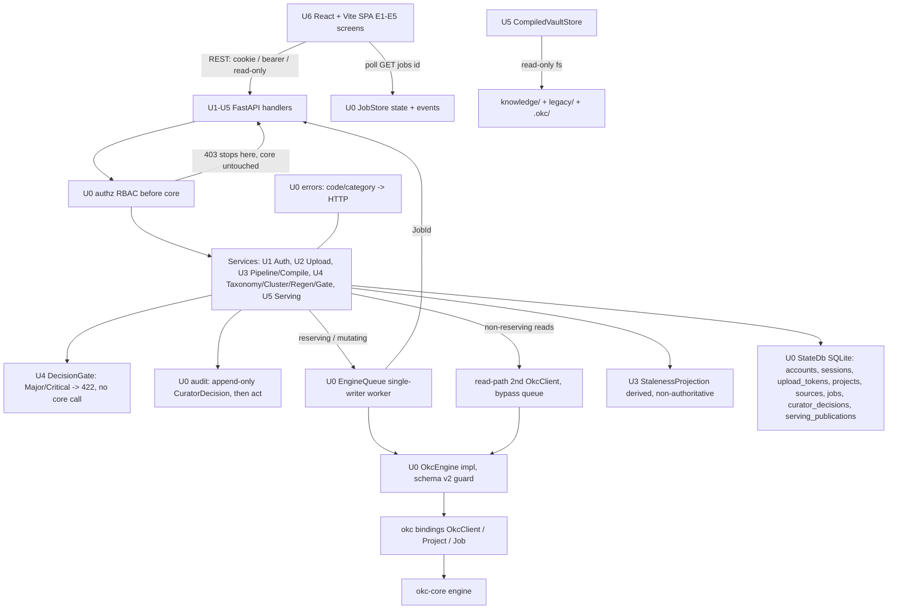

# okc-web — Application Design: Component Dependencies & Data Flow

**Depth**: comprehensive. Communication styles: in-process **Protocol calls** (U1–U6 → `OkcEngine`), **executor submit + asyncio bridge** (handlers → `EngineActor`), **HTTP REST + JSON** (frontend/mcp → FastAPI), and **SQLite** (all repositories → one WAL file). No inter-process coordination (single long-lived engine process, Q6/Q9=A). **UI is frozen — this document defines wiring only, no UI redesign.**

---

## Dependency matrix (unit → depends on)

| From \ On | U0 adapter+queue | U0 shared (authz/error/jobs/audit/state) | U1 auth | U2 upload | U3 orch | U4 review | U5 serving | okc bindings |
|---|---|---|---|---|---|---|---|---|
| **U0 adapter** | — | jobs, audit (link JobId) | — | — | — | — | — | **imports directly (sole point)** |
| **U0 shared** | error←EngineError | — | — | — | — | — | — | no |
| **U1 auth** | — | authz (supplies `AuthProvider` session resolver), error, state | — | — | curator label → U3 | — | — | no |
| **U2 upload** | engine-queue (`add_source`), adapter (`AddSourceRequest`→`okc.SourceInput`) | authz (token resolver), error, jobs, audit, state (`sources` write) | needs admin session | — | reads project + sources root | — | — | no (via U0) |
| **U3 orch** | engine-queue (status/preflight/integrate/compile), adapter (`OkcEngine`) | authz, error, jobs (job-status endpoint), audit, state (`projects`, `sources` owner) | consumes admin identity → curator_id | reads landed sources / cap reconcile | — | — | hands compiled path/manifest to U5 | no (via U0) |
| **U4 review** | engine-queue (approve/regenerate/taxonomy/clusters), adapter | authz, error, jobs, audit (`CuratorDecision`), state | — | — | reads `PipelineService` checkpoint + `StalenessProjection` | — | — | no (via U0) |
| **U5 serving** | adapter read-path only (`verify`/`explain`, **queue-bypass**) | authz, error, state (`SourceRegistry` read, `serving_publications`) | — | — | reads `compiled_vault_path` + frozen-input hashes | not at request time (`.okc/` self-contained) | — | no (via U0) |
| **U6 web** | — (HTTP only) | mirrors error map, job polling | HTTP auth endpoints | HTTP `/u/{token}/*` | HTTP `/api/projects/*` | HTTP `/api/.../review/*` | HTTP `/api/serving/*` + `/compiled*` | no |

**Key cross-module contracts (post-correction):**
- **U1 → U0 authz**: U1 provides the `AuthProvider.resolve_session` impl producing `Principal.Admin(account_id, session_id_hash, curator_label)`; U0 owns the canonical `AuthContext(principal, role)` + dependency + `require`. U0 authorizes, U1 authenticates.
- **U2 → U0 authz**: `AuthProvider.resolve_token` produces `UploadContext` (= `Principal.UploadToken` payload). One type, not two.
- **U2 → U3/state**: on `add_source` commit, U2 writes the `sources` row (`SourceRegistry`, owned by U3) so U5 can later resolve `SourceId → owner_display_name` (resolves the previously dangling ref).
- **U3 → U4**: U4 reads the current checkpoint from `PipelineService` and stale hints from `StalenessProjection`; it does not re-derive checkpoints.
- **U3 → U5**: `CompileService` output (`compiled_vault_path` + manifest + frozen-input hashes) is read by `ServingStateStore` for Live/Offline/Stale; U5 never calls compile.
- **All → U0 error**: every engine-touching op raises `EngineError`; the one `shared.error` module maps to HTTP.
- **All → U0 audit**: `CuratorDecision`, freeze, and approval receipts + hash bindings.

---

## Communication patterns

1. **Protocol boundary (in-process)** — U1–U6 depend only on `OkcEngine` + okc-web DTOs. Enforcement of ADR-0002: the `okc` bindings are imported only in `adapter`.
2. **Serialization queue (executor + asyncio bridge)** — reserving/mutating ops go handler → `EngineHandle` → `EngineActor` (single worker thread owning the sole `OkcClient`) → the `okc` bindings. Non-reserving reads bypass the queue via a read-path second `OkcClient` (verifier #8).
3. **HTTP REST + JSON (3 auth contexts, Q9)** — admin routes use the cookie session; `/u/{token}/*` uses a bearer token; `/api/serving/*` is read-only. Errors are the single `{code, category, message, retryable, retry_after_ms?}` body; the frontend branches on code/category, never message.
4. **Job polling (Q7)** — one canonical project-scoped route `GET /api/projects/{id}/jobs/{jobId}` (admin) reading `JobStore`; the token upload flow reads the same `JobStore` snapshot via `GET /u/{token}/jobs/{jobId}`. verify/explain are synchronous (no polling).
5. **SQLite (single WAL file)** — every repository shares `StateDb`; owners: `accounts`/`sessions` (U1), `upload_tokens` (U2), `projects`/`sources` (U3), `jobs`/`job_events`/`curator_decisions` (U0), `serving_publications` (U5).

---

## Data-flow diagram (Mermaid)

### Text alternative (same content)

1. The U6 React + Vite SPA frontend calls U1–U5 FastAPI handlers over REST using one of three auth contexts: admin cookie session, `/u/{token}` bearer token, or read-only `/api/serving/*`.
2. Every mutating request first passes U0 authz (RBAC-before-core); a 403 stops the request before any engine op is enqueued, guaranteeing okc-core was not touched (C-1).
3. Authorized requests reach the unit services (U1 Auth; U2 Upload; U3 Pipeline/Compile/Lifecycle/Staleness; U4 Taxonomy/Cluster/Regen/Gate; U5 Serving).
4. For cluster approval, U4 `DecisionGate` runs the Major/Critical check in okc-web; if blocked it returns 422 APPROVAL_REQUIRED and no engine call is made.
5. Curator decisions and freezes are written to the U0 append-only audit store before the engine op; the resulting JobId is linked after.
6. Reserving/mutating engine ops go through the U0 single-writer EngineQueue → the `OkcEngine` impl (schema-v2 guard) → the `okc` bindings → okc-core, making okc-web the single writer. Non-reserving reads (taxonomy/clusters/manifest/verify/explain) bypass the queue via a read-path second `OkcClient` so they never stall behind a long integrate/compile.
7. Long ops return a JobId; the frontend polls the canonical job-status route, which reads job state + drained progress events from the U0 JobStore (no new engine reservation). verify/explain are synchronous.
8. U3 StalenessProjection derives (never authoritatively) freeze-then-run staleness by comparing recorded vs current source fingerprints; core remains the source of truth via ApprovalStale / checkpoint regression.
9. All repositories share one SQLite WAL file; all errors flow through the single U0 code/category → HTTP mapping (handlers never parse message strings).
10. U5's CompiledVaultStore reads the immutable 3-root compiled vault (`knowledge/`+`legacy/`+`.okc/`) directly from disk; only the adapter reaches the `okc` bindings/okc-core.
