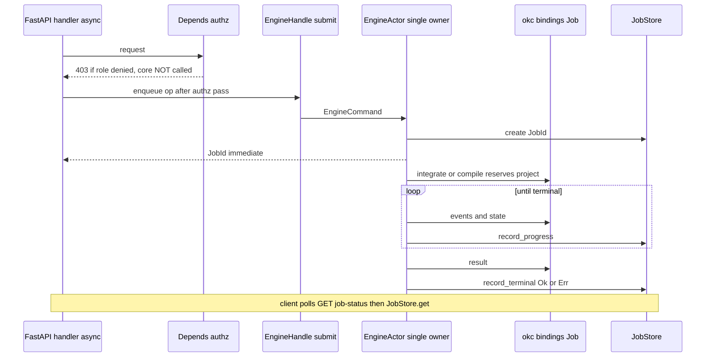

# okc-web — Application Design: Services & Orchestration

**Depth**: comprehensive. Services group related components and own the orchestration patterns. The defining cross-cutting services are the **single-writer engine serialization queue**, the **adapter conversion firewall**, **RBAC-before-core**, **error translation**, and the **record-then-act curator audit**.

---

## S0.A EngineSerializationService (`adapter.queue`) — single-writer actor (Q6 / NFR-CONC-1)

**Pattern**: an actor over a single-worker `ThreadPoolExecutor(max_workers=1)` owning the sole `OkcClient`, bridged to asyncio via `run_in_executor`. Async FastAPI handlers never touch the engine directly; they submit an `EngineCommand` and `await` the returned future. The worker processes exactly one **reserving/mutating** command at a time and blocks on the `okc.Job` to terminal before dequeuing the next → NFR-CONC-1 satisfied at the okc-web layer, on top of the bindings' process-global `PROJECT_RESERVATIONS`.

- **Fast mutations** (`add_source`, `approve_taxonomy`, `approve_cluster`, `replace_sources`) use `call()` — submit + await terminal inline.
- **Long ops** (`preflight`, `integrate`, `regenerate_cluster`, `compile`) use `enqueue()` — the worker creates a `JobId`, returns it immediately, then pumps `Job.events()` into `JobStore` so the client can poll (Q7).
- **`status()`** is RESERVING in the bindings (submitted with reservation=true), so it is routed through the queue too — this prevents a status poll from racing a long `integrate()` and returning `PROJECT_BUSY`.
- **Residual `ProjectBusy`** (genuine cross-process `project.lock` contention) → mapped to 409 `PROJECT_BUSY` with synthesized retry guidance; the queue makes this rare by construction.

### Read-path policy (verifier #8 — HOL-blocking fix, applied)

Because the single worker blocks on `Job.result()` until terminal (the native ext releases the GIL), enqueuing reads behind a multi-minute `integrate`/`compile` would stall them. Verified non-reserving in the bindings (submitted with `project=None, mutating=false`): `taxonomy`, `clusters`, `manifest`, `verify_artifact`, `explain_artifact`. Therefore:

- **Through the queue** (reserving/mutating): `status`, `add_source`, `replace_sources`, `preflight`, `integrate`, `approve_taxonomy`, `approve_cluster`, `regenerate_cluster`, `compile`.
- **Bypass the queue** (non-reserving reads via `OkcEngineImpl`'s read-path second `OkcClient`): `taxonomy`, `clusters`, `manifest`, `verify`, `explain`. Serving verify/explain are therefore synchronous request/response with no polling.

### Mutating-op flow (Mermaid)

**Text alternative**: The async handler first passes through the `Depends(...)` auth dependency; if the role is insufficient it gets 403 and no engine call is made. On pass, the handler calls `EngineHandle.enqueue(op)`, which submits an `EngineCommand` to the single `EngineActor`. The actor creates a `JobId` in the `JobStore` and returns it immediately to the handler. The actor then invokes the binding mutating method (which reserves the project via the process-global reservation set), loops draining `events()`/`state` into `JobStore.record_progress`, and on the terminal state reads `result()` and calls `JobStore.record_terminal`. Meanwhile the client polls the job-status endpoint, which reads `JobStore.get(JobId)`. Non-reserving reads (taxonomy/clusters/manifest/verify/explain) do not enter this actor at all; they use the read-path second `OkcClient` directly.

---

## S0.B AdapterConversionService (`adapter.dto` + `schema_guard`) — the schema + error firewall

Owns the ONLY import of `okc` binding types. Every binding result is version-checked (`SchemaGuard.check_payload` against the `interop_schema_version` field each DTO carries) and converted to an okc-web `*View`. Every `okc.OkcError` is converted to an okc-web `EngineError` (preserving `code`, `category`, `retryable`, `retry_after_ms`, redacted `message`). **This is the single point where the ADR-0002 boundary is enforced**: `code`/`category` remain the stable contract downstream, and no binding type crosses into U1–U6 (verifier #3). One-`status()`-call returns both `checkpoint` and `integration` (packed into `StatusView`), so U3 never needs a second reserving call.

---

## S0.C AuthorizationService (`shared.authz`) — RBAC-before-core (C-1)

**Orchestration**: FastAPI `Depends(...)` dependencies run first for protected routes; establish the principal via an injected `AuthProvider` (session for admin → `Principal.Admin`; hashed bearer token for uploads → `Principal.UploadToken`/`UploadContext`), enforce role (`Role.{Admin, Contributor}`), and only then yield to the handler (a 401/403 raised in a dependency ⇒ the handler body never runs). **Invariant (testable, C-1)**: for any request that fails authz, zero `OkcEngine` methods execute — a 403 guarantees okc-core was never touched. Establishes the okc-web-verified `curator_label` that later audit records and the core `curator_id` label are bound to. Split of duties: U1/U2 authenticate (supply the resolver); U0 authorizes (owns the guard, ordering guarantee, and canonical `AuthContext`/`Principal`/`Role`).

---

## S0.D ErrorTranslationService (`shared.error`)

Single, table-driven mapping from `EngineError`/okc-web-origin errors to HTTP status + stable JSON `{code, category, message, retryable, retry_after_ms?}`. Central so all units share one HTTP error contract; the frontend branches on `code`/`category`, never on prose. Adds `Retry-After` for retryable `PROJECT_BUSY`/`RESOURCE_LIMIT` **by code** (the binding's `retryable` flag is not reliable for reservation-collision `ProjectBusy`). Full mapping table (with the added `ProjectInvalid`, `ArtifactSchemaUnsupported`, `PathUnsupported`, `OutputDurabilityUncertain`, and safe default) is in *Application Design*.

---

## S0.E CuratorAuditService (`shared.audit`) — record-then-act (Q8, C3)

For every Case-B decision (U4) and every freeze/approval (U3), the flow is **record-then-act**: `AuditStore.append(...)` (append-only, with `HashBindings(proposal_hash, critic_hash, taxonomy_hash)`) runs BEFORE the decision is mapped to `approve_cluster`/`regenerate_cluster`/`approve_taxonomy` via the queue, and the resulting `JobId` is linked back. Preserves an immutable decision trail alongside okc-core's immutable, hash-bound contradictions (C-2/C-4). The `CuratorDecision` union's lack of a winner-select variant is the code-verifiable C3 differentiator. Single owner = U0; producers = U4/U3.

---

## U1 — AuthService

Owns the login/session/account lifecycle. **Pattern: purely pre-core, DB-only** (never touches the engine queue).
- **login**: `AccountStore.find_by_email` → `PasswordHasher.verify` (constant-time) → reject disabled (`ACCOUNT_DISABLED`) / bad creds (401, code-based) → `SessionStore.create` (plaintext id once, SHA-256 stored) → `SessionCookieCodec.write`. Only `role == Admin` lands in the app shell (E1-1); `Contributor` has no app-shell session (uploads are token capabilities).
- **session resolution**: `AuthContext` dependency → `SessionStore.resolve` (TTL/idle) → `touch` (sliding). The resolved `Principal.Admin` feeds U0's RBAC guard.
- **account admin (E1-3/E1-5)**: create/set_role/set_status/change_password guarded by U0 RBAC(Admin). Invariants: email uniqueness, **last-admin guard** (`count_active_admins()==1` blocks demote/disable of the final admin), session revoke-all on disable / password change, one-time temp secret shown once (NFR-SEC-1).

---

## U2 — UploadTokenService (admin-facing) & UploadIngestService (token-facing)

**UploadTokenService** — admin cookie session + RBAC(Admin), DB-only, pre-core.
- **issue**: `active_slot_count` check (block at 10/10) → `UploadTokenSecret.generate` → store `verifier_hash` + `selector` plaintext → persist row (owner_display_name/kind = decorative, unverified) → return one-time plaintext token + upload URL (E2-2). Plaintext never persisted or re-shown.
- **revoke/rotate**: flip `revoked_at` (immediate `/u/{token}` block) / revoke+reissue same slot.

**UploadIngestService** — the one U2 flow that MUTATES the engine; capability-authenticated. Ordered, fail-fast pipeline (every step before `add_source` guarantees core-untouched on rejection, C-1):
1. `UploadContext` extractor yields the token principal (TOKEN_INVALID/EXPIRED/REVOKED → 401/403 before core).
2. `SlotAccountant.reserve` → `SOURCE_CAP_EXCEEDED` (okc-web owns the ≤10 cap ahead of core; core `ResourceLimit` is the backstop).
3. `UploadReceiver.receive` → stream to temp with hard byte cap (`UPLOAD_TOO_LARGE` while streaming).
4. `ArchiveValidator.inspect` → `ValidationReport` (blocking Fail = FORMAT/PATH_UNSAFE/SYMLINK; non-blocking Warn = CONTENT_NOT_MARKDOWN/DUPLICATE_SOURCE). Honest early duplication of okc-core hostile-input defenses (FR-UP-3).
5. `SourceLander.land` → materialize to an ABSOLUTE path under the project sources root (C-6: disk THEN register); content hash.
6. **`OkcEngine.add_source`** via the U0 single-writer worker (NFR-CONC-1) with an okc-web `AddSourceRequest(project_id, source_id, absolute_path, owner_display_name)`; the adapter converts to `okc.SourceInput` and applies the schema-v2 guard at that single point. Returns a `JobId`.
7. On success: `SlotAccountant.commit` (bind SourceId) + `SourceRegistry.record` (owner-label row for U5) + `UploadTokenStore.mark_used` + append-only audit; on failure: `SlotAccountant.release`.
- **Progress (Q7)**: contributor polls `registration_status(job)` reading the **same JobStore snapshot** via `GET /u/{token}/jobs/{jobId}` (E2-5). PROJECT_BUSY surfaces via the U0 error mapping as 409 with retry guidance.
- **Idempotency**: duplicate content is a hash-based no-op (`DUPLICATE_SOURCE`), so token retries are safe.

---

## U3 — PipelineService / CompileService / ProjectLifecycleService / StalenessProjection

- **PipelineService** drives the DERIVED checkpoint loop. Reads `StatusView(checkpoint, integration)` from the single reserving `status()` (through the queue), computes the E3-3 Next-Action and E3-5 gates, and enqueues `preflight`/`integrate`. **Disclosure surface (E3-5)**: exposes `NeedsProvider`/`NeedsDisclosure`; E3-5 collects `DisclosureDecision(allow_remote_provider, remote_disclosure_confirmed)` that flows into `integrate`. A remote provider without confirmed disclosure yields `EngineError(code="RemoteConsentRequired")` → surfaced as a consent prompt (422), not a generic error. Live E3-5 progress comes from in-flight `Job.events()`/`.state` held by the JobStore (non-reserving), NOT from a fresh `status()`.
- **CompileService** re-checks `checkpoint == ReadyToCompile` before enqueuing `compile` (no-clobber). Trigger button lives on E5-1 but calls this U3 endpoint; E4-1 only deep-links when Ready. Compile of an unapproved plan returns core `ProjectInvalid` → mapped to 422 (consistent with the gate).
- **ProjectLifecycleService** owns the `projects` registry and the source-freeze transition; passes the U1 admin identity as the unverified `curator_id` to `create_project`.
- **StalenessProjection** owns the derived, non-authoritative staleness label (compares recorded vs current source fingerprints); core remains the source of truth via `ApprovalStale`/checkpoint regression.

---

## U4 — TaxonomyReviewService / ClusterReviewService / RegenerationService / ReviewGateService

**Case-B decision → core mapping (Q8, FR-INT-5).** `CuratorDecision` is the only way to mutate review state. Each variant maps to exactly one engine op and is appended to the audit store BEFORE the op (receipt after):
- `ApproveTaxonomy(edited_clusters, rationale)` → `engine.approve_taxonomy(...)` (rationale required iff edited).
- `ApproveCluster(cluster_id, omission_rationales, minor_waivers)` → **`DecisionGate.assert_approvable`** → `engine.approve_cluster(...)`.
- `RegenerateCluster(cluster_id, feedback)` → `engine.regenerate_cluster(...)` (long AI job).

**Gate-before-core (C-1 analogue).** `DecisionGate` runs the Major/Critical domain check in okc-web and returns a clean `422 APPROVAL_REQUIRED` without ever queuing an engine call. Code-verified necessity: core's blocking-approval rejection maps to the generic `ProjectInvalid` (not `ApprovalRequired`) through the `okc` bindings' `map_project_message`, so the deterministic 422 must originate in okc-web.

**No winner-select.** There is deliberately no `SelectWinner`/`ResolveContradiction` variant; the E4-3 Contradictions tab is read-only and preserves both sides (FR-INT-6, ADR-0024). The only path that changes a contradiction is a full cluster Regenerate.

**ReviewGateService** computes the read-only E4-1 compile-eligibility scoreboard (`Blocked|PendingApprovals|Ready`); it never triggers compile.

---

## U5 — ServingService / ProvenanceComposer / ServingStateStore

- **ServingService** (facade) fans out to `CompiledVaultStore` (filesystem 3-root reads), `ProvenanceComposer`, `ServingStateStore`, `McpContractBuilder`. Machine `/api/serving/*` is GET/HEAD only (405 on mutating verbs; 404 out-of-root). verify/explain are non-mutating and synchronous (bypass the queue) — a deliberate U5 decision peers must not contradict.
- **ProvenanceComposer** (E5-2 focal) fuses `explain` (`ProvenanceView`) + `verify` (`VerificationView`) + `SourceRegistry.owner_labels` + `.okc/` contradiction index into `NoteProvenanceView` (lineage graph + verify strip + explain steps + preserved contradictions). All fields derive from real engine DTOs or okc-web state rows — no mock data.
- **ServingStateStore** owns publish/unpublish as an okc-web-only, admin-gated SQLite state flip (no core op, no queue). Staleness derived by comparing bound manifest hashes to U3's current frozen-input hashes; the immutable manifest is still served with a Stale label.
