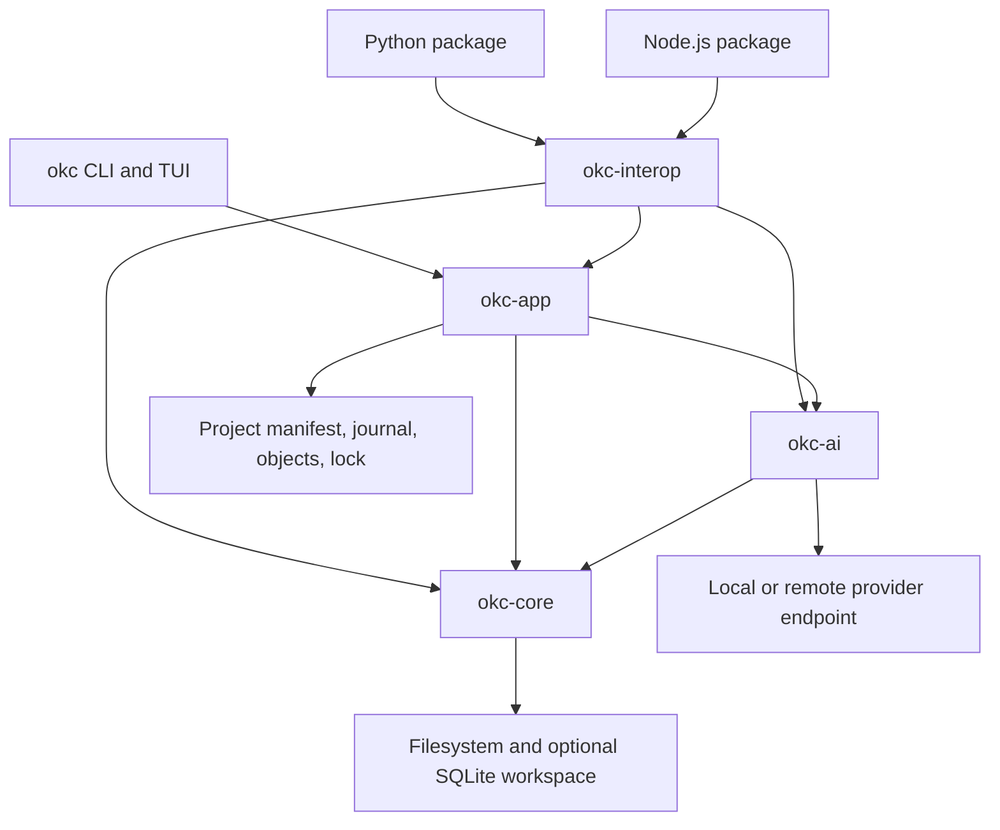
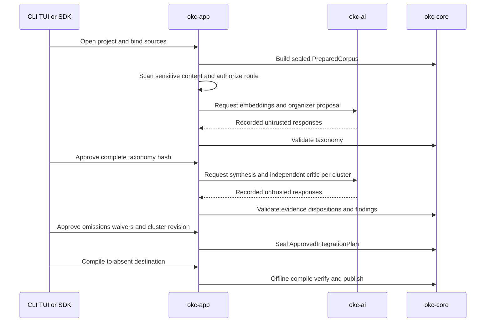

# Reverse Engineering — System Architecture

> Normative source: [`framework-architecture.md`](../../../docs/specs/framework-architecture.md).
> This document is an as-built projection for AI-DLC continuity.

## System overview

OKC is a local, framework-first modular native product. Dependencies point
inward from adapters to a runtime-neutral facade and application services, then
to provider-neutral AI and the deterministic compiler core. Source Vaults,
provider responses, project state, and artifact files are separate trust
domains.

## Package architecture

Text alternative: CLI/TUI calls `okc-app`; Python and Node call
`okc-interop`; both paths converge on `okc-app`, `okc-ai`, and `okc-core`.
Only `okc-ai` performs provider I/O. Only `okc-core` owns corpus validation and
offline artifact compilation.

## Component boundaries

| Package | Type | Owns | Must not own |
|---|---|---|---|
| `okc-core` | library/core | hostile-input corpus construction, Schema 3 integration DTO validation, offline compile/verify/explain | provider I/O, UI, keychain, updater, language runtime |
| `okc-ai` | library/adapter | provider profiles, portable request/response types, HTTP adapters, capability and schema checks | approval, canonical project state, publication policy |
| `okc-app` | library/application | project/journal/object lifecycle, disclosure, provider routes, review, workers, artifact service | alternate compiler policy |
| `okc-interop` | library/facade | API-v1 DTOs, jobs, scheduling, structured errors, project reservation | cwd discovery, prompts, keychain, updater, presentation |
| `okc` | executable/adapter | Clap CLI, Ratatui TUI, terminal safety, exit-code mapping | canonical state or duplicated workflow policy |
| `okc-python` | native adapter | Python object/type projection over interop | cwd discovery, output, prompting, secret persistence |
| `okc-node` | native adapter | Node/TypeScript projection and key-name conversion | business policy or canonical state |

## State ownership

| State | Owner | Persistence |
|---|---|---|
| Original Vault bytes | Source snapshot | immutable source directory/archive |
| Sealed corpus and block projection | `okc-core` | memory and optional build SQLite |
| Provider request/response evidence | `okc-app` | immutable content-addressed project objects |
| Run/task/approval history | `okc-app` | append-only SQLite journal schema 4 |
| Review authority | hash-bound approval records | immutable project objects and journal pointers |
| Compilation authority | `ApprovedIntegrationPlan` | immutable object or explicit JSON file |
| Published artifact | `okc-core` materializer | new Schema 3 directory |

## Integration state flow

Text alternative: source binding precedes corpus construction; preflight
precedes disclosure; all provider output is recorded and locally validated;
taxonomy and each cluster require explicit approval; the sealed plan is then
compiled and verified without a provider.

## External integration points

- Provider HTTP endpoints for OpenAI, Anthropic, Gemini, Ollama, and
  OpenAI-compatible profiles, with local/remote classification and bounded I/O.
- Native OS keychain for CLI/TUI profiles only; bindings accept environment
  variable names only.
- Local filesystem for sources, projects, SQLite, and new output directories.
- GitHub Actions/cargo-dist/Maturin/npm for build and release candidates. They
  are build infrastructure, not runtime dependencies of the compiler core.

## Architecture invariants

1. Sources are immutable hostile inputs.
2. Provider output is a proposal and never approval authority.
3. Every current Markdown document, block, and metadata value has complete
   taxonomy/disposition coverage before plan sealing.
4. Compilation uses one validated `ApprovedIntegrationPlan`, performs no live
   provider call, and publishes without replacement.
5. Every output path closes provenance to source evidence and review records.
6. MCP/plugin/web surfaces remain adapters or future products.
7. Experimental algorithms cannot affect the default path.

## Current limitations

The implemented materializer is Markdown-only. Complete semantic-scale
execution, attachments, Canvas/Base output, full link rewriting, OKCPack,
complete cross-platform filesystem/cancellation evidence, remote package
matrices, and native release signing remain open.
