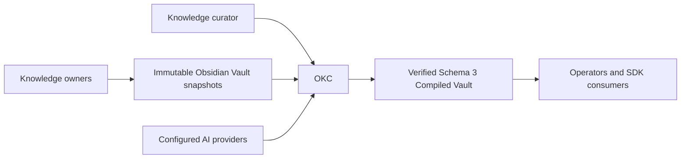

# Reverse Engineering — Business Overview

## Business context

Text alternative: knowledge owners provide immutable Vault snapshots; a
curator configures and reviews integration; providers return proposals; OKC
emits a newly verified directory consumed through the CLI, TUI, Rust, Python,
or Node.js surfaces.

## Business description

OKC solves knowledge integration across heterogeneous Obsidian Vaults without
trusting source tooling or granting an AI model authority over source files or
publication. Its definition of a complete integration is mechanical: every
Markdown document belongs to exactly one approved cluster; every block and
frontmatter value has one disposition; generated sections have evidence;
contradictions retain all supported sides; critic findings and curator approval
close the plan.

## Business transactions

| Transaction | Outcome | Primary requirements |
|---|---|---|
| Discover or select a workspace | Deterministic set of candidate projects and Vaults | REQ-APP-002, REQ-SEC-001 |
| Create/open a project | Current Schema 3 manifest and private schema-4 journal | REQ-APP-001, REQ-INT-005 |
| Bind immutable sources | One to ten source IDs with safe absolute locators | REQ-SNP-001/002, REQ-SRC-001/002 |
| Configure a provider route | Capability-driven, non-secret profile per semantic role | REQ-AI-001, REQ-SEC-003 |
| Preflight disclosure | Sensitive findings and route authorization before provider I/O | REQ-SEC-002 |
| Generate taxonomy | Recorded candidates and exactly-once document clustering | REQ-AI-003/004, REQ-INT-001 |
| Approve taxonomy | Hash-bound human authority over the complete taxonomy | REQ-INT-005 |
| Generate and critique clusters | Evidence-complete proposal and independent report per cluster | REQ-INT-002/003/004 |
| Approve or regenerate a cluster | Exact omissions/waivers or a new stale-invalidating revision | REQ-INT-004/005 |
| Seal a plan | Complete offline compilation authority | REQ-MAT-001, REQ-AI-004 |
| Compile and publish | New verified directory, never source mutation or replacement | REQ-CMP-001, REQ-INT-006 |
| Verify or explain | Reproduce artifact bytes and return one provenance record | REQ-PRV-001, REQ-SDK-001/002 |

## Actors

| Actor | Goal | Authority boundary |
|---|---|---|
| Knowledge owner | Contribute a Vault snapshot | Owns source bytes; does not approve global synthesis by implication |
| Curator | Review taxonomy, synthesis, omissions, waivers, and contradictions | Sole explicit human approval authority bound to project policy |
| Rust developer | Embed corpus/compile primitives | Uses `okc-core`; cannot bypass validation |
| Python/Node developer | Automate an explicit-path workflow | Uses bounded jobs and per-call consent; no cwd/keychain side effects |
| Build/release maintainer | Build and qualify packages | Cannot publish stable 0.3.0 until QG-001 through QG-008 pass |
| AI provider | Return structured generation or embeddings | Proposal-only; no filesystem, approval, or publication authority |
| Future adapter developer | Add MCP/Obsidian surfaces | Must remain thin and least-authority |

## Business dictionary

The canonical definitions are in [`docs/GLOSSARY.md`](../../../docs/GLOSSARY.md).
The load-bearing terms are `Vault snapshot`, `Integration corpus`, `Taxonomy`,
`Disposition`, `Critic report`, `Approval`, `Approved integration plan`,
`Compiled Vault`, and `Provenance record`.

## Component-level business responsibilities

- `okc-core`: converts hostile inputs and approved evidence into deterministic,
  independently verifiable knowledge artifacts.
- `okc-ai`: translates provider-specific APIs into one proposal contract.
- `okc-app`: manages the resumable human-and-provider workflow.
- `okc-interop`: provides one stable automation contract across runtimes.
- `okc`: provides operator-facing CLI/TUI interaction.
- Python and Node adapters: project the same interop contract into native language idioms.

## Product truth boundary

The current product successfully emits Markdown directories only. A Pack and
non-Markdown carry-through are roadmap work, not current business transactions.
