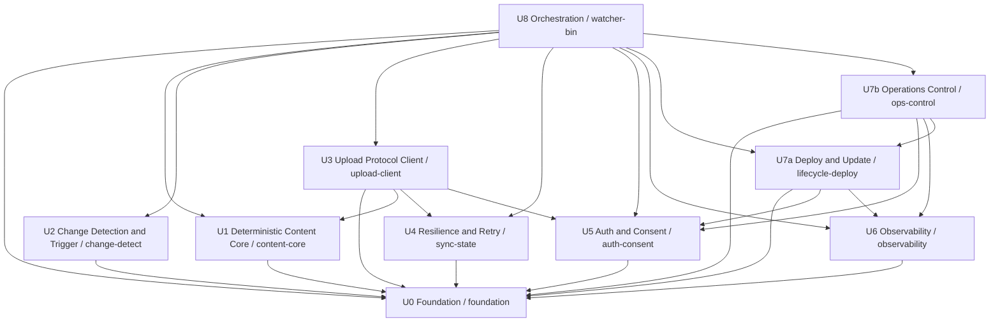

# 작업 단위 의존성 — okc-hooks "Watcher"

**단계**: INCEPTION → Units Generation (Part 2, 산출물 2/3)
**작성일**: 2026-09-08
**범위**: 확정된 10-단위 그룹(UQ-1=A / UQ-2=B / UQ-3=A)에 대해 (1) `component-dependency.md`의 30개 컴포넌트-레벨 엣지를 단위-레벨로 집계, (2) 10×10 단위 의존성 매트릭스, (3) 위상정렬 웨이브(빌드 순서) + 순환 0 검증 + 임계경로 깊이, (4) 통신 패턴, (5) 검증된 Mermaid + ASCII 폴백 다이어그램을 산출한다.

> **권위 있는 엣지 원천**: `application-design/component-dependency.md` §1 컴포넌트 의존성 매트릭스(30행). 통신 패턴은 `component-dependency.md` §2 + `services.md`. 웨이브 초안은 `plans/unit-of-work-plan.md` §1.4. 근거 없는 추측 없이 위 세 아티팩트에서만 도출한다.

---

## 1. 확정 단위 그룹 및 집계 규칙

### 1.1 10-단위 컴포넌트 배정 (고정 — 재분해 금지)

| Unit | 이름 | 크레이트 | 컴포넌트 | 초안 웨이브 대비 변경 |
|---|---|---|---|---|
| **U0** | Foundation | `foundation` (lib) | CoreTypes, ConfigProvider | F → U0 승격 |
| **U1** | Deterministic Content Core | `content-core` (lib) | ContentAddressing, VaultScanner, ManifestBuilder, ManifestDiffer, SafetyLimitsValidator | 변경 없음 |
| **U2** | Change Detection & Trigger | `change-detect` (lib) | FilesystemWatcher, ReconciliationScheduler, VaultAvailabilityGuard | SingleInstanceLock **제외**(U8로 이동) |
| **U3** | Upload Protocol Client | `upload-client` (lib) | UploadProtocolDriver | 변경 없음 |
| **U4** | Resilience & Retry | `sync-state` (lib) | SyncStateStore, RetryBackoffController | 변경 없음 |
| **U5** | Auth & Consent | `auth-consent` (lib) | AuthTransport, CredentialProvider, ConsentGate | 변경 없음 |
| **U6** | Observability | `observability` (lib) | StructuredLogger, StatusService, UploadHistoryStore, CriticalErrorNotifier, TrayIndicator(선택) | 변경 없음 |
| **U7a** | Deploy & Update | `lifecycle-deploy` (lib) | ServiceManager, AutoUpdater, Uninstaller | U7 분할(바이너리 생명주기) |
| **U7b** | Operations Control | `ops-control` (lib) | OperatorCli, ControlPlane, RunStateController | U7 분할(실행 데몬 제어) |
| **U8** | Orchestration | `watcher-bin` (binary) | WatcherDaemon, SyncCycleCoordinator, SingleInstanceLock | O → U8 승격 + SingleInstanceLock 흡수 |

30개 컴포넌트가 정확히 1회씩 배정됨(중복 0, 미배정 0).

### 1.2 집계 규칙 (엣지 → 단위)

1. **집계 방향**: `component-dependency.md` §1의 각 컴포넌트 엣지를 소유 단위로 접어 단위-레벨 엣지로 변환한다.
2. **단위 내부 엣지 제외**: 출발·도착 컴포넌트가 같은 단위이면 단위 엣지에 반영하지 않는다(예: `ManifestBuilder→VaultScanner`는 U1 내부이므로 제외).
3. **SingleInstanceLock → U8 귀속**: `SingleInstanceLock`이 U2에서 U8로 이동(UQ-1=A)했으므로 그 엣지(`SingleInstanceLock → [Foundation]`)는 U8→U0으로 귀속.
4. **`[Foundation-contract]` 엣지 → U0**: 로그/상태 싱크 계약(trait) 엣지 5건은 U6 런타임 의존이 아니라 파운데이션 계약 의존이다(Fix1). 즉 U0 의존으로 처리한다.
   - `AuthTransport(U5) → StructuredLogger` ⇒ U5→U0
   - `ConsentGate(U5) → StatusService, StructuredLogger` ⇒ U5→U0
   - `UploadProtocolDriver(U3) → StatusService, StructuredLogger` ⇒ U3→U0
5. **`[Foundation-contract]` 미표기 엣지는 그대로 유지**: 매트릭스에서 `[Foundation-contract]`가 붙지 않은 U6 대상 엣지(예: U7a/U7b/U8 → StructuredLogger/StatusService/UploadHistoryStore/CriticalErrorNotifier)는 계약 재해석 대상이 아니므로 **실제 U6 의존**으로 집계한다. (계획 §1.4가 "U7 (←U5,U6)"으로 U6 의존을 명시한 것과 정합.)
6. **U8 = 단일 바이너리 조립 루트**: `watcher-bin`(U8)은 RESILIENCY-01에 따라 모든 lib 크레이트를 링크하고, `WatcherDaemon`이 전 단위 컴포넌트를 생성·주입한다(`services.md` WatcherDaemon 4단계). 따라서 U8은 나머지 9개 단위 전부에 의존한다.

---

## 2. 단위-레벨 의존성 도출 (집계 결과)

각 단위의 의존 집합과 그 근거가 된 컴포넌트 엣지(단위 내부 엣지·중복 제외):

| 단위 | → 의존 단위 | 근거 컴포넌트 엣지 (component-dependency.md §1) |
|---|---|---|
| **U0** | (없음 — 루트) | `CoreTypes`(의존 0), `ConfigProvider→CoreTypes`(U0 내부, 제외) |
| **U1** | U0 | ContentAddressing/ManifestBuilder/ManifestDiffer/SafetyLimitsValidator → CoreTypes; VaultScanner → [Foundation] |
| **U2** | U0 | FilesystemWatcher / ReconciliationScheduler / VaultAvailabilityGuard → [Foundation] |
| **U3** | U0, U1, U4, U5 | UploadProtocolDriver → [Foundation](U0), ContentAddressing+SafetyLimitsValidator(U1), SyncStateStore(U4), AuthTransport(U5), StatusService+StructuredLogger `[Foundation-contract]`(U0) |
| **U4** | U0 | SyncStateStore / RetryBackoffController → [Foundation] |
| **U5** | U0 | CredentialProvider → [Foundation]; AuthTransport → [Foundation] + StructuredLogger `[FC]`(U0); ConsentGate → [Foundation] + StatusService/StructuredLogger `[FC]`(U0) |
| **U6** | U0 | StructuredLogger/UploadHistoryStore → [Foundation]; StatusService → CoreTypes; TrayIndicator → [Foundation](StatusService 내부); CriticalErrorNotifier → [Foundation](나머지 내부, TrayIndicator `[optional no-op]` 내부) |
| **U7a** | U0, U5, U6 | ServiceManager → ConfigProvider/CoreTypes(U0) + StructuredLogger(U6); AutoUpdater → [Foundation](U0) + StatusService/CriticalErrorNotifier/StructuredLogger(U6); Uninstaller → CredentialProvider(U5) + ConfigProvider/CoreTypes(U0) + StructuredLogger(U6) |
| **U7b** | U0, U5, U6, U7a | RunStateController → ConfigProvider/CoreTypes(U0) + StatusService/StructuredLogger(U6); ControlPlane → ConfigProvider/CoreTypes(U0) + StatusService/UploadHistoryStore/StructuredLogger(U6) + ConsentGate(U5); OperatorCli → [Foundation](U0) + ServiceManager+Uninstaller(**U7a**) |
| **U8** | U0, U1, U2, U3, U4, U5, U6, U7a, U7b | SingleInstanceLock → [Foundation](U0); SyncCycleCoordinator → [Foundation](U0), U2·U1·U5·U3·U4·U6 협력자; WatcherDaemon → [Foundation](U0), SyncStateStore(U4), FilesystemWatcher/ReconciliationScheduler(U2), StatusService/StructuredLogger(U6), ControlPlane(U7b); **조립 루트로서 U7a(ServiceManager/AutoUpdater) 생성 + watcher-bin이 lifecycle-deploy 크레이트 링크 ⇒ U8→U7a** |

**신규 엣지 주목 — U7b → U7a**: `OperatorCli`(U7b)가 `ServiceManager`·`Uninstaller`(U7a)를 직접 호출한다(`watcher install/uninstall` 등의 CLI 경로). U7 분할이 만든 유일한 새 단위 간 엣지이며, 이것이 아래 웨이브에서 U7b를 U7a보다 뒤로 밀어낸다. 역방향(U7a→U7b)은 존재하지 않음 — U7a의 어떤 컴포넌트도 U7b를 참조하지 않으므로 순환 없음.

**집계된 단위 엣지 총 25개**: U1(1), U2(1), U3(4), U4(1), U5(1), U6(1), U7a(3), U7b(4), U8(9).

---

## 3. 10×10 단위 의존성 매트릭스

**행 = 의존 주체(depends on)**, **열 = 피의존 대상(depended upon)**. `●` = 행이 열에 의존, 빈칸 = 무의존, `—` = 자기 자신.

| 의존주체 \ 피의존 | U0 | U1 | U2 | U3 | U4 | U5 | U6 | U7a | U7b | U8 |
|---|---|---|---|---|---|---|---|---|---|---|
| **U0** | — |  |  |  |  |  |  |  |  |  |
| **U1** | ● | — |  |  |  |  |  |  |  |  |
| **U2** | ● |  | — |  |  |  |  |  |  |  |
| **U3** | ● | ● |  | — | ● | ● |  |  |  |  |
| **U4** | ● |  |  |  | — |  |  |  |  |  |
| **U5** | ● |  |  |  |  | — |  |  |  |  |
| **U6** | ● |  |  |  |  |  | — |  |  |  |
| **U7a** | ● |  |  |  |  | ● | ● | — |  |  |
| **U7b** | ● |  |  |  |  | ● | ● | ● | — |  |
| **U8** | ● | ● | ● | ● | ● | ● | ● | ● | ● | — |

**비순환성 근거 (정정)**: 이 매트릭스 헤더는 단위 ID 순서(U0..U8)이며 위상 순서와 일치하지 않는다 — 예컨대 `U3→U4`, `U3→U5`는 U3가 헤더상 앞서지만 뒤 단위에 의존하므로 대각선 위쪽에 찍힌다. 따라서 "하삼각/상삼각" 형태로 비순환을 주장하지 않는다. 비순환성은 매트릭스 모양이 아니라 §4의 Kahn 위상정렬 웨이브 분해(진입차수 0 노드를 반복 제거해 전 노드를 소진)로 정식 확립된다. 이 매트릭스는 집계된 25개 단위 엣지의 시각적 요약일 뿐이다.

---

## 4. 웨이브(빌드 순서) · 순환 0 검증 · 임계경로

### 4.1 위상정렬 웨이브

Kahn 알고리즘으로 진입차수 0 노드를 반복 제거해 층(웨이브)을 산출:

| 웨이브 | 단위 | 진입 조건(모든 의존이 이전 웨이브에 존재) |
|---|---|---|
| **W1** | **U0** | 의존 0 (루트) |
| **W2** | **U1, U2, U4, U5, U6** | 각각 U0에만 의존 → 서로 독립(최대 병렬 폭 5) |
| **W3** | **U3, U7a** | U3←{U0,U1,U4,U5}(W1∪W2), U7a←{U0,U5,U6}(W1∪W2) |
| **W4** | **U7b** | U7b←{U0,U5,U6,U7a} — U7a(W3)가 필요 |
| **W5** | **U8** | U8←전 단위 — U7b(W4)가 필요 |

### 4.2 계획 §1.4 대비 재계산 결과

- 계획 §1.4 초안(9단위)은 **4-웨이브**: W1=F; W2={U1,U2,U4,U5,U6}; W3={U3,U7}; W4=O.
- **U7 분할(U7a/U7b) 후 실제 매트릭스에서 재계산 → 5-웨이브**. 유일한 변화 원인은 **U7b → U7a 엣지**(OperatorCli→ServiceManager/Uninstaller): U7a·U7b가 같은 웨이브에 공존할 수 없어 U7a는 W3 유지, U7b는 W4로, 조립 루트 U8은 W5로 각각 1층씩 밀렸다. 이는 UQ-1=A가 예고한 "웨이브 4→5"와 정확히 일치.
- **임계경로 깊이 = 5** (웨이브 수 = 최장 경로의 노드 수).
  - **임계경로**: `U0 → U5 → U7a → U7b → U8` (길이 5).
  - 대안 최장 경로 `U0 → U1 → U3 → U8`(길이 4)은 임계경로보다 짧다.

### 4.3 순환 검증 — 순환 0 ✅

25개 단위 엣지 전부가 "후행 웨이브 → 선행 웨이브" 방향임을 개별 확인:

| 엣지 | 웨이브 방향 | 판정 |
|---|---|---|
| U1,U2,U4,U5,U6 → U0 | W2 → W1 | 정방향 |
| U3 → U0,U1,U4,U5 | W3 → W1,W2 | 정방향 |
| U7a → U0,U5,U6 | W3 → W1,W2 | 정방향 |
| U7b → U0,U5,U6,U7a | W4 → W1,W2,W3 | 정방향 |
| U8 → (전 9단위) | W5 → W1..W4 | 정방향 |

모든 엣지가 웨이브 번호 감소 방향이므로 사이클 형성 불가. **역방향(back-edge) 0건, 순환 0건.** 잠재 순환 후보였던 (a) U6 push-only 불변식(U6는 U1–U5를 역참조 안 함), (b) U7a↔U7b(U7a→U7b 부재), (c) 조립 루트 U8↔하위(U8만 아래를 참조, 하위는 U8 미참조)를 모두 확인 — `component-dependency.md` §6(a)의 30-노드 DAG 결론과 일관.

### 4.4 병렬화 구분 (계획 §1.4 계승)

- **런타임 병렬 ≠ 빌드 병렬**: 동기화 파이프라인은 의도적 단일 직렬 사이클(Q2=B/FQ-2=A)이며 이 웨이브는 **빌드/작업 순서**를 뜻한다. 웨이브를 런타임 동시성으로 오해하면 안 됨.
- **W2의 5개 단위(U1·U2·U4·U5·U6)**는 상호 독립이므로 Functional Design/Code Gen을 병렬 에이전트로 팬아웃 가능(UQ-3=A). 1인 개발자에게는 각 단위의 사람 승인 게이트가 여전히 직렬이다.

---

## 5. 통신 패턴

`component-dependency.md` §2 + `services.md`에서 확정된 패턴을 단위-레벨 엣지에 대응시킨다. 모든 패턴은 단일 배포 바이너리 내부 in-process 호출이며, 예외는 (4) 로컬 IPC와 (5) HTTP 네트워크 경계뿐이다.

### 5.1 트레이트 주입 — 파운데이션 하향 주입 (U0 → 아래로)
- 조립 루트 `WatcherDaemon`(U8)이 `ConfigProvider`/`CoreTypes`와 **로그·상태-push 계약 트레이트**(`Logger`/`StatusSink`/`HistorySink`/`CriticalEventSink`, Q9 2축 상태 값 타입 포함, 모두 `CoreTypes` 소유)를 최초 1회 생성해 하위 단위에 생성자 주입한다. 파운데이션은 어떤 단위도 역참조하지 않음.
- 매트릭스의 모든 `→ U0` 엣지가 이 패턴이다. 특히 U3/U5의 로그·상태 싱크 엣지 5건은 U6 구현이 아니라 **U0 계약**에 대한 의존(`[Foundation-contract]`, Fix1) — 이로써 U3/U5가 U6에 빌드-종속되지 않아 W2/W3 병렬이 확보된다. U6는 계약의 **구현만** 제공하고 조립 루트가 주입(의존성 역전).

### 5.2 직접 함수 호출 (in-process, 동일 바이너리)
- 데이터 파이프라인 및 단위 간 협력의 주 패턴. 단위 엣지 대응: **U3→U1/U4/U5**(재개 오프셋 조회·재검증 해시·프로토콜 have/want), **U7b→U7a**(OperatorCli가 ServiceManager/Uninstaller 호출), **U7a→U5**(Uninstaller가 CredentialProvider로 자격 정리), **U8→U1/U2/U3/U4/U5**(SyncCycleCoordinator의 사이클 오케스트레이션).

### 5.3 트리거당 1회 직렬 동기화 사이클 (Orchestration 소유)
- `SyncCycleCoordinator`(U8)가 트리거(FilesystemWatcher 디바운스 / ReconciliationScheduler 주기 / ControlPlane `sync-now`)마다 감지→스냅샷→diff→프리플라이트→동의게이트→have/want→전송→커밋→상태지속을 **끝까지 1회 직렬** 수행한다(Q2=B). 진행 중이면 단일-사이클 잠금으로 직렬화(busy면 최신 트리거만 유효). 별도 생산자/소비자 배출 루프 없음.

### 5.4 Status Push (→ U6, push-only 불변식)
- 각 단위는 운영 라이프사이클/조건집합을 U6 싱크로 **밀어 넣기만** 한다. 단위 엣지 대응: **U7a→U6, U7b→U6, U8→U6**(SyncCycleCoordinator/WatcherDaemon의 idle/syncing/offline/OverLimit/ConsentBlocked/UpdateRolledBack 등 push, UploadHistoryStore append). U6는 U1–U5를 역참조하지 않으므로 순환 방지(§4.3).
- 주의: U2 검사기는 의도적으로 U6를 의존하지 않으며, US-E1-01/US-E1-06의 실제 로그·status push는 `SyncCycleCoordinator`(U8)가 소유한다(`services.md` 노트2).

### 5.5 로컬 IPC (프로세스 경계 — Unix 도메인 소켓 / Windows 명명 파이프)
- CLI 프로세스와 실행 중 데몬 프로세스를 잇는 유일한 프로세스 간 경로(Q5=A). `OperatorCli`(U7b, 클라이언트 측)가 소켓/파이프로 요청을 보내고, 데몬 `WatcherDaemon`(U8)이 `ControlPlane`(U7b)을 IPC 서버로 호스팅·구동한다. 소유자 권한 제한, 버전드 요청/응답 + `--json`.
- 경로 예: `watcher status/pause/resume/sync-now/history/consent/reload` → OperatorCli → (IPC) → ControlPlane → {StatusService, UploadHistoryStore, RunStateController, ConsentGate}.

### 5.6 HTTP-over-AuthTransport (네트워크 경계)
- U3는 HTTP를 소유하지 않는다. `AuthTransport`(U5)가 TLS + 매 요청 토큰 부착 + 응답/오류 taxonomy(타입은 `CoreTypes`) 분류를 단독 소유(Q4=A). 흐름: `UploadProtocolDriver`(U3) → `AuthTransport`(U5) → Mock OKC Server. 오류는 U5가 `CoreTypes` taxonomy로 분류 → `RetryBackoffController`(U4)가 재시도/백오프 판단(U4는 U3/U5 역참조 없음).

### 5.7 런타임 스레드 모델 = 3스레드
직렬 동기화 사이클(5.3)과 공존하는 백그라운드 스레드는 정확히 2개뿐이다(계획 §1.4):

| # | 스레드 | 소유 컴포넌트 | 단위 | 역할 |
|---|---|---|---|---|
| 1 | 메인/사이클 스레드 | SyncCycleCoordinator | U8 | 트리거당 1회 직렬 사이클 실행 |
| 2 | 파일 감시 스레드 | FilesystemWatcher | U2 | 디바운스 감시 → 트리거 신호 |
| 3 | IPC 서버 스레드 | ControlPlane | U7b | 로컬 IPC 요청 수신·응답 |

⇒ **런타임 총 3스레드**. 파이프라인 자체에는 병렬을 넣지 않는다(승인된 직렬 결정 유지).

---

## 6. 다이어그램

### 6.1 Mermaid (검증된 flowchart TD — 노드=단위, 엣지=의존)

화살표 방향 = "의존한다"(dependent → dependency).



### 6.2 ASCII 폴백 다이어그램 (동등 — 웨이브 층 + 의존 주석)

```text
방향: 오른쪽/아래 단위가 왼쪽/위 단위에 의존 (화살표 = "빌드 순서: 먼저 → 나중")
각 단위 옆 "→ {...}" = 그 단위가 의존하는 단위 집합

[W1]           [W2]                         [W3]                  [W4]            [W5]
Foundation     독립 5단위 (모두 U0에만 의존)   합류/분할              U7a 소비        조립 루트

 U0  ──┬──────► U1  → {U0} ─────────────────┐
       │                                     │
       ├──────► U2  → {U0} ──────────────────┼───────────────────────────────► U8
       │                                     │
       ├──────► U4  → {U0} ───────┐          │
       │                          ├────────► U3  → {U0,U1,U4,U5} ─────────────► U8
       ├──────► U5  → {U0} ──┬─────┘          
       │                     │               
       ├──────► U6  → {U0} ──┤               
       │                     └────────────► U7a → {U0,U5,U6} ──► U7b → {U0,U5,U6,U7a} ──► U8
       │                                                            
       └────────────────────────────────────────────────────────────────────► U8
                                                                    
 U8 (watcher-bin) → {U0,U1,U2,U3,U4,U5,U6,U7a,U7b}  = 전 단위 링크(단일 배포 바이너리)

임계경로(깊이 5): U0 → U5 → U7a → U7b → U8
순환: 0  (모든 엣지가 후행 웨이브 → 선행 웨이브 방향)
```

---

## 7. 검증 요약 및 확장 컴플라이언스

### 7.1 완전성 검증
- **컴포넌트 커버리지**: 30개 컴포넌트가 10단위에 정확히 1회씩 배정(중복 0, 누락 0).
- **엣지 정합**: `component-dependency.md` §1의 30행 엣지를 집계 규칙(§1.2)대로 단위 25엣지로 축약. `[Foundation-contract]` 5엣지 → U0 재귀속, SingleInstanceLock 엣지 → U8 귀속 반영.
- **순환 0**: §4.3에서 25엣지 전부 정방향 확인. `component-dependency.md` §6(a) 30-노드 DAG 결론과 일관.
- **빌드 순서**: 5-웨이브(U7 분할로 초안 4→5), 임계경로 깊이 5, 계획 UQ-1=A 예고와 일치.

### 7.2 활성 확장 컴플라이언스 (Units Generation 단계)
- **Security Baseline: OFF** — 미로딩. 해당 없음.
- **Property-Based Testing: ON** — 이 아티팩트(단위 의존성 매핑)에는 **N/A**. PBT는 Functional Design/Code Generation에서 단위별 테스트 프로파일로 적용(예: U3 프로토콜 상태머신, U4 백오프/크래시 주입). 웨이브 W2의 5개 독립 단위가 서로 다른 PBT 프로파일을 격리 보유함을 의존성 구조가 보장.
- **Resiliency Baseline: ON** — 대체로 **N/A**(런타임/코드 산출물 아님)이나, 이 의존성 구조가 회복탄력성 요소를 명시적 단위 경계로 배치함을 확인: 무손실 상태(U4 `SyncStateStore`), 백오프(U4 `RetryBackoffController`, U3/U5 역참조 없이 taxonomy만 소비), 자동 업데이트/롤백 게이팅(U7a `AutoUpdater` ↔ U6 `StatusService.update_probe()`), U6 push-only 관측, 단일 배포 바이너리(RESILIENCY-01: U8 `watcher-bin`이 전 lib 크레이트 링크). 정합.

> 관련 산출물: 단위 정의 `unit-of-work.md`, 스토리 매핑 `unit-of-work-story-map.md`, 컴포넌트 의존성 `application-design/component-dependency.md`, 서비스 `application-design/services.md`.
