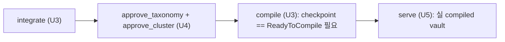
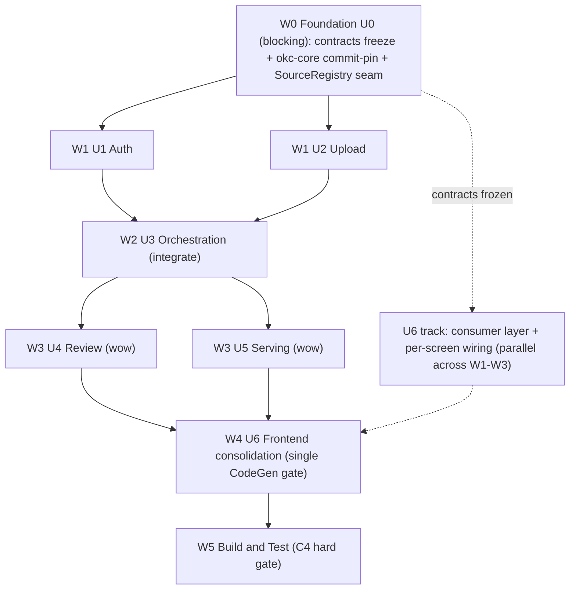

# Parallel Construction Execution Plan — okc-web

**Stage**: CONSTRUCTION / Planning (진입 게이트 대기) — 병렬 웨이브 재계획
**Date**: 2026-09-08
**Strategy**: **BALANCED WAVE (균형 웨이브)** — 사용자 승인(2026-09-08). 백엔드는 데이터흐름 웨이브, 프런트(U6)는 계약 확정 후 완전 병렬 트랙. DAG가 허용하는 병렬성만 주장한다.
**Scope**: 계획 문서 전용 — 애플리케이션 코드 미생성. CONSTRUCTION 유닛별 승인 게이트는 그대로 유지된다.
**Supersedes**: [`execution-plan.md`](../../inception/plans/execution-plan.md)의 순차 빌드 시퀀스(`U0→U1→U2→U3→U4→U5`, U6 인터리브)를 **병렬 웨이브 스케줄로 재구성**한다. 유닛 정의·경계·depth·6-기준 게이트는 무변경(execution-plan / unit-of-work 그대로 상속).
**Grounding**: [`unit-of-work-dependency.md`](../../inception/application-design/unit-of-work-dependency.md)(의존성 매트릭스·비순환 증명) · [`unit-of-work.md`](../../inception/application-design/unit-of-work.md)(유닛 정의·경계·okc-core 접점·FD depth) · [`execution-plan.md`](../../inception/plans/execution-plan.md)(단계별 depth·판정 게이트) · [`services.md`](../../inception/application-design/services.md)(단일-writer 큐 S0.A·read-path·CompileService `ProjectInvalid→422`·U4 Case-B) · [`application-design.md`](../../inception/application-design/application-design.md)(IntegrationCheckpoint·SQLite state) · [`aidlc-state.md`](../../aidlc-state.md)(construction depth·7 오픈 질문)
**Verification**: 워크플로 `wf_c2496026-48c`(2 도출 렌즈 → 3 적대적 검증 렌즈[DAG 간선 / AI-DLC gate / 통합-C4] → 1 종합). DAG 간선 위반 **0건**(검증자 verdict=sound), 1건 blocking(숨은 런타임 spine 간선)·다수 major/minor 수정 모두 종합에 반영.

---

## 0. 결정 요약 (TL;DR)

- **확정 병렬 (DAG로 증명):**
  1. **U4 ∥ U5** (W3): 두 유닛 행 모두 `{U0, U3}`, 상호 연결 간선 없음. U4는 요청 시점 U5 무의존, U5는 `.okc/` 자기완결(compile 미호출·live U4 무의존). U5 read-path는 단일-writer 큐를 우회하므로 런타임 경합도 없음 → **통합까지 완전 병렬**.
  2. **U6 프런트 트랙 ∥ 전 백엔드 웨이브** (W0 배리어 이후): U6는 별도 Next.js 스택, 백엔드에 **컴파일 간선 0** (HTTP 계약 의존만). W0에서 소비자층·셸을 착수하고 각 화면은 소유 유닛 API가 나오는 즉시 배선.
  3. **U1 ∥ U2 코드작성** (W1): 둘 사이 컴파일 간선 없음(둘 다 U0에만 컴파일 의존). `U2→U1`은 **런타임 전용**(admin 토큰 발급 콘솔이 admin 세션 필요; `/u/{token}` 업로드는 `Principal::UploadToken` 사용). → 코드작성 병렬, **통합(실 로그인→토큰→업로드 스파인)은 U1 착지 후 순차**.
- **의도적 순차 유지:** `U0→(U1,U2)→U3→(U4,U5)` 데이터흐름 순서. C4 "실제 end-to-end 동작" 하드 게이트가 데모 스파인(login→upload→integrate→review→serve)의 mock을 금지하므로, 각 웨이브 배리어에서 **실 okc-interop 데이터로 통합 검증**한다.
- **숨은 런타임 spine 간선(핵심 정합성 수정):** `integrate(U3) → approve_taxonomy+approve_cluster(U4) → compile(U3, ReadyToCompile 필요) → serve(U5)`. 빌드 DAG의 `U4→U3`/`U5→U3` 간선이 이 순서를 가린다. **실 컴파일 vault는 U3 완료가 아니라 U4 승인 이후(W3)에 생긴다.**
- **크리티컬 패스:** `U0 → U1 → U2 → U3(integrate) → U4(approve) → U3(compile) → U5(real-serve) → Build&Test`. 데모 스파인의 꼬리는 U4 그림자 속 U5가 아니라 **U5의 실-서빙 캡처**다.
- **AI-DLC 게이트:** 유닛 *내부* 스테이지 순서(FD→NFR-Req→NFR-Design→Infra→CodeGen)와 각 스테이지 2-옵션 게이트는 **무변경**. 오직 유닛 *간* "한 유닛 완료 후 다음" 규칙만 **웨이브 단위로 승격**(사용자 승인 deviation). 배치/3-옵션 승인 없음(emergent behavior 금지).

---

## 1. 병렬화 판단 근거 — 무엇을 병렬화하고 무엇을 순차로 두는가

의존성 매트릭스([`unit-of-work-dependency.md`](../../inception/application-design/unit-of-work-dependency.md) §1)는 하삼각 DAG이며 유효 위상 순서는 `U0 → U1 → U2 → U3 → {U4, U5} → U6`이다. 병렬화 여지는 **간선의 성격**을 분류해야 정확히 드러난다.

| 간선 성격 | 정의 | 병렬화에의 의미 |
|---|---|---|
| **HARD 컴파일-타임** | U0 계약(트레이트/DTO/EngineError/큐 시그니처/AuthContext/SQLite 스키마)에 대한 링크 | U0가 얼면 하위가 컴파일 가능 → U0는 유일한 진짜 blocking 배리어 |
| **SOFT 런타임 데이터흐름** | U1↔U5 사이 (admin 세션·착지 소스·checkpoint·compiled vault 읽기) | 코드작성은 계약 대상 병렬 가능, **통합/E2E는 데이터흐름 순서 유지** |
| **HTTP 계약** | U6 → U0..U5 | 별도 스택. 계약 확정 후 완전 병렬 |

- **U0 → 전 유닛 (HARD):** U0 열이 전부 `X`. 유일 okc-interop 링크점(ADR-0002)이자 최고 리스크(미공개 okc-core 0.3.0 commit-pin CI 그린). → **W0 단독 blocking 웨이브**.
- **U1 ∥ U2 (컴파일 간선 없음):** 둘 다 U0에만 컴파일 의존. `U2→U1`은 런타임 전용 → 코드작성 병렬 안전. 검증자(missed-parallelism)가 지적한 순차 안전-여유를 반영해 W1에서 함께 착수.
- **U3 (데이터흐름 pivot):** `U3→{U0,U1,U2}`. U2 착지 소스·U1 curator_id를 실 데이터로 소비해야 하므로 통합은 U2 이후. U3 출력(checkpoint·StalenessProjection·compiled_vault_path)이 U4·U5 **양쪽의 유일 런타임 의존**이라 fork 전 완료 필요.
- **U4 ∥ U5 (연결 간선 0):** DAG로 증명된 유일한 **통합까지 완전 병렬** 웨이브.
- **U6 (HTTP only):** 컴파일 간선 0 → W0부터 병렬 트랙. 단, 자체 CodeGen 게이트를 BnT 전에 가진다(§6).

---

## 2. 웨이브 스케줄 (W0–W5)

| Wave | 백엔드 유닛 | 병렬성 | 진입 조건 | AI-DLC 스테이지 (depth) | 동기화 배리어 (실 spine 검증) |
|---|---|---|---|---|---|
| **W0** | U0 | 없음 (직렬 병목·SPOF) | INCEPTION 완료 + 사용자 CONSTRUCTION 게이트 | FD skip · NFR-Req min · NFR-Design std · Infra min · **CodeGen comp** | U0 CodeGen 승인 + **okc-core commit-pin CI 그린** + 계약 version-lock(SourceRegistry seam 포함) |
| **W1** | **U1 ∥ U2** (코드작성) | 코드작성 병렬 / 통합 순차 | W0 배리어 통과 | U1: FD std · U2: FD std · (공통) NFR-Req min · NFR-Design std · Infra min · CodeGen comp | 양 유닛 게이트 체인 + 실 스파인 1–2: 로그인→토큰 발급→업로드→`add_source`(단일-writer 큐)로 실 소스+SourceRegistry row 착지 |
| **W2** | U3 | 없음 (U4·U5 fork 전 완료) | W1 배리어 (실 착지 소스·admin 신원) | **FD comprehensive** · NFR-Req min · NFR-Design std · Infra min · CodeGen comp | U3 게이트 체인 + 실 스파인 3: integrate가 실 데이터로 checkpoint를 승인-대기 상태까지 진행. **compiled vault는 아직 아님**. checkpoint/StalenessProjection/compiled_vault_path **계약** freeze = fan-out 지점 |
| **W3** | **U4 ∥ U5** | **완전 병렬 (통합 포함)** | W2 배리어 | U4: **FD comp** · U5: FD skip · (공통) NFR-Req min · NFR-Design std · Infra min · CodeGen comp | 양 유닛 게이트 체인 + 실 스파인 4–5: U4 승인→ReadyToCompile→U3 compile이 **실 vault** 생성→U5 서빙(실 verify/explain·Live/Stale). 결정론적 `422 APPROVAL_REQUIRED`·모순 보존(winner-select 없음) 확인 |
| **W4** | (U6) | — (프런트 통합) | W3 배리어 (전 백엔드 API live) | U6: FD skip · NFR-Req min · NFR-Design std · Infra min · **CodeGen comp** | **U6 단일 통합 CodeGen 게이트** 승인 → U0–U6 전 유닛 게이트 통과 |
| **W5** | — | 없음 (종단) | 전 유닛(U0–U6) 게이트 통과 | Build and Test standard | **C4 하드 게이트**: 무-mock 스파인 e2e 그린 + 단일-writer/PROJECT_BUSY 통합 + 불변식 단위 테스트 + screenshots/ + both-stack CI + lockfile + README/PROCESS narrative + secret scan |

### 2.1 웨이브별 세부

**W0 — Foundation (U0): blocking 계약 freeze + okc-core commit-pin**
- **백엔드**: `adapter::OkcEngine` 트레이트 + 단일 `OkcEngineImpl`, `*View/*Cmd/*Spec` DTO + `From<okc_interop::…>`, `EngineError` code/category enum + table-driven HTTP 맵, `SchemaGuard` v2, `adapter::queue` 단일-writer `EngineActor`(bounded mpsc+oneshot) 시그니처 + read-path `OkcClient` clone 우회, `shared::authz` `AuthContext`/`Role{Admin,Contributor}`/`Principal{Admin,UploadToken}` + 가드 순서(403⇒엔진 0회 호출), `shared::jobs` `JobStore`+`job_events`, `shared::audit` append-only `curator_decisions`+`HashBindings`+winner-select-불가 `CuratorDecision` enum, `shared::state` 단일 SQLite WAL 마이그레이션 — **`sources`/SourceRegistry write-read API seam 포함**.
- **프런트**: U6 트랙 개시(얼린 서브셋에 한해): Next.js App Router 셸(ui-screens.md/design-system.md), `apiClient`·`queryKeys`·`okcErrorMap`(U0 맵 mirror, code/category 분기, message 파싱 금지). `useJobPolling`은 **job-route two-mount 계약 확정 후**(§7) 착수.
- **배리어**: U0 CodeGen 승인 **AND** okc-core commit-pin CI **그린** **AND** 계약 version-lock. 이 단일 배리어가 백엔드 체인과 U6 트랙을 **동시에** 연다.

**W1 — Auth + Upload (U1 ∥ U2 코드작성; 스파인 통합 순차)**
- **U1**(auth): 계정·세션·비밀번호 lifecycle, argon2id PHC, 세션 id SHA-256 저장, last-admin 가드, revoke-all, U3로 `curator_id` 라벨 공급.
- **U2**(upload): 토큰 발급/폐기 + 순서보장 fail-fast ingest, 스트리밍 byte-cap, zip-bomb/traversal/symlink pre-landing 검증, disk-then-register landing, U0 큐 경유 `add_source`, `SourceRegistry.record`.
- **프런트**: E1(로그인/계정) U1 API 착지 시, E2(토큰·`/u/{token}` 업로드·기여자 job-poll) U2 API 착지 시 배선.
- **병렬 주석**: U1∥U2는 **코드작성 병렬만**. 데모 스파인 캡처(로그인→토큰 발급→업로드)는 U1 착지 후 순차. U2 ingest 단독 검증은 **seeded 토큰 fixture**로 하되 C4 스파인 캡처에 절대 유출 금지.

**W2 — Orchestration (U3): integrate + checkpoint 기계 (compile은 W3로 이연)**
- **백엔드**: `ProjectLifecycleService`(freeze), `PipelineService`(단일 reserving `status()`에서 파생 checkpoint 루프·Next-Action/disclosure·`RemoteConsentRequired→422`), `CompileService`(no-clobber, ReadyToCompile 재확인; 미승인 plan→`ProjectInvalid→422`), `StalenessProjection`, SourceRegistry 의미·≤10 freeze.
- **정합성 수정**: U3 배리어는 integrate가 실 U2 소스로 checkpoint를 **승인-대기 상태**까지 진행함만 주장. **실 `compiled_vault_path`는 주장하지 않음** — compile은 `ReadyToCompile`(U4 승인으로만 도달) 필요. compile 코드는 여기서 작성하나 **런타임 실행은 W3**.
- **프런트**: E3 checkpoint 스테퍼·disclosure 422 UX·stale-invalidation UX·job 진행 배선.

**W3 — Review ∥ Serving (U4 ∥ U5): 클린 병렬 fork + 런타임 compile/serve 스파인**
- **U4**(review): `TaxonomyReviewService`/`ClusterReviewService`/`RegenerationService`, `DecisionGate`(Major/Critical gate-before-core→`422 APPROVAL_REQUIRED`), record-then-act 감사, winner-select 없음, 모순 보존.
- **U5**(serving): `ServingService`(read-only GET/HEAD), `ProvenanceComposer`(verify/explain 큐 우회), `ServingStateStore`(publish/stale flip), `McpContractBuilder`.
- **런타임 스파인(여기서 착지)**: U4 승인(`approve_taxonomy`+`approve_cluster`)→checkpoint `ReadyToCompile`→U3 `CompileService`(W2 코드)가 **compile 실행**→실 `compiled_vault_path` 생성→U5가 서빙. 따라서 **실-컴파일-vault·serve 마일스톤은 W3**.
- **프런트**: E4(리뷰 표면) ∥ E5(서빙) 동시 배선; focal wow 화면 E4-3 ClusterReview·E5-2 provenance는 꼬리에서 폴리시.
- **병렬 주석**: 백엔드 U4∥U5 완전 동시. U4(comprehensive/focal)가 Request-Changes에서 지연되면 U5(경량, FD-skip)는 자기 체인을 마치고 배리어에서 대기.

**W4 — Frontend consolidation (U6): 별도 per-unit 루프 + 단일 CodeGen 게이트**
- **정합성 수정**: U6는 매트릭스상 1급 유닛(`U6→U0..U5`)이며 CodeGen은 ALWAYS per-unit. → **gate 없는 트랙 불가**. W1–W3에 인터리브된 화면 배선은 **이 단일 U6 CodeGen 게이트 아래 plan-체크박스 진행**으로 롤업(다중 암묵 게이트=emergent behavior 금지).
- **프런트**: 전 화면 empty/loading/success/error 상태 매트릭스, focal E4-3/E5-2 폴리시, 문제정의 카피, 3 auth-context 배선 검증.

**W5 — Build and Test: C4 하드 게이트 수렴**
- 무-mock 스파인 e2e(login→upload→integrate→approve→compile→serve) + 단일-writer/PROJECT_BUSY 통합 1건 + 불변식 단위 테스트(403-never-calls-core·OkcError code 분기·schema-version 거부·staleness 캐스케이드·업로드 거부·결정론적 422) + screenshots/(E4·E2·E5·403) + both-stack CI + 커밋 lockfile + README/PROCESS narrative + secret scan.

---

## 3. 병렬화 확정 목록 & 순차 유지 간선

### 3.1 병렬화 (parallelizable)
- **U4 ∥ U5** (W3, 통합 포함): 연결 간선 0 확정. U5 verify/explain 큐 우회로 런타임 경합 없음. 순서 무관.
- **U6 프런트 트랙 ∥ 전 백엔드 웨이브** (W1–W3): 컴파일 간선 0. 소비자층·셸은 W0에 착수, 화면 배선은 각 백엔드 API를 뒤따르며 백엔드 웨이브를 막지 않음.
- **U1 ∥ U2 코드작성** (W1, 통합 순차): 컴파일 간선 없음. `U2→U1` 런타임 전용.
- **오버랩(코드작성만, 통합 순차 유지):** U3 코드작성은 W1 꼬리에서 얼린 U0+SourceRegistry seam 대상 가능; U4·U5 코드작성은 W2/U3 꼬리에서 얼린 checkpoint/StalenessProjection/compiled_vault_path seam DTO 대상 가능.
- **U6 E4-화면 배선 ∥ U6 E5-화면 배선** (W3 내): 두 focal 표면 독립.

### 3.2 순차 유지 (honored sequential edges)
- `U0 → {U1..U6}`: **HARD 컴파일-타임**. 단일 blocking 웨이브 W0.
- `U1 → U2` (통합, 런타임): admin 토큰 발급 콘솔이 admin 세션 필요. 실 스파인 무-mock 위해 순차.
- `U2 → U3` (런타임 데이터흐름): U3가 U2 착지 소스·≤10 cap 재조정 소비.
- `U3 → U4` / `U3 → U5` (컴파일-타임 on checkpoint/vault DTO + 런타임 read): W2 완료로 fork 게이팅.
- **숨은 런타임 스파인 간선** `integrate(U3) → approve(U4) → compile(U3) → serve(U5)`: §4.
- `U6 화면별 배선 → 소유 유닛 API 착지`: HTTP 계약 타이밍. 화면을 게이팅하나 백엔드 체인은 아님.
- `Build and Test → 전 유닛`: AI-DLC ALWAYS-after-all-units, C4 수렴.

---

## 4. 숨은 런타임 스파인 간선 (정합성 핵심 — blocking 수정)

빌드 DAG는 `U4→U3`, `U5→U3`(U4/U5가 U3를 읽음)만 보여주지만, **런타임 실행 순서**는 다음을 강제한다:



**텍스트 대안**: (1) U3 `integrate`가 IntegrationCheckpoint를 승인-대기 상태로 진행한다. (2) U4가 `approve_taxonomy`+`approve_cluster`로 checkpoint를 `ReadyToCompile`까지 올린다. (3) U3 `CompileService`가 `compile`을 실행해 실 `compiled_vault_path`를 만든다(미승인 plan은 `ProjectInvalid→422`, [`services.md`](../../inception/application-design/services.md) U3). (4) U5가 그 vault를 read-only로 서빙(verify/explain 큐 우회).

**함의**: 실 컴파일 vault는 **U3 완료(W2)가 아니라 U4 승인 이후(W3)** 에 존재한다. U3 완료를 vault-ready로 간주하는 어떤 스케줄 변형도 C4 serve 세그먼트를 깨뜨린다. → W3 동기화 배리어가 이 순서를 통합-테스트 어서션으로 인코딩한다(§7 open-item 4).

---

## 5. 크리티컬 패스 & 통합 배리어

### 5.1 크리티컬 패스
```
U0 → U1 → U2 → U3(integrate) → U4(approve) → U3(compile) → U5(real-serve) → Build&Test
```
데모 스파인의 꼬리는 **U5의 실-서빙 e2e 캡처**다(U4 그림자 속이 아님) — 실 vault가 U4 승인 후에만 존재하기 때문. U5 CodeGen은 U4와 병렬(작성 크리티컬 패스 밖: FD skip·경량)이나, **U5의 end-to-end 서빙 검증은 C4 크리티컬 패스 위**에 있다. U6 트랙은 U1→U4 전 구간과 오버랩하며 focal 폴리시(W4)와 스크린샷만 꼬리에서 수렴.

### 5.2 통합 배리어 (각 웨이브 = 실 okc-interop 검증 지점)
- **W0**: okc-core commit-pin CI 그린 + U0 계약 version-lock(SourceRegistry seam 포함). 양 스택 unblock.
- **W1**: 실 로그인→토큰 발급→업로드→`add_source`(단일-writer 큐)로 실 소스+SourceRegistry row 착지 (무-mock).
- **W2**: 실 integrate가 실 데이터로 IntegrationCheckpoint를 승인-대기 상태까지 진행; checkpoint/StalenessProjection/compiled_vault_path **계약** freeze (실 vault는 아직 아님).
- **W3**: 실 U4 승인→ReadyToCompile→U3 compile이 실 vault 생성→U5 서빙(실 verify/explain·Live/Stale). 결정론적 `422 APPROVAL_REQUIRED`·모순 보존 확인.
- **W4**: U6 통합 CodeGen 게이트 — 전 화면·상태 매트릭스·focal 폴리시 1회 게이팅.
- **W5**: C4 하드 게이트 — 전 스파인 e2e·통합/불변식 테스트·screenshots/·both-stack CI·lockfile·README/PROCESS·secret scan.

---

## 6. AI-DLC 승인 게이트 재조정 (사용자 승인 deviation)

- **유닛 내부 무변경**: 모든 유닛에서 스테이지 순서 `FD → NFR-Req → NFR-Design → Infra → CodeGen`와 각 스테이지의 표준 2-옵션 게이트("Request Changes" | "Continue to Next Stage")가 기본 AI-DLC per-unit 루프대로, **올바른 depth로** 발화한다(U0 FD skip; U1/U2 FD standard; U3/U4 FD comprehensive; U5/U6 FD skip; NFR-Req minimal; NFR-Design standard; Infra minimal; CodeGen comprehensive).
- **유닛 간만 승격**: "한 유닛 완전 완료 후 다음" 규칙만 **웨이브 단위**로 승격. (기본 CLAUDE.md 순차 per-unit 루프로부터의 명시적 deviation — 사용자 승인, aidlc-state.md/audit.md에 기록.)
- **병렬 웨이브 내 게이트 프로토콜**: 병렬 웨이브(W1 U1∥U2, W3 U4∥U5)에서 각 유닛은 **자기 고유의 순차 per-stage 2-옵션 게이트**를 독립 발화한다. **배치/결합/3-옵션 승인 프롬프트 없음**(금지된 emergent behavior). 웨이브 동기화 배리어 = 웨이브 내 전 유닛의 **완전한 게이트 체인**(CodeGen뿐 아니라 전 스테이지 게이트)의 논리 AND **+** 해당 웨이브 spine 세그먼트의 무-mock 통합 체크. 한 유닛이 Request-Changes에 머물면 배리어는 대기하고 형제 유닛은 자기 체인을 마친 뒤 대기.
- **U6**: 별도 per-unit 스테이지 루프(NFR-Req min → NFR-Design std → Infra min → CodeGen comp) + **단일 통합 CodeGen 게이트**(W4). W1–W3 인터리브 배선은 그 단일 게이트 아래 plan-체크박스 진행으로 추적.
- **Build and Test**: 전 U0–U6 게이트 후 단일 종단 스테이지 유지.

---

## 7. 오픈 이슈 처리 (7개 오픈 질문 — aidlc-state 캐리)

- **W0에서 해소 (횡단, 하위 차단):**
  - okc-core commit-pin 해시 (CI 게이트).
  - **SourceRegistry owner** — 해소: 물리 스키마 = U0 `shared::state`, 의미 = U3. `sources` write/read API를 W0 마이그레이션에서 freeze (U2 `add_source→record`가 U3 전에 컴파일 가능하도록).
  - **job-route two-mount 계약** `GET /api/projects/{id}/jobs/{jobId}` + `/u/{token}/jobs/{jobId}` — U6 `useJobPolling`·U2/U3 의존.
- **소유 웨이브로 이연 (유닛-로컬):**
  - serving addressing/authz + E5-2 contradiction source → U5 (W3).
  - `Role::{Admin,Contributor}` vs curator 모델 + session/token hashing refinements → U1/U2 (W1).
  - 의존 U6 배선(E5 화면·세션 의존 흐름)은 W0로 밀어넣지 말고 해당 유닛 착지에 게이팅.
- **기록/검증:**
  - per-unit "한 유닛 완료 후 다음"의 웨이브-승격 deviation을 aidlc-state.md + audit.md에 기록(2-옵션 게이트는 유닛 내부 보존).
  - W3 런타임 compile-after-approval 순서를 **통합-테스트 어서션**으로 인코딩(산문뿐 아니라)해 숨은 spine 간선이 조용히 회귀하지 못하게 함.

---

## 8. 리스크

1. **숨은 런타임 간선(최고 정합성 리스크)**: compile은 `ReadyToCompile`(U4 승인 필요) → 실 vault 마일스톤은 W3. U3 완료를 vault-ready로 다루는 변형은 C4 serve 세그먼트를 깬다. 완화: W3 런타임 배리어 `integrate→approve→compile→serve` + 통합-테스트 어서션.
2. **W0 직렬 병목·SPOF**: okc-core commit-pin CI 미그린이면 백엔드·U6 트랙 **전부** 정지. 설계상 최고 리스크 선차단이나 W0를 느슨히 time-box 금지.
3. **SourceRegistry seam**: U0 `shared::state` 내부 seam(오픈 질문). W0에서 freeze 누락 시 U2 `add_source→record`가 W1에서 컴파일/완료 불가.
4. **이연 오픈 질문 계약 drift**: serving addressing/authz·E5-2·session/token hashing·Role 모델이 소유 웨이브에서 확정 후 형태가 바뀌면 U6 `useJobPolling`/E5 배선·seam-stub 작성이 캐스케이드 재작업. U0 계약 freeze 규율 + job-route 조기 확정이 병렬 주장의 load-bearing.
5. **동시 게이트 리뷰 대역폭**: U1∥U2, U4∥U5의 per-unit 게이트가 동시 도착. 무거운 유닛(U4 comprehensive/focal)이 Request-Changes면 배리어 정지·형제 유닛 idle. 완화: 경량 유닛은 마치고 대기, 집합 배리어만 대기.
6. **단일-writer 큐 지연 노출**: 큐는 W1(`add_source`)부터 실사용 → PROJECT_BUSY 결함이 W0 sign-off 대비 늦게 표면화. W5 단일-writer/PROJECT_BUSY 통합 테스트가 backstop, 이연 금지.
7. **U1∥U2 seeded-토큰 fixture 유출 위험**: U1 착지 전 U2 ingest 검증용 seeded 토큰 fixture는 실 `login→issue-token` 스파인 캡처에 절대 유출 금지(C4 무-mock).

---

## 9. 웨이브 의존성 다이어그램 (Mermaid)

간선 방향 = 실행/데이터흐름 진행(A → B = "A 이후 B"). 점선 = HTTP 계약 트랙(컴파일 간선 아님).



**텍스트 대안**: W0(U0)가 완료되면 W1의 U1과 U2가 **병렬**로 시작한다(둘 다 W0에만 의존). U1·U2 완료 후 W2의 U3(integrate). U3 완료 후 W3에서 U4와 U5가 **병렬**로 진행(둘 다 U3에만 의존, 상호 무의존). U4·U5 완료 후 W4에서 U6를 통합(단일 CodeGen 게이트). U6 완료 후 W5 Build and Test(C4 하드 게이트). U6 트랙(소비자층·화면 배선)은 W0 계약 freeze 직후부터 W1–W3 전 구간과 **병렬**로 흐르며 점선으로 표시되고 W4에서 최종 통합된다. (런타임 compile/serve 스파인의 세부 순서는 §4 별도 다이어그램 참조.)

---

## 10. 6-기준 self-check (판정 게이트)

- **C1 (협업 진정성/추적성)**: 본 계획은 승인된 [`unit-of-work-dependency.md`](../../inception/application-design/unit-of-work-dependency.md) 매트릭스·[`execution-plan.md`](../../inception/plans/execution-plan.md) depth를 **재명명/재범위 없이** 상속하고 병렬 스케줄만 재구성. 유닛↔epic↔story 매핑·FD depth 무변경. 도출→적대적 검증(3렌즈)→종합의 감사 흔적이 audit.md·`wf_c2496026-48c` 저널에 기록.
- **C2 (문제 정의)**: N/A (스케줄링 산출물; 문제정의 카피는 U6/README 소유).
- **C3 (차별성)**: U4 Case-B 결정 표면(winner-select 없음·Major/Critical→422)·모순 보존이 **W3 실 파이프라인으로 검증**되도록 배리어에 인코딩 — 주장 아닌 실행 산출로 착지.
- **C4 (실제 동작)**: 각 웨이브 배리어가 **실 okc-interop 무-mock 통합 체크**. 숨은 런타임 spine 간선을 명시화해 serve 세그먼트가 실 vault로 동작하도록 보장. W5가 screenshots/·e2e·CI로 하드 게이트.
- **C5 (온보딩/사용성)**: U6 트랙 병렬화로 상태 매트릭스·focal 화면이 조기 배선·꼬리 폴리시. 화면별 배선은 계약 확정 후만 → 재작업 최소.
- **C6 (유지보수성)**: 유닛↔모듈 1:1·U0 seam 격리 무변경. 병렬화는 스케줄만 바꾸고 경계·큐·상태 소유를 건드리지 않음. 명시적 sync 배리어·계약 freeze 규율이 병렬 안전성의 근거.

**Extension 준수**: Security/Resiliency/PBT 전부 opt-out(aidlc-state 확인) → 해당 규칙 미로딩·N/A. 기본 업로드 검증은 U2 일반 요구사항으로 W1에 유지.
