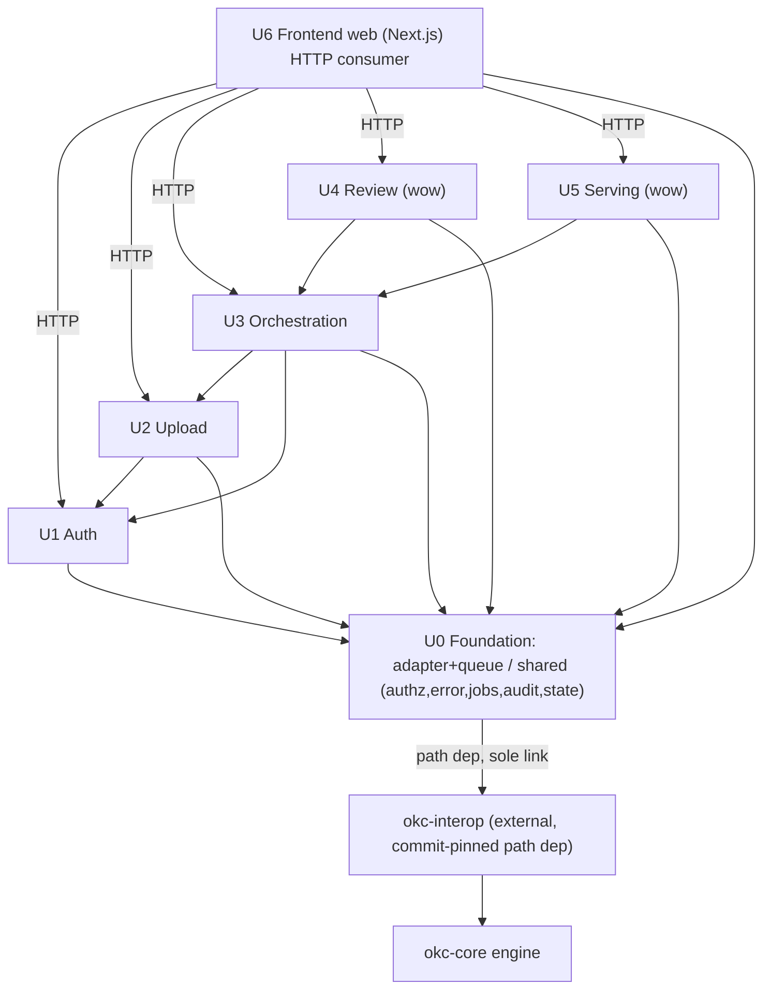

# Unit of Work Dependencies — okc-web

**Stage**: INCEPTION / Units Generation — Part 2 (Generation)
**Depth**: Standard
**Date**: 2026-09-08
**System**: okc-web = 단일 axum(Rust) 크레이트 + Next.js 프런트, `okc-interop` path dep로 okc-core 엔진 소비(ADR-0002). 단일 장기 프로세스 · 단일 SQLite state · 단일-writer 엔진 큐.
**Grounding**: `execution-plan.md`(승인된 7-유닛 U0–U6 분해·빌드 시퀀스·유닛별 depth) · `unit-of-work-plan.md`(Part 1 승인값 Q1–Q7 = A) · `application-design.md`(모듈 맵·epic→unit·SQLite state) · `component-dependency.md`(유닛 의존성 매트릭스·통신 패턴) · `services.md`(S0.A 단일-writer 큐·read-path 정책) · `stories.md`(29 스토리 / 5 epic) · `module-integration-guide.md`(§2 내부 모듈 맵 · §4 모노레포 레이아웃)

이 문서는 7개 유닛(U0–U6)의 **의존성 매트릭스**, **통신 패턴**, **빌드 순서**를 정의하고, 의존성 그래프가 **U0를 기반으로 하는 비순환 단방향**임을 검증한다. 유닛 정의·경계·책임은 `unit-of-work.md`, 스토리↔유닛 배정은 `unit-of-work-story-map.md`가 담당한다.

---

## 1. 유닛 의존성 매트릭스 (unit → depends-on)

각 **행(row)** 은 유닛, 각 **열(column)** 은 그 유닛이 의존하는 대상 유닛이다. 표시는 아래 범례를 따른다. 모든 유닛은 U0에 의존하며, **U0는 어떤 유닛에도 의존하지 않는다**(기반 유닛). 유닛 내부의 세부 모듈 관심사는 `application-design.md` §13 epic→unit→module 맵을 따른다.

| 행\열 (row depends on column) | U0 | U1 | U2 | U3 | U4 | U5 | U6 |
|---|:--:|:--:|:--:|:--:|:--:|:--:|:--:|
| **U0** Foundation (`adapter`+`queue` · `shared`) | — |   |   |   |   |   |   |
| **U1** Auth (`auth`) | X | — |   |   |   |   |   |
| **U2** Upload (`upload`) | X | X | — |   |   |   |   |
| **U3** Orchestration (`orchestration`) | X | X | X | — |   |   |   |
| **U4** Review (`review`) | X |   |   | X | — |   |   |
| **U5** Serving (`serving`) | X |   |   | X |   | — |   |
| **U6** Frontend (`web` / Next.js) | X | X | X | X | X | X | — |

**범례**: `X` = 해당 열 유닛에 의존함 · `—` = 자기 자신(대각선) · 빈칸 = 의존 없음.

**행렬은 하삼각(lower-triangular)** 이다 — 대각선 위쪽(상삼각)에 `X`가 하나도 없다는 것이 곧 비순환(단방향)의 시각적 증거다. 즉 어떤 유닛도 자기보다 나중에 빌드되는 유닛에 의존하지 않는다(U6는 예외적으로 모든 선행 유닛에 의존하는 최상위 소비층).

### 외부 의존성 — okc-interop (유닛 아님)
`okc-interop`(→ okc-core 엔진)는 유닛이 아니라 commit-pin된 외부 path dep다. **오직 U0 `adapter`만이 이를 링크한다**(ADR-0002 단일 링크점). U1–U6는 U0가 소유한 typed-DTO(`*View`/`*Cmd`/`*Spec`) + `EngineError` 경계 뒤에서만 엔진에 도달하며, 어떤 `okc_interop::*` 타입도 U0 경계를 넘지 않는다. 따라서 매트릭스 열에는 U0–U6만 두고 okc-interop는 U0의 외부 링크로 별도 표기한다.

### 유닛별 의존 근거 (component-dependency.md 매트릭스 기준)
- **U0 → (없음)**: 기반 유닛. 유닛 내부에서 `adapter`가 `shared::jobs`/`shared::audit`를 참조하나 이는 U0 내부(intra-unit) 결합이며 다른 유닛 의존이 아니다. 외부로는 okc-interop만 링크한다.
- **U1 → U0**: `shared::authz`(세션 리졸버 `AuthProvider`를 U1이 공급, 가드는 U0 소유) · `shared::error` · `shared::state`(`accounts`/`sessions`). 순수 pre-core, 엔진 큐 미접촉.
- **U2 → U0, U1**: U0(`adapter::queue`로 `add_source`, `shared::authz` 토큰 리졸버, `error`/`jobs`/`audit`/`state`의 `sources` write); U1(토큰 발급 콘솔은 admin 세션 필요 — `needs admin session`).
- **U3 → U0, U1, U2**: U0(`adapter::queue`로 `status`/`preflight`/`integrate`/`compile`, `shared` 전반); U1(admin identity를 비검증 `curator_id` 라벨로 소비); U2(U2가 착지시킨 소스를 읽고 ≤10 캡 재조정 `reads landed sources / cap reconcile`).
- **U4 → U0, U3**: U0(`adapter::queue`로 `approve_taxonomy`/`approve_cluster`/`regenerate_cluster`, `shared::audit`에 `CuratorDecision` 기록); U3(`PipelineService` 현재 checkpoint + `StalenessProjection`을 읽음 — checkpoint를 재도출하지 않음). U4는 요청 시점에 U5에 의존하지 않는다.
- **U5 → U0, U3**: U0(`adapter` read-path로 `verify`/`explain`, 큐 우회 · `shared::state`의 `SourceRegistry`/`serving_publications`); U3(`compiled_vault_path` + manifest + frozen-input 해시를 읽어 Live/Offline/Stale 판정 — U5는 compile을 절대 호출하지 않음). U5는 요청 시점에 U4에 의존하지 않는다(`.okc/` 자기완결).
- **U6 → U0, U1, U2, U3, U4, U5**: HTTP 소비만. U0의 `okcErrorMap`/`useJobPolling` 계약을 미러링하고, U1–U5의 REST 엔드포인트를 호출한다(코드 링크 아님, 계약 의존).

### U2↔U3 결합 명확화 (순환 아님)
`projects`/`sources` 테이블의 **의미(semantics)** 는 U3가 소유하지만, **물리 스키마는 U0 `shared::state`(단일 SQLite WAL)** 에 있다(`application-design.md` §9). U2는 `add_source` 커밋 시 `sources` 행을 U0 `shared::state`를 통해 기록하고, U3는 그 착지된 소스를 읽는다. 따라서 데이터 흐름의 유닛-레벨 방향은 **U3 → U2**(U3가 U2 산출물을 소비, 빌드 순서 U2 먼저와 일치) 한 방향뿐이며, U2가 U3 코드에 의존하는 역방향 간선은 존재하지 않는다(공유 상태 접근은 U2 → U0로 흡수). 이로써 U2/U3 사이에 순환이 생기지 않는다.

---

## 2. 통신 패턴

모든 유닛은 **하나의 axum 크레이트 안의 인-프로세스 Rust 모듈**이다(`unit-of-work-plan.md` Q2/Q4 = A). **유닛 간 네트워크 호출·프로세스 간 코디네이션은 없다** — 단일 장기 엔진 프로세스가 okc-interop의 프로세스-글로벌 `scheduler`/`PROJECT_RESERVATIONS`와 정합한다. 통신은 아래 5가지 패턴으로 한정된다.

1. **트레이트 경계 (인-프로세스)** — U1–U6는 U0 `adapter::OkcEngine` 트레이트 + okc-web DTO에만 의존한다. `okc_interop`는 `adapter`에서만 import되어 ADR-0002가 컴파일 타임에 강제된다. 인-프로세스 함수/트레이트 호출이므로 유닛 간 RPC/HTTP가 없다.
2. **직렬화 큐 (bounded mpsc + oneshot) — 모든 변경성 엔진 op** — reserving/mutating op은 handler → `EngineHandle`(mpsc) → 단일 blocking `EngineActor`(유일 `OkcClient` 소유자) → okc-interop 경로로 흐른다. 워커는 한 번에 정확히 하나의 명령만 처리하고 interop `Job`을 terminal까지 몰아간 뒤 다음을 dequeue한다 → okc-web이 엔진의 **단일 writer**(NFR-CONC-1). 잔여 `ProjectBusy`(진짜 cross-process 경합)는 **code로 분기**하여 409 + `Retry-After`로 처리한다(interop `retryable` 플래그 미신뢰).
3. **HTTP REST + JSON (3 auth context)** — U6(및 okc-mcp 소비자)만이 HTTP로 진입한다. admin 라우트=쿠키 세션, `/u/{token}/*`=bearer 업로드 토큰, `/api/serving/*`=read-only. 오류 바디는 단일 `{code, category, message, retryable, retry_after_ms?}`이며 프런트는 **code/category로만 분기**(메시지 파싱 금지, FR-INT-8).
4. **Job 폴링 (Q7)** — 장기 op은 `JobId`를 즉시 반환하고, 클라이언트는 정규 라우트 `GET /api/projects/{id}/jobs/{jobId}`(admin) 또는 `GET /u/{token}/jobs/{jobId}`(token, 동일 `JobStore` 스냅샷)로 폴링한다. verify/explain은 동기(비변경)라 폴링 대상이 아니다.
5. **SQLite 공유 상태 (`shared::state`, 단일 WAL)** — 모든 리포지토리가 하나의 `StateDb`를 공유한다. 논리 소유: `accounts`/`sessions`(U1) · `upload_tokens`(U2) · `projects`/`sources`(U3, `sources`는 U2가 write·U5가 read) · `jobs`/`job_events`/`curator_decisions`(U0) · `serving_publications`(U5). 유닛 간 상태 공유는 오직 이 U0 계층을 통한다.

### 엔진 op 라우팅 — 큐 통과 vs 큐 우회 (services.md S0.A · verifier #8)
| 경로 | 성격 | 엔진 op | 소유 유닛 |
|---|---|---|---|
| **U0 단일-writer 큐 통과** | reserving / **mutating** | `status`, `add_source`, `replace_sources`, `preflight`, `integrate`, `approve_taxonomy`, `approve_cluster`, `regenerate_cluster`, `compile` | U2(add_source) · U3(status/preflight/integrate/compile) · U4(approve_*/regenerate) |
| **큐 우회 (read-path OkcClient clone)** | non-reserving **read** | `taxonomy`, `clusters`, `manifest`, `verify`, `explain` | U4(taxonomy/clusters 읽기) · U5(manifest/verify/explain) |

**핵심 불변식**: (a) 유닛 간 네트워크 호출 없음(단일 크레이트 인-프로세스). (b) 모든 변경성 엔진 op은 U0 단일-writer 큐로 직렬화. (c) 유닛 간 공유 상태는 U0 `shared::state`(SQLite) 경유만. (d) U6는 HTTP API만 소비. (e) 비변경 `verify`/`explain`(및 taxonomy/clusters/manifest 읽기)은 큐를 우회해 다분 걸리는 integrate/compile 뒤에서 stall되지 않는다.

---

## 3. 빌드 순서

**시퀀스: U0 → U1 → U2 → U3 → U4 → U5, U6 인터리브**(`unit-of-work-plan.md` Q7 = A). 리스크-우선 + 데이터 흐름 순서이며, 각 유닛의 API가 나오는 즉시 U6가 해당 화면을 배선한다. 순서는 **데모 스파인**을 조기에 관통한다: **login → upload → integrate → review → serve**.

| 단계 | 유닛 | 데모 스파인 | 근거 (왜 이 순서인가) |
|---|---|---|---|
| 1 | **U0** Foundation | (기반) | **모든 유닛이 U0에 의존**하므로 최우선. 유일한 okc-interop 링크점 + 단일-writer 큐 + RBAC 가드 + `OkcError→HTTP` 매핑 + `JobStore` + 감사 + SQLite를 선착지. 최고 리스크(okc-core commit-pin 소스 빌드/CI 그린)를 먼저 차단한다. 유닛 내부 순서는 `shared`(state/error/authz/jobs/audit) → `adapter`(+`queue`). |
| 2 | **U1** Auth | login | 데모 스파인 진입점. admin 세션을 생산해 U2–U5의 admin 게이팅을 가능케 한다. 순수 pre-core·DB-only라 엔진 위험 없이 조기 안정화. U0에만 의존. |
| 3 | **U2** Upload | upload | 데모 1단계. U1 admin 세션으로 토큰을 발급하고(U2→U1), 검증된 소스를 착지시켜 **첫 변경성 엔진 op(`add_source`)** 을 U0 큐로 통과시킨다 — 큐/어댑터 경로를 실데이터로 검증. |
| 4 | **U3** Orchestration | integrate | 데모 2단계. U2가 착지시킨 소스를 소비(U3→U2)해 freeze → IntegrationCheckpoint 루프 → compile을 오케스트레이션. checkpoint 상태를 생산해 U4가 읽게 한다. |
| 5 | **U4** Review | review (wow) | 데모 3단계·focal. U3의 checkpoint/staleness를 읽어(U4→U3) taxonomy/cluster 결정 표면을 제공. `DecisionGate`(Major/Critical→422, 코어 미호출)와 winner-select 부재가 C3 차별자 — 실 critic 데이터로 검증. |
| 6 | **U5** Serving | serve (wow) | 데모 4·5단계·focal. U3의 compiled vault + frozen-input 해시를 읽어(U5→U3) read-only 서빙 + `verify`/`explain` provenance를 큐 우회로 제공. `.okc/` 자기완결이라 요청 시점에 U4 불필요. |
| ↺ | **U6** Frontend | 전 화면 | 백엔드 유닛과 **인터리브**: 각 유닛 API가 나오면 해당 화면(E1→E5)을 배선하고 마지막에 focal(E4-3/E5-2) 폴리시. UI는 `ui-screens.md`/`design-system.md`로 선착수돼 있어 배선 계약만. |

**프런트 우선(백엔드 이후)를 택하지 않는 이유**: 백엔드 계약(엔드포인트·DTO·에러 code) 미확정 상태에서 화면을 배선하면 계약 확정 후 재작업을 유발한다. 인터리브는 계약이 나온 화면만 배선하므로 재작업을 피하고 데모 스파인을 단계별로 관통시킨다.

---

## 4. 의존성 그래프 (Mermaid)

간선 방향은 **의존하는 쪽 → 의존받는 쪽**(A → B = "A는 B에 의존")이며, 모든 간선이 기반 U0(및 그 아래 okc-interop → okc-core)로 수렴한다. 역방향 간선이 없어 순환이 없다.

### 텍스트 대안
다이어그램의 모든 간선을 산문으로 재진술한다(간선 = "의존한다"):
- **U1 → U0**: U1(Auth)은 U0에 의존한다(`shared::authz` 가드/`error`/`state`).
- **U2 → U1**: U2(Upload)는 U1에 의존한다(토큰 발급 콘솔은 admin 세션 필요).
- **U2 → U0**: U2는 U0에 의존한다(`add_source`용 단일-writer 큐, `authz` 토큰 리졸버, `jobs`/`audit`/`state`의 `sources` write).
- **U3 → U2**: U3(Orchestration)는 U2에 의존한다(U2가 착지시킨 소스를 읽고 ≤10 캡 재조정).
- **U3 → U1**: U3는 U1에 의존한다(admin identity를 비검증 `curator_id` 라벨로 소비).
- **U3 → U0**: U3는 U0에 의존한다(`status`/`preflight`/`integrate`/`compile` 큐 통과, `shared` 전반).
- **U4 → U3**: U4(Review)는 U3에 의존한다(`PipelineService` checkpoint + `StalenessProjection` 읽기).
- **U4 → U0**: U4는 U0에 의존한다(`approve_taxonomy`/`approve_cluster`/`regenerate_cluster` 큐 통과, `shared::audit`에 `CuratorDecision` 기록).
- **U5 → U3**: U5(Serving)는 U3에 의존한다(`compiled_vault_path` + manifest + frozen-input 해시 읽기; U5는 compile 미호출).
- **U5 → U0**: U5는 U0에 의존한다(`verify`/`explain` read-path 큐 우회, `shared::state`의 `SourceRegistry`/`serving_publications`).
- **U6 → U1, U2, U3, U4, U5 (HTTP)**: U6(Frontend)는 U1–U5의 REST 엔드포인트를 HTTP로만 소비한다.
- **U6 → U0**: U6는 U0에 의존한다(U0 `okcErrorMap`/`useJobPolling` 계약 미러링).
- **U0 → okc-interop (path dep, sole link)**: U0 `adapter`만이 commit-pin된 `okc-interop`를 링크한다.
- **okc-interop → okc-core**: interop이 okc-core 엔진을 래핑한다.

---

## 5. 비순환·단방향·U0 기반 단언 (검증)

**단언**: okc-web의 유닛 의존성 그래프는 **비순환(acyclic)** 이며 **단방향(single-direction)** 이고, **U0가 유일한 기반(foundational sink)** 이다.

검증 근거:
1. **U0 기반성**: §1 매트릭스의 U0 행은 전부 빈칸이다 — U0는 어떤 유닛에도 의존하지 않는다. 반대로 U1–U6의 U0 열은 전부 `X`다 — **모든 유닛이 U0에 의존**한다. U0의 유일한 바깥 의존은 유닛이 아닌 외부 path dep okc-interop이다.
2. **하삼각 = 순환 없음**: §1 매트릭스는 하삼각(대각선 위 `X` 없음)이므로 어떤 유닛도 자기보다 나중에 빌드되는 유닛에 의존하지 않는다. §4 그래프의 모든 간선은 U0(및 okc-interop → okc-core) 방향으로만 수렴하며 역방향 간선이 없다.
3. **잠재 순환 지점 해소**: U2/U3의 `sources` 결합은 U3 → U2 한 방향뿐이며 공유 상태 접근은 U2 → U0로 흡수된다(§1 "U2↔U3 결합 명확화"). U3/U4, U4/U5도 각각 U4 → U3, (요청 시점) 무의존으로 단방향이다 — U3는 U4에, U5는 U4에 의존하지 않는다.
4. **위상 정렬 = 빌드 순서와 일치**: 유효한 위상 순서 `U0 → U1 → U2 → U3 → {U4, U5} → U6`가 존재하며(U4·U5는 상호 무의존이라 순서 무관), 이는 §3 빌드 시퀀스 `U0 → U1 → U2 → U3 → U4 → U5`(U6 인터리브)와 일치한다. 위상 순서의 존재 자체가 그래프의 비순환성을 증명한다.

**결론**: 의존성 그래프는 DAG이며 U0를 기반으로 단방향으로 흐른다. `unit-of-work-plan.md` Part 2 검증 항목 "유닛 경계·의존성 검증(순환 없음, U0 기반 단방향)"을 충족한다.
