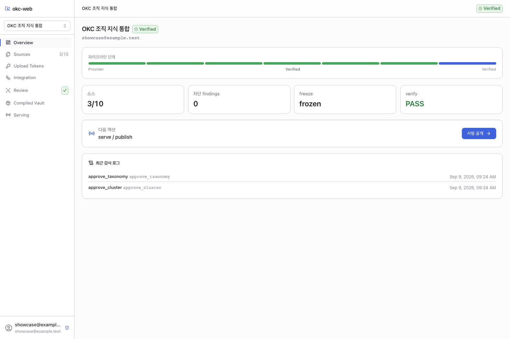
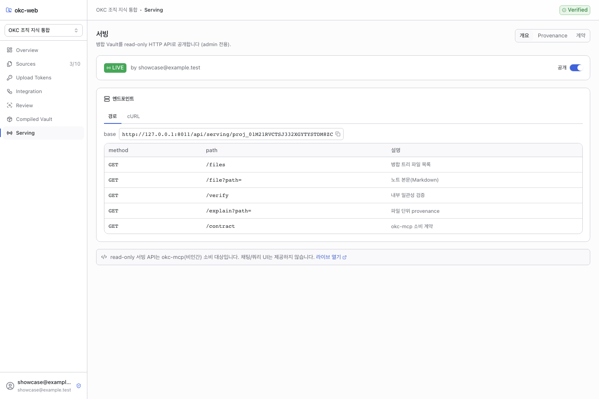

# screenshots/

Demo captures of the working implementation (judging criterion #4).

## Captured screens (real, committed)

These are **real renders of the running app** (the same captures used on the
showcase site), covering the offline-reachable / deterministic path:

| Screen | Capture |
|---|---|
| Project overview |  |
| Sources + freeze |  |
| Compiled vault |  |
| Serving / publish |  |
| Provenance & verify (focal) |  |

The provenance/verify shot shows the focal "wow" screen: per-file provenance
lineage, the `Verified` badge, the deterministic hash, and the in-screen note that
`verify` proves internal consistency (not publisher authenticity) — the screen
explains its own model.

## Still pending (need a live LLM provider)

The **AI-driven focal screens** — E3 integration monitor and the E4 cluster/critic
review (severity badges, Minor-waive vs un-waivable→regenerate, `APPROVAL_REQUIRED`
compile block, preserved contradictions) — are **not yet captured** here, because
they only populate after a real run through a configured provider (absent in the
build environment). The repeatable script below produces them once a provider is
configured.

## Capture (local, with a browser)
```bash
# 1) build the frontend and run the app (see aidlc-docs/construction/build-and-test/build-instructions.md)
cd backend && OKC_WEB_BOOTSTRAP_ADMIN_EMAIL=admin@example.com OKC_WEB_BOOTSTRAP_ADMIN_PASSWORD=change-me \
  .venv/bin/python -m uvicorn app.main:create_app --factory --workers 1 --port 8000 &

# 2) install a headless browser once, then capture
cd frontend && npx playwright install chromium
node ../screenshots/capture.mjs        # writes PNGs into screenshots/
```
`capture.mjs` logs in, walks the offline-reachable routes, and captures each. For the
AI happy-path, configure a provider (`OKC_WEB_PROVIDER_*`), complete a run through the
UI, then re-run the script — it will additionally capture the populated focal screens
(E3-5 integration monitor, E4-3 cluster review, E5-2 provenance/verify).

## Intended shot list (demo path §9)
`01-login` · `02-projects` · `03-project-overview` · `04-sources-freeze` · `05-tokens` · `06-upload-portal` · `07-integration-monitor★` · `08-review-gate` · `09-taxonomy` · `10-cluster-review★` · `11-compiled-vault` · `12-serving-publish` · `13-provenance-verify★` · `14-mcp-contract` (★ = focal "wow" screens).
