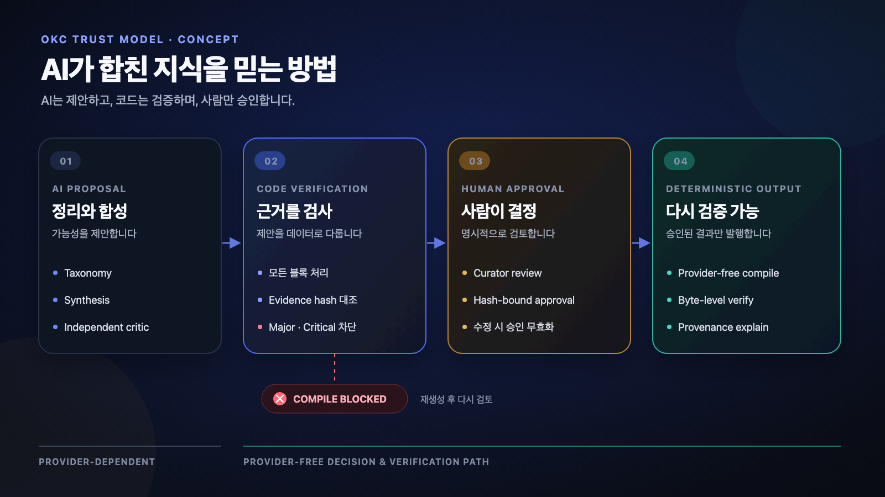
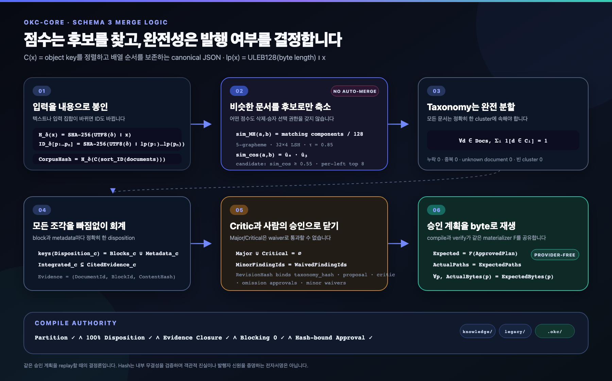
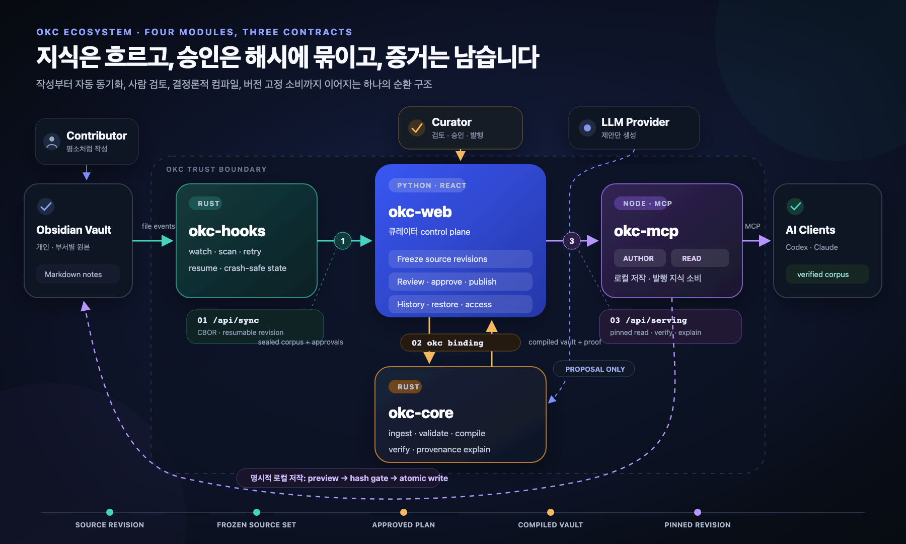
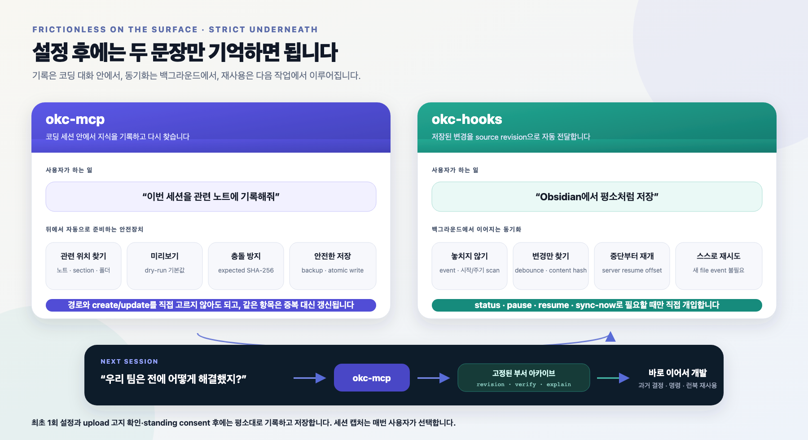
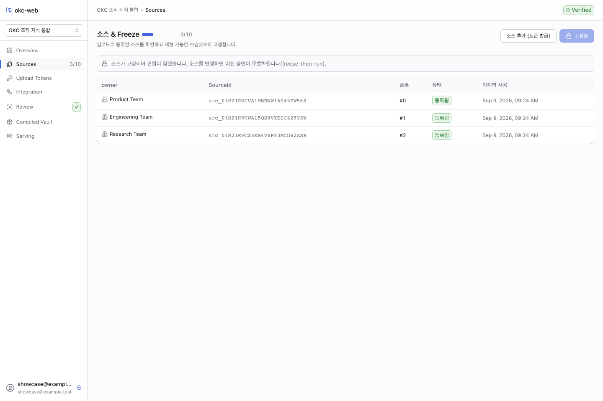
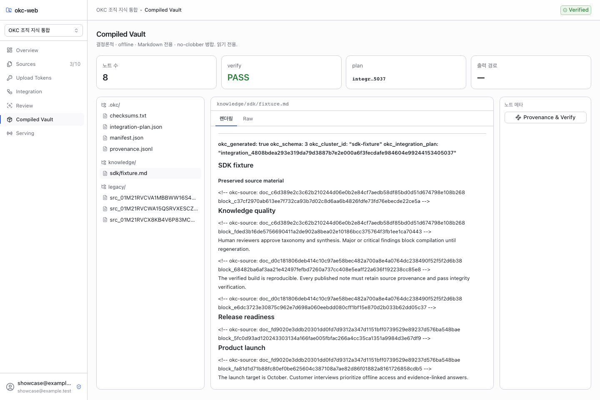
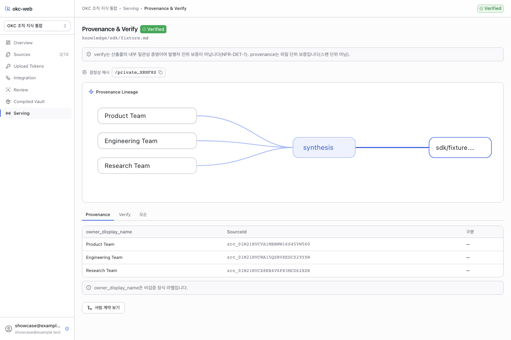
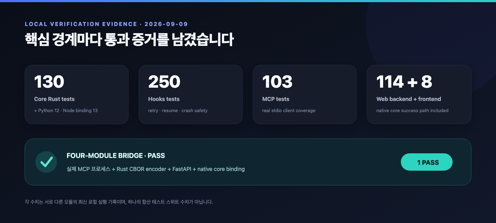

# OKC — AI가 합친 지식을 검증 가능한 결과로 만드는 컴파일러

> 여러 팀의 Obsidian Vault를 **AI 제안 → 코드 검증 → 사람 승인**을 거쳐 하나의 결정론적이고, 출처를 추적할 수 있으며, 다시 검증 가능한 지식 베이스로 컴파일합니다.


*개념 이미지 — 각자의 Vault는 그대로 유지하고, 승인된 지식만 하나의 검증 가능한 revision으로 만듭니다.*

**AI가 합친 지식, 어떻게 믿을 수 있을까요?**

일반적인 AI 요약은 읽기 좋지만, 중요한 질문이 남습니다. 어떤 소스가 쓰였는지, 모순이 사라지지는 않았는지, 사람이 승인한 뒤 내용이 바뀌지는 않았는지, 지금 읽는 파일이 바로 그 승인 결과인지 다시 확인하기 어렵습니다.

OKC는 이 문제를 검색이나 챗봇 기능이 아니라 **컴파일 문제**로 다룹니다.

- Obsidian MCP가 코딩 중 나온 결정·명령·해결법을 개인 Vault에 남기고 다음 작업에서 다시 꺼냅니다.
- OKC는 여러 구성원의 Vault를 출처와 승인 기록이 남는 부서 공동 아카이브로 만듭니다.
- 코딩 에이전트는 발행된 부서 지식을 새 구현에서 다시 활용합니다.
- AI는 taxonomy, synthesis, critic 결과를 **제안**합니다.
- 코드는 근거, 해시, 누락, 비평 심각도를 **검증**합니다.
- 큐레이터가 명시적으로 검토하고 **승인**합니다.
- 승인된 계획만 provider 없이 결정론적으로 **compile · verify · explain** 됩니다.
- 발행된 revision은 고정되어 사람과 AI 에이전트가 같은 지식을 읽습니다.

**4개 모듈 · 3개 주요 계약 · 6개 CI workflow 정의 · 실제 경계를 잇는 1개 four-module bridge**

<!-- 데모 영상을 업로드한 뒤 이 위치에 링크를 추가하세요. -->


*6컷으로 보는 지식 순환 — 개인 Vault에 기록 → 부서 공동 아카이브 → 코딩 에이전트의 재사용 → 새 배움의 환류.*

## 문제: Vault를 합치는 순간, 지식보다 판단이 먼저 섞입니다

각 팀이 로컬 Obsidian을 잘 쓰고 있어도 조직 단위로 통합하려는 순간 네 가지 위험이 생깁니다.

1. **출처 소실** — 합성된 문장이 어느 팀의 어떤 노트에서 왔는지 알기 어렵습니다.
2. **모순 은폐** — 서로 다른 출시일이나 정책이 자연스러운 한 문장으로 뭉개질 수 있습니다.
3. **승인 드리프트** — 승인 후 제안이 수정되어도 과거 승인이 그대로 남을 수 있습니다.
4. **버전 혼동** — 최신 발행본과 오래된 로컬 지식이 조용히 섞일 수 있습니다.

OKC가 해결하려는 일은 단순한 “노트 병합”이 아닙니다. 팀이 원하는 것은 **검증 가능한 조직 기억**입니다.

| 단순 병합에서 생기는 문제 | OKC가 적용하는 통제 |
|---|---|
| 입력이 계속 바뀜 | source revision을 수집한 뒤 freeze |
| AI 결과가 곧 최종 결과가 됨 | proposal로만 받고 로컬 검증 수행 |
| 중요한 비평도 사람이 무시할 수 있음 | Major/Critical finding은 compile 차단 |
| 승인 후 내용이 바뀔 수 있음 | 승인을 대상 hash에 바인딩 |
| 결과 파일의 무결성을 다시 확인하기 어려움 | embedded plan에서 결과를 다시 유도해 byte 비교 |
| 과거와 현재 지식이 섞임 | revision-pinned read, history, restore |

## 핵심 아이디어: AI는 제안하고, 코드는 검증하며, 사람만 승인합니다



*개념도 — Major/Critical finding이 하나라도 남으면 승인 경로가 아니라 재생성 경로로 돌아갑니다.*

OKC에서 AI 출력은 신뢰의 종착점이 아니라 검증의 입력입니다.

### 1. AI는 가능성을 제안합니다

LLM provider는 문서 분류, 클러스터별 합성, 독립 critic 결과를 제안합니다. 소스 텍스트는 명령이 아니라 잠재적으로 적대적인 evidence로 취급하며, provider 응답은 로컬에서 파싱·검증한 뒤 입력과 해시에 묶습니다.

### 2. 코드는 통과 조건을 검사합니다

`okc-core`의 검증기는 다음 조건을 코드로 강제합니다.

- 모든 문서는 taxonomy에서 정확히 한 번 다뤄져야 합니다.
- 모든 block과 metadata에는 정확히 하나의 disposition이 있어야 합니다.
- 통합했다고 표시한 block은 실제 evidence로 인용되어야 합니다.
- evidence의 document, block, content hash가 원본 입력과 일치해야 합니다.
- Major 또는 Critical finding이 남아 있으면 compile할 수 없습니다.

### 3. 사람의 승인은 대상에 묶입니다

큐레이터의 승인은 taxonomy, proposal, critic, revision hash와 연결됩니다. 승인한 내용을 수정하면 기존 승인은 더 이상 유효하지 않습니다. Minor finding을 넘기려면 명시적인 사유가 필요하고, Major/Critical finding은 waive할 수 없습니다.

### 4. 최종 판단 경로는 provider 없이 동작합니다

승인 뒤의 compile, verify, provenance explain은 LLM provider 호출 없이 실행됩니다. 모델이 바뀌거나 외부 API가 사라져도 승인된 결과의 내부 일관성을 다시 확인할 수 있습니다.

## okc-core는 어떻게 병합하는가



*okc-core 병합 로직 — 유사도는 검토 후보만 좁히고, 완전성·근거·critic·해시 결합 승인이 실제 컴파일 권한을 결정합니다.*

okc-core는 비슷한 문서를 곧바로 합치지 않습니다. 유사도는 함께 검토할 후보를 찾는 신호이고, 실제 병합은 모든 입력 조각의 처리 방식과 근거, critic, 큐레이터 승인이 하나의 계획 안에서 완전히 닫힌 뒤에만 가능합니다.

아래에서 δ는 hash domain, lp(x)는 byte 길이를 앞에 붙인 값, C(x)는 객체 key를 정렬하고 배열 순서를 보존하는 canonical JSON, 1[조건]은 조건이 참일 때 1인 지시 함수입니다.

~~~text
H_δ(x)          = SHA-256(UTF8(δ) || x)
ID_δ[p1,...,pn] = SHA-256(UTF8(δ) || lp(p1) || ... || lp(pn))
lp(x)           = ULEB128(byte_length(x)) || x
~~~

### 1. 움직이는 원본을 내용 기반 ID로 봉인합니다

Markdown을 document, block, metadata로 나누고 정렬한 뒤 내용 기반 hash를 계산합니다.

~~~text
δ_block      = "okc:block-content:v3\0"
δ_corpus     = "okc:integration-corpus:v3\0"

BlockHash(b) = H_δ_block(UTF8(normalized_text(b)))

CorpusHash   = H_δ_corpus(
                 C(documents sorted by DocumentId)
               )
~~~

Document와 block ID에는 버전화된 domain과 길이 prefix가 들어갑니다. 같은 문장이 여러 Vault에 있어도 occurrence ID가 분리되므로 중복 후보를 찾으면서 “어느 source의 어느 block인가”를 잃지 않습니다. 봉인된 정규화 텍스트나 corpus 구성이 바뀌면 hash가 바뀌고, 이전 제안과 승인은 stale로 거부됩니다.

### 2. 두 종류의 점수로 검토 범위만 좁힙니다

결정론적 사전 분석은 본문과 frontmatter hash가 모두 같은 exact group을 찾고, Unicode 5-grapheme shingle의 MinHash로 near-duplicate 후보를 만듭니다.

~~~text
ExactKey(d)  = (BodyHash(d), FrontmatterHash(d))

S5(d)        = document d의 고유한 연속 5-grapheme 집합
δ_mh         = "okc:minhash:v2\0"
h_j(s)       = first_BE64(ID_δ_mh[BE32(j), UTF8(s)])
m_j(d)       = min { h_j(s) : s in S5(d) }
sim_MH(a,b)  = (1 / 128) * sum[j=1..128] 1[m_j(a) = m_j(b)]
~~~

기본값은 128개 MinHash component, 32 bands × 4 rows, threshold 0.85, 문서당 최대 100개 후보입니다. 108/128 = 0.84375는 탈락하고 109/128 = 0.8515625부터 후보가 됩니다.

현재 공개 통합 실행은 embedding을 L2 정규화한 뒤 exact cosine 후보를 별도로 만듭니다.

~~~text
u(d)         = v(d) / ||v(d)||_2
sim_cos(a,b) = u(a) · u(b)

Candidate(a) = Top8 { b > a : sim_cos(a,b) >= 0.55 }
~~~

현재 버전에서 MinHash/LSH는 private 사전 분석 후보이고, organizer가 받는 semantic 후보는 cosine 경로입니다. 두 경로를 HNSW와 함께 합치는 기능은 아직 release blocker로 남아 있습니다. 어느 점수도 문서를 자동 삭제하거나 어떤 주장이 참인지 결정하지 않습니다.

### 3. Taxonomy는 전체 문서의 완전 분할이어야 합니다

전체 문서 집합을 Docs, 제안된 cluster를 C1 ... Cn이라고 하면 core는 다음 조건을 강제합니다.

~~~text
for every d in Docs:  sum[i=1..n] 1[d in Ci] = 1
~~~

같은 식을 집합으로 쓰면 union(Ci) = Docs이고 모든 Ci ∩ Cj는 공집합입니다. 문서가 하나라도 빠지거나, 두 cluster에 들어가거나, 빈 cluster 또는 알 수 없는 document ID가 있으면 hard-fail입니다. Singleton cluster도 synthesis, critic, 승인을 모두 거칩니다.

### 4. 모든 source 조각에 정확히 하나의 처리 결과가 필요합니다

Cluster c의 전체 대상을 block과 metadata의 합집합으로 정의합니다.

~~~text
T_c = Blocks_c union Metadata_c

set(DispositionTargets_c) = T_c
|DispositionTargets_c|    = |T_c|

IntegratedBlocks_c subset_of CitedEvidenceBlocks_c
OmissionProposedTargets_c = ApprovedOmissionTargets_c
~~~

각 target은 Integrated, PreservedVerbatim, OmissionProposed 중 정확히 하나를 가져야 합니다. 합쳤다고 표시한 block은 실제 output evidence에 등장해야 하고, omission에는 사유와 정확한 사람 승인이 필요합니다.

~~~text
Evidence = (DocumentId, BlockId, ContentHash)
~~~

Evidence의 세 값은 현재 cluster의 실제 원본 block과 다시 대조됩니다. Synthesis section과 모순의 각 claim도 evidence가 없으면 통과하지 못합니다.

### 5. Critic과 승인을 하나의 revision hash로 묶습니다

~~~text
MajorFindings union CriticalFindings = empty_set
MinorFindingIds                      = WaivedFindingIds
~~~

Major/Critical은 waive할 수 없습니다. Minor는 finding ID 전체와 정확히 일치하는 waiver, curator, 사유가 필요합니다.

~~~text
δ_revision = "okc:cluster-revision:v3\0"
δ_plan     = "okc:integration-plan:v3\0"

ClusterRevisionHash = H_δ_revision(C({
  taxonomy_hash,
  proposal,
  critic,
  omission_approvals,
  minor_waivers
}))

IntegrationPlanId = "integration_" || hex(H_δ_plan(C({
  corpus_hash,
  policy_hash,
  taxonomy_hash,
  taxonomy_approval,
  ordered_cluster_revision_objects,
  ordered_provider_recording_hashes
})))
~~~

제안, critic, omission, waiver 중 하나라도 바뀌면 revision hash와 plan ID가 달라집니다. 과거 승인 기록만으로 수정된 결과를 통과시킬 수 없는 이유입니다.

### 6. 승인된 계획에서 최종 byte를 다시 만듭니다

Materializer F는 provider 호출 없이 승인 계획에서 한 cluster당 하나의 knowledge/ note, 각 원본을 가리키는 legacy/ stub, 그리고 plan·provenance·manifest·checksum을 만듭니다. 경로와 collection을 정렬하므로 같은 schema·product version과 같은 승인 계획은 같은 byte를 유도합니다.

~~~text
Expected = F(ApprovedPlan)

Verify = (ActualPaths = ExpectedPaths)
      and (for every path p: ActualBytes(p) = ExpectedBytes(p))
      and (Manifest and Provenance are re-derived from ApprovedPlan)
~~~

Core는 sibling staging directory에서 전체 산출물을 만들고 verify(stage)를 먼저 통과시킨 뒤에만 기존 경로를 덮어쓰지 않는 방식으로 publish합니다. explain은 artifact 전체를 먼저 검증한 뒤 선택한 output file을 cluster, proposal, critic, approval, source evidence 집합에 연결합니다.

> **병합 권한 = 완전 분할 + 100% disposition + evidence closure + blocking critic 0건 + hash-bound human approval.** 0.85와 0.55는 자동 병합 기준이 아니라 후보를 줄이는 기준입니다.

코드 근거: [identity와 길이-prefix hash](https://github.com/HappySPigs/okc/blob/main/okc-core/crates/okc-core/src/identity.rs#L17-L31), [MinHash/LSH 후보](https://github.com/HappySPigs/okc/blob/main/okc-core/crates/okc-core/src/dedup.rs#L107-L216), [현재 cosine top-8](https://github.com/HappySPigs/okc/blob/main/okc-core/crates/okc-app/src/integration_execution.rs#L424-L500), [taxonomy 완전 분할](https://github.com/HappySPigs/okc/blob/main/okc-core/crates/okc-core/src/integration.rs#L749-L817), [evidence·critic·승인 closure](https://github.com/HappySPigs/okc/blob/main/okc-core/crates/okc-core/src/integration.rs#L821-L1170), [compile과 verify](https://github.com/HappySPigs/okc/blob/main/okc-core/crates/okc-core/src/integration.rs#L1324-L1496).

## 에코시스템: 네 모듈이 하나의 지식 순환을 만듭니다



*에코시스템 설계 — 실선은 source revision → frozen source set → approved plan → compiled vault → pinned revision의 발행 흐름을, 점선은 LLM의 proposal-only 입력과 MCP의 명시적 로컬 저작 경로를 나타냅니다. 1~3은 아래 표의 세 계약입니다.*

### `okc-hooks` — 변경을 놓치지 않는 동기화 계층

Obsidian Vault의 변경을 감지하고 재시도와 재개가 가능한 업로드를 수행합니다. 같은 업로드 자격으로 보낸 후속 업로드는 새 소스로 추가되지 않고 같은 논리 소스의 새 revision으로 기록됩니다. stale commit은 더 최신 revision을 되돌릴 수 없습니다.

### `okc-web` — 사람이 통제하는 큐레이션 계층

여러 팀의 revision을 모으고, 입력 집합을 freeze하고, taxonomy와 cluster review를 진행하고, 승인된 산출물을 발행합니다. 인증, review gate, history, restore, read access가 이 control plane에 모입니다.

### `okc-core` — 신뢰 규칙을 실행하는 컴파일 엔진

입력을 불변 snapshot으로 만들고, 제안을 검증하고, 승인된 계획을 결정론적으로 컴파일합니다. 발행 전에 staging 산출물을 스스로 verify하고, embedded plan에서 파일·provenance·manifest·checksum을 다시 유도해 실제 byte와 비교합니다.

### `okc-mcp` — 저작과 소비를 연결하는 에이전트 인터페이스

사람과 AI 에이전트가 로컬 소스 노트를 명시적으로 작성하고, `okc-web`이 발행한 revision-pinned 지식을 읽습니다. web mode에서 오류가 발생하면 오래된 로컬 지식으로 조용히 전환하지 않습니다.

이 네 모듈의 핵심 데이터 경로는 세 계약에 집중됩니다.

| 계약 | 연결 | 전달하는 것 |
|---|---|---|
| `/api/sync` | hooks → web | canonical CBOR, 재개 가능한 source revision |
| `okc` Python binding | web ↔ core | sealed corpus, review 결정, compiled artifact |
| `/api/serving` | web → mcp | pinned revision, files, verify, explain |

## 엄격한 내부, 단순한 사용자 경험



*한 번 해결한 문제를 다음 작업의 출발점으로 — 기록은 코딩 대화 안에서, 동기화는 백그라운드에서, 재사용은 다음 코딩 세션에서 이루어집니다.*

| 순간 | 사용자가 하는 일 | OKC가 뒤에서 하는 일 |
|---|---|---|
| 처음 연결할 때 | 설정을 채우고 upload 고지를 확인한 뒤 standing consent를 한 번 부여 | setup이 MCP 등록과 watcher auto-start 구성을 준비하고, 동의 전 업로드는 차단 |
| 문제를 해결한 직후 | “이번 세션을 관련 노트에 기록해줘”라고 요청 | okc-mcp가 관련 노트·section·폴더를 찾고 변경안을 미리 보여줌 |
| Obsidian에 저장한 뒤 | 평소처럼 다음 작업을 계속함 | okc-hooks가 변경을 감지해 새 source revision을 전송 |
| 전송 중 네트워크가 끊겼을 때 | 일시적 오류라면 별도 작업 없음 | server offset부터 재개하고 새 file event 없이 스스로 재시도 |
| 다음 프로젝트·세션 | “우리 팀은 전에 어떻게 해결했지?”라고 질문 | okc-mcp가 고정된 부서 archive에서 과거 결정·명령·런북을 읽음 |

### okc-mcp — 경로를 고민하지 않고, 먼저 확인하고, 안전하게 기록합니다

- **한 문장으로 세션 기록:** 사용자가 기록할 세션을 선택한 뒤 “이번 세션을 관련 노트에 기록해줘”라고 요청하면 됩니다. 자동 감시나 세션 종료 시 몰래 수집하는 기능은 없으며, 매번 user-selected 선언이 필요합니다.
- **파일 경로 선택을 에이전트가 보조:** prepare 단계가 관련 로컬 노트, heading 경로, 폴더 관례, 이전 capture 위치를 찾아줍니다. 사용자가 매번 파일 경로나 create/update 여부를 정할 필요가 없습니다.
- **저장 전 미리보기:** 모든 write와 session capture는 dry-run이 기본값입니다. 적용할 경로, 이유, 현재 hash와 응답 한도 내 내용 미리보기를 먼저 확인할 수 있습니다.
- **기존 노트를 존중하는 쓰기:** 관련 주제는 기존 section을 보강하고 독립 주제는 폴더 관례에 맞는 새 연결 노트가 됩니다. 관계없는 본문과 YAML은 보존합니다.
- **충돌과 중복 방지:** 기존 노트 수정은 expected SHA-256을 다시 확인하고 Vault 밖에 backup을 만든 뒤 note 단위로 atomic write합니다. Session capture는 저장 후 read-back hash까지 검증하며, 같은 session/item ID는 중복 추가 대신 갱신합니다.
- **로컬 저작과 부서 지식 읽기의 분리:** 작성 도구는 언제나 로컬 source Vault만 바꿉니다. web mode의 읽기는 발행 revision에 고정되고, 오류가 생겨도 오래된 local 지식으로 조용히 바뀌지 않습니다. read-only 설정에서는 write와 capture 도구 자체가 노출되지 않습니다.

설치도 한 번의 setup으로 Codex와 Claude Code의 공식 CLI에 MCP를 등록할 수 있습니다. 설정은 0600 권한으로 저장되고 token은 출력이나 로그에 남지 않으며, agent CLI가 없으면 설정 파일을 임의 수정하는 대신 붙여 넣을 client snippet을 보여줍니다. doctor 명령으로 local path와 web publication 접근을 미리 확인할 수 있습니다.

### okc-hooks — 설치한 뒤에는 Obsidian에서 평소처럼 저장합니다

- **최초 1회 동의:** 업로드 대상과 공개 범위를 설명하는 고지를 확인하고 standing consent를 부여해야 동기화가 시작됩니다. 동의 상태를 조회하거나 언제든 철회할 수 있으며, 동의가 없거나 상태 파일이 의심스러우면 업로드를 차단합니다.
- **놓친 변경까지 복구:** 실시간 file event뿐 아니라 시작 scan과 주기 reconciliation scan을 함께 사용합니다. OS watcher가 이벤트를 놓쳐도 다음 scan이 현재 상태를 다시 확인합니다.
- **저장 폭주를 한 번으로 정리:** 짧은 시간에 연속으로 발생한 Obsidian save를 debounce해 불필요한 업로드를 줄입니다.
- **필요한 blob만 전송:** path, SHA-256, size로 만든 manifest를 먼저 negotiate하고, server에 없는 blob이나 덜 전송된 구간만 chunk로 보냅니다.
- **중단 지점부터 재개:** server가 알려준 authoritative resume offset을 따릅니다. transient failure는 backoff 뒤 새 file event를 기다리지 않고 재시도하며, 그동안 들어온 edit는 최신 상태로 합쳐집니다.
- **잘못된 대상에 보내지 않기:** local state를 canonical Vault path, HTTPS endpoint, token selector의 fingerprint에 묶습니다. 설정 대상이 바뀌면 기존 state로 다른 project에 업로드하지 않고 명시적으로 중단합니다.
- **필요할 때만 직접 제어:** status, health, pause, resume, sync-now, history, reload, stop 명령을 제공합니다. setup은 user-level auto-start service 등록을 구성하고 재실행해도 같은 결과가 되며, uninstall은 Vault를 건드리지 않습니다.

루트의 단일 설정 파일과 `./install.sh` 또는 `install.ps1`을 사용하면 hooks와 MCP를 함께 구성할 수 있습니다. 최초 upload 고지 확인과 standing consent를 마치면 사용 흐름은 “코딩 중 배움을 MCP로 남기기 → Obsidian 저장 → hooks 자동 전송 → 큐레이터 승인과 core compile → 다음 코딩 세션에서 부서 지식 재사용”으로 이어집니다.

구현 근거: [MCP 한국어 사용 흐름](https://github.com/HappySPigs/okc/blob/main/okc-mcp/README_KOR.md), [preview·hash·backup write pipeline](https://github.com/HappySPigs/okc/blob/main/okc-mcp/src/authoring.ts#L52-L93), [session capture 회귀](https://github.com/HappySPigs/okc/blob/main/okc-mcp/tests/capture.test.ts#L67-L118), [hooks setup과 sync 계약](https://github.com/HappySPigs/okc/blob/main/okc-hooks/aidlc-docs/construction/build-and-test/watcher-setup.md), [event 없는 retry 회귀](https://github.com/HappySPigs/okc/blob/main/okc-hooks/crates/watcher-bin/tests/retry_loop.rs).

## 실제 동작 화면

아래 화면은 세 개의 부서 샘플 노트를 실제 `okc-web`과 native `okc-core` 경로로 ingest, freeze, approve, compile, publish, verify한 로컬 실행 결과입니다. 콘텐츠 생성에는 deterministic synthetic provider를 사용했습니다. 따라서 이 캡처는 **workflow와 계약의 실행 증거**이며 live-model의 문장 품질을 평가하는 자료는 아닙니다.

### 입력을 먼저 고정합니다



Product, Engineering, Research 세 팀의 revision을 등록한 뒤 source set을 고정했습니다. 이후 입력이 바뀌면 downstream 승인이 무효화되는 freeze-then-run 규칙이 적용됩니다.

### 승인된 계획으로 읽기 전용 Vault를 컴파일합니다



컴파일 결과는 `knowledge/`, `legacy/`, `.okc/` 영역으로 나뉩니다. 화면에는 8개 산출 파일, `verify PASS`, plan ID, 보존된 source material이 함께 보입니다. 기존 출력은 덮어쓰지 않는 no-clobber 방식으로 발행합니다.

### 발행 결과와 source attribution을 함께 확인합니다



이 화면에서는 선택한 compiled note와 프로젝트의 source owner 라벨, verify 결과를 함께 확인할 수 있습니다. owner 라벨은 비검증 장식 정보이며, `Verified`는 발행자 신원이나 span 단위 계보가 아니라 **승인된 계획과 현재 산출물의 내부 일관성**을 뜻합니다.

### 한 화면에서 현재 상태를 확인합니다


큐레이터는 source 수, freeze 상태, blocking finding, verify 결과, 최근 승인 기록을 한 화면에서 확인합니다.

## 기술적으로 인상적인 세 장면

### 발행 전에 스스로 검증하는 컴파일러

OKC는 승인 계획을 검증하고 임시 staging 디렉터리에 결과를 만든 다음, 그 staging 결과에 `verify`를 실행합니다. 검증을 통과해야만 no-replace publish가 일어납니다.

`verify`는 저장된 manifest를 그대로 믿지 않습니다. embedded integration plan을 다시 검증하고, 그 계획에서 예상되는 파일·provenance·manifest·checksum을 다시 만든 뒤 실제 디스크 byte와 비교합니다. 누군가 발행 파일을 직접 수정하면 read도 `VERIFICATION_FAILED`로 거부됩니다.

### 모순을 지우지 않는 데이터 모델

OKC의 curator decision에는 “승자 선택” 동작이 없습니다. 타입과 SQLite constraint는 approve taxonomy, approve cluster, regenerate 세 결정만 허용합니다. Omission과 Minor waiver는 사유를 포함한 cluster approval에서만 허용되며, 서로 충돌하는 주장은 각 evidence와 함께 보존됩니다.

### 발행 당시의 지식을 그대로 읽는 revision pinning

Revision A를 읽던 client는 Revision B가 새로 발행된 뒤에도 A를 명시적으로 요청해 같은 byte를 읽을 수 있습니다. 존재하지 않는 revision을 현재 버전으로 조용히 바꾸지 않으며, history와 restore가 제공됩니다.

## 해커톤 MVP를 넘어선 엔지니어링 증거



*검증 기록 — 각 숫자는 서로 다른 모듈에서 실행한 최신 로컬 결과이며 하나의 합산 테스트 스위트 수치가 아닙니다.*

| 영역 | 최신 로컬 기록 |
|---|---:|
| Core Rust | 130 passed |
| Core Python binding | 12 passed |
| Core Node binding | 13 passed |
| Hooks | 250 passed |
| MCP | 103 passed |
| Web backend | 114 passed |
| Web frontend | 8 passed |
| Four-module bridge | 1 passed |

Four-module bridge는 **실제 MCP subprocess, Rust CBOR encoder, FastAPI 서비스, native core binding**을 하나의 경로로 연결합니다. LLM은 synthetic provider를 사용하고 hooks daemon과 OS service 설치 자체는 이 테스트 범위에 포함하지 않습니다.

저장소에는 core, hooks, MCP, web backend, web frontend를 분리한 6개의 path-scoped CI workflow가 정의되어 있습니다. 핵심 상태·업로드·저작 로직에는 property-based test를 적용했고, native binding 경계에는 Rust·Python·Node가 동일 fixture 산출물 byte에 합의하는 golden test가 있습니다.

## 현재 범위도 명확하게 공개합니다

OKC는 현재 development-stage 프로젝트이며 `okc-web`은 single-organization, single-process 해커톤 MVP입니다. 현재 컴파일 산출물은 Markdown 중심입니다. live third-party provider 품질 검증, 전체 native OS service 설치 검증, 성능·배포·패키지 release gate는 후속 과제로 남아 있습니다.

이 경계를 숨기지 않는 이유는 간단합니다. OKC가 다루는 핵심 가치가 바로 **검증 가능한 주장**이기 때문입니다.

## 직접 확인하기

- GitHub: [HappySPigs/okc](https://github.com/HappySPigs/okc)
- 전체 구조와 시작 방법: [Repository README](https://github.com/HappySPigs/okc#readme)
- `okc-hooks`와 `okc-mcp` 로컬 설치:

```sh
cp okc-install.config.example.json okc-install.config.json
./install.sh
```

위 원커맨드 설치는 hooks와 MCP를 대상으로 합니다. 컴파일 엔진과 큐레이터 web 실행 방법은 각 모듈 README에 분리되어 있습니다.

---

**AI 시대의 지식에는 답만큼 증거가 필요합니다.**

OKC는 그럴듯한 요약을 넘어, 누가 무엇을 제안했고 어떤 근거가 승인됐으며 지금 읽는 byte가 그 승인 결과와 일치하는지 다시 물을 수 있는 조직 지식을 만듭니다.
